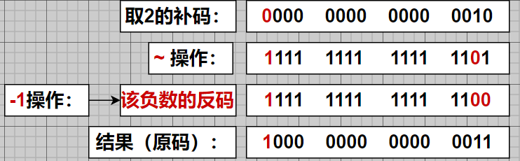

## 原码 补码 反码

### 	1.二进制，最高位为符号位，0为正数，1为负数

### 	2.正数的三码一致

### 	3.负数反码=符号位不变，其他位取反（对应正数的二进制）；		负数的补码=反码+1；	

> ​			已知负数补码：反码=补码-1

### 	4.Java中都是有符号数 

### 	5.计算机以 *`补码`* 计算，结果以 补码 计算 原码

### 位运算符（& ，| ，^ ，~ ，>> ，>>>）

> >>> ：逻辑右移，低位溢出高位补0，没有 **<<<** 运算符

## 	1.	2&5

## 	2.	3|2

## 	3.	5^2

## 	4.	~ -2  和 ~ 2

## 	5.	1>>2

> ### 	公式：m>>n ===> m/2^n

## 	6.	2>>>1

> ### 	公式：m<<n ===> m*2^n

