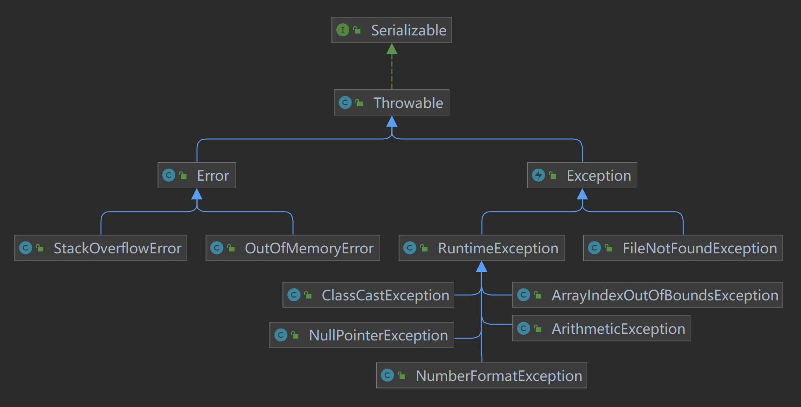
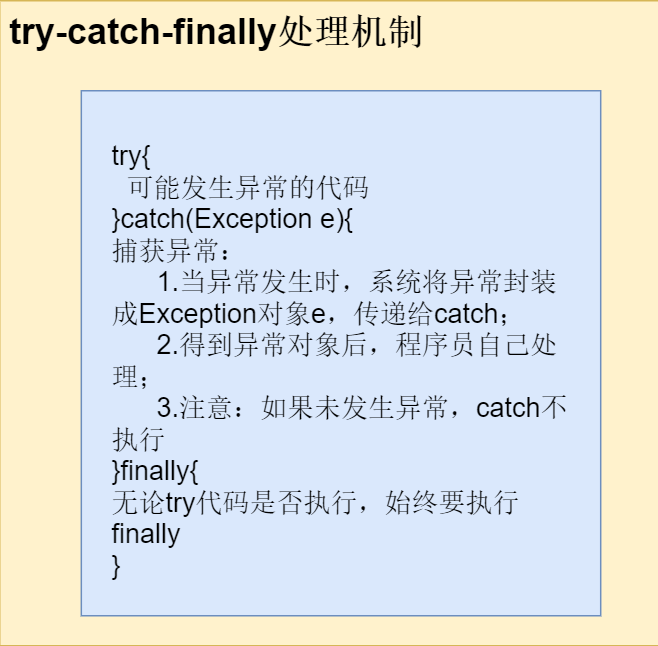
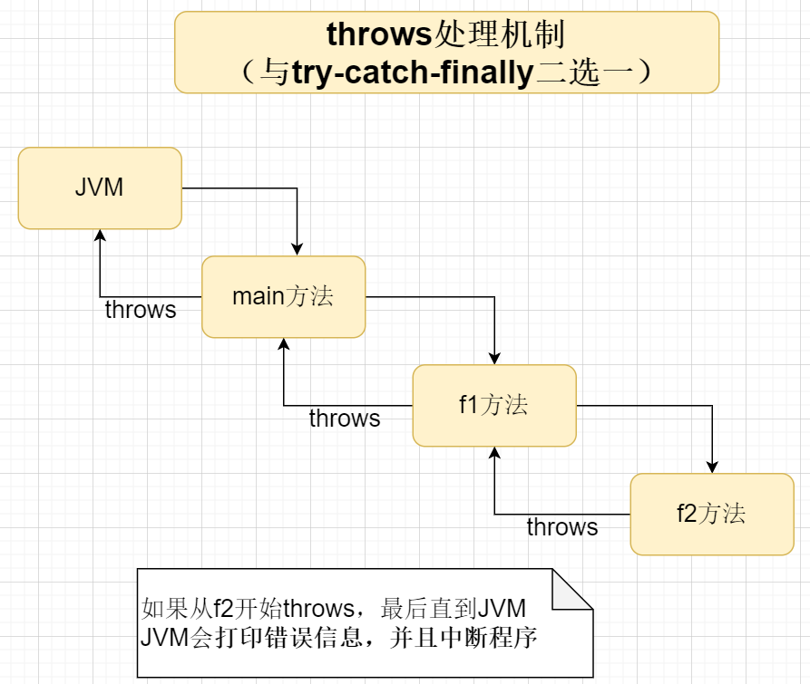

[TOC]


#  异常

##  基本介绍

> Java中，出现不正常情况称为“异常”（语法和逻辑错误不是异常）


##  种类

1. Error：Java虚拟机无法解决的严重问题，程序会崩溃
2. Exception：因程序错误或者外在因素导致一般性问题
   - 运行时异常
   - 编译时异常


##  异常体系图🚩




##  常见运行时异常

1. NullPointerException：空指针异常
2. ClassCastException：类转型异常
3. ArrayIndexOutOfBoundsException：数组索引越界
4. ArithmeticException：算数运算异常
5. NumberFormatException：数字格式异常 

##  常见编译时异常

1. SQLException：操作数据库是，查询表可能发生异常
2. IOException：操作文件时，发生异常
3. FileNotFoundException：操作不存在文件时，发生异常
4. ClassNotFoundException：加载类时，不存在该类，发生异常
5. EOFException：操作文件到末尾时，发生异常
6. IllegalArguementException：参数异常

##  异常处理

###  系统方式

1. **try-catch-finally**

   > 程序员在代码中捕获异常，自行处理

   

   细节：

   - 异常发生时，其后的代码不会执行，直接进入catch

   - 若没有异常发生，则顺序执行try代码块，不会进入catch

   - 若希望无论有无异常都执行代码，则使用finally

   - 🚩可有多个catch语句，要求父类异常在后，子类异常在前；当发生异常只会匹配一个catch

   - 可以使用try-finally组合，使用场景：不捕获异常，无论异常都要执行某个模块；（⚡但是执行完成finally后，程序会退出）

     

2. **throws**

   > 将异常抛出，交给调用者处理；顶级处理者是JVM	
   
   
   
   细节：
   
   - throws抛出的异常可以是异常本身，也可以是其父类：public void met() throws Exception{};
   - throws后也可跟异常列表，如：void met() NullPointerException,ArrayIndexOutOfBoundsException{};
   - 🚩编译时异常必须*显式处理*，运行时异常默认使用throws*隐式处理*
   - 🚩子类重写父类方法抛出异常必须和父类方法一致，或者是父类异常的子类


###  自定义异常类

步骤：

1. 定义类：自定义异常类名，继承Exception或者RuntimeException
2. 继承Exception属于编译异常
3. 继承RuntimeException属于运行异常

```java
package com.java_learn.abnormal_;
import java.util.Scanner;
/**
 * @author ECHOm6
 * @version 1.0
 * @Summary 自定义异常类
 */
public class cus_Exception {
    public static void main(String[] args) {
        AgeException.met();
    }
}
class AgeException extends RuntimeException{//继承运行时异常
    public AgeException(String message) {//使用构造器输出错误信息
        super(message);
    }
    public static void met(){
        System.out.println("请输入年龄（1~120）：");
        Scanner scanner = new Scanner(System.in);
        int age=scanner.nextInt();
        if(age<1 || age >120){
            throw new AgeException("年龄不在范围内");//可自定义错误信息
        }
    }
}
```


##  throw和throws

| 关键字 |          作用          |       位置       | 后接代码 |
| :----: | :--------------------: | :--------------: | :------: |
| throws |      异常处理方式      | 方法声明的（）后 |   异常   |
| throw  | 手动生成异常对象关键字 |     方法体内     | 异常对象 |

