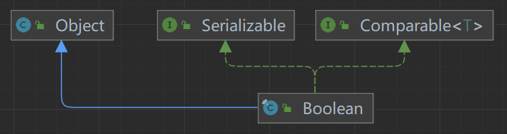

[TOC]


#  包装类

##  分类

注：*黄色标识*的为Number子类

| 基本数据类型 |  包装类   |
| :----------: | :-------: |
|   boolean    |  Boolean  |
|     char     | Character |
|     byte     |  *Byte*   |
|    short     |  *Short*  |
|     int      | *Integer* |
|     long     |  *Long*   |
|    float     |  *Float*  |
|    double    | *Double*  |

##  分析图

- Boolean

  

- Character

  

- Number子类

  

##  包装类和基本数据转换

> - jdk5*之前*为手动装箱（基本类型=>包装类型）、拆箱（包装类型=>基本类型）
> - jdk5*之后*为**自动装箱、拆箱**；底层调用valueOf()方法。


##  String和包装类互相转换

```java
package com.java_learn.commonly_used_class.package_class;
/**
 * @author ECHOm6
 * @version 1.0
 * @Summary String和包装类的转换
 */
public class String_Package {
    public static void main(String[] args) {
        //Integer -> String
        Integer i=100;
        String s1=i+"";//方法1
        String s2=i.toString();//方法2
        String s3=String.valueOf(i);//方法3
        //String -> Integer
        String s="123";
        Integer i1=Integer.parseInt(s);//方法1
        Integer i2=new Integer(s);//方法2
    }
}
```

##  包装类常用方法

查询api手册