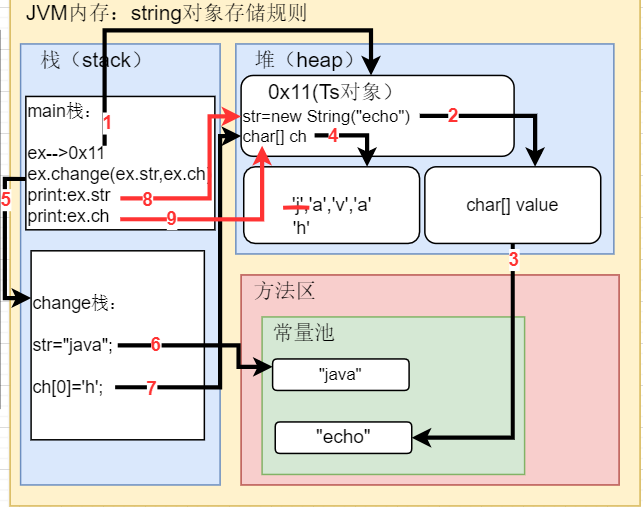
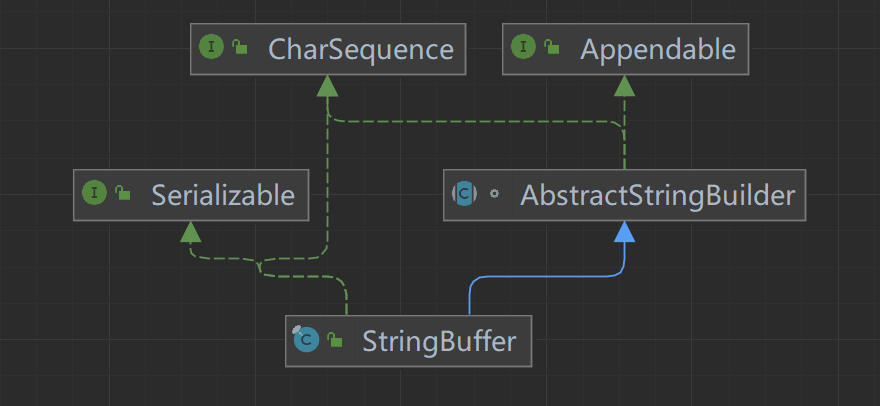
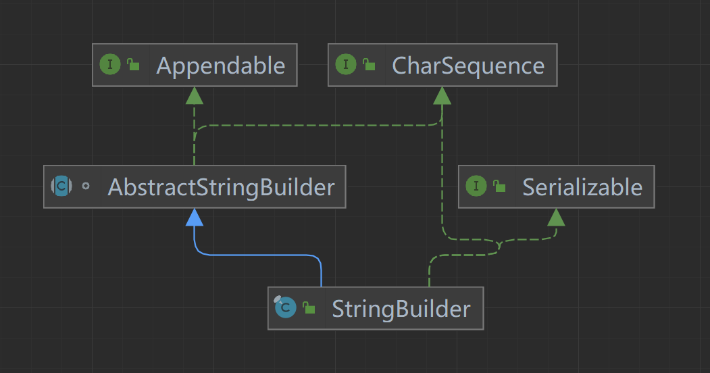

#  String类

##  String类的理解

1. String对象用于保存字符串，也就是一组字符序列；使用双引号括起

2. 使用的编码是Unicode，即不区分中英文，一个字符占2字节

3. 常用的String类构造器：

   > - `String s1=new String();`
   > - `String s2=new String(String original);`
   > - `String s3=new String(char[] a);`
   > - `String s4=new String(charp[] a,int startIndex,int count);`
   > - `String s5=new String(byte[] b);`

4. String类实现了Serializable接口（可串行化：在网络中传输）；实现了Comparable接口（对象可以比较）。

5. String是final类，不能被其他类继承

6. 用于存储字符串的底层是String类中的`private final char value[ ]`属性；

7. 注意value属性是final类型，不可修改（指的是该数组的地址不可改变，内容可修改）

##  创建字符串的两种方式

- `String s="echom6";`
- `String s1=new String("echom6");`

说明：

1. 方法一：在常量池中查找是否有echom6；有则*直接指向常量池*中该地址，若没有创建后再指向；

2. 方法二：在常量池中查找是否有echom6；有则*通过value指向常量池*中该地址，若没有创建后通过value指向；

   > 区别：前者直接指向常量池；后者指向堆中value地址，value再指向常量池

测试：

```java
//方法一
String s="aaa";
String b="aaa";
s.equals(b);//T 因为String重写了equals；比较两者的值是否相等
s==b;//T 因为s在常量池创建了aaa；所以b判断有aaa直接指向该地址
//方法二
String s1=new String("ccc");
String b1=new String("ccc");
s1.equals(b1);//T 比较值是否相等
s1==b1;//F 
//此时的变量指向的value地址不同；但是value指向的常量池地址相同都是ccc的地址
```

intern方法

```java
//intern方法
//当池中有该字符串则返回池中地址，若没有则在池中创建字符串后，返回该对 象的引用
        System.out.println(s1==b1.intern());//T此时为真是因为intern方法返回的是常量池地址不是value的地址
        System.out.println(b1==b1.intern());//F a1为value地址，a1.intern为常量池地址
```


##  字符串特性

- 特性一：

  1. `String a="aa",b="bb";`创建了两个对象在常量池

  2. `String s="aa"+"bb";`创建了一个对象，编译器会在底层优化为：`String s="aabb";`

  3. `String a="hello",b="haha",c=a+b;`创建了三个对象；1.在常量池创建啊a,b两个对象，2.StringBuilder sb=StringBuilder();执行sb.append("hello");再执行sb.append("haha");最后c=sb.toString();   最后c指向的是堆中的对象，value[]-->"hellohaha";

     > **小结：**
     >
     > 常量相加看池（第2点），变量相加看堆（第3点）

- 特性二：

  1. `String s="echo", s1="java, s3="echojava" s2=(s+s1).intern();"`此时s2指向的是s+s1的池中地址(intern方法的作用)；所以s3==s2为true；

  2. ```java
     public class Mi{
         public static void main(String[] args){
             ex=new Ts();
             ex.change(ex.str,ex.ch);//此时虽然str指向了java
             System.out.println(ex.str+"And"+ex.ch)//这里输出时仍然是对象的str,但是ch的第一个元素被修改
         }
     }
     class Ts{
         String str=new String("echo");
         final char[] ch={'j','a','v','a'};
         public void change(String str,char[] ch){
             str="java";
             ch[0]='h';
         }
     }
     ```

     

     > 小结：
     > 深入理解字符串对象的存储机制


##  常用方法

- equalslgnoreCase忽略大小写的判断内容是否相等

- length获取字符的个数，字符串的长度

- indexOf(ch)获取ch字符(或者字符串）在字符串对象中第一次出现的索引，索引从0开始，如果找不到，返回-1

- lastIndexOf(ch）获取ch字符（或者字符串）在字符串中最后一次出现的索引，索引从0开始，如果找不到，返回-1

- substring(index)截取index后的字符串；substring(index1，index2)从index1截取到index2

- toUpperCase()转换成大写

- toLowerCase()转换成小写

- concat拼接字符串
  /String s1="宝玉"：
  /s1=s1.concat("林黛玉").concat("薛宝钗").concat("together'")i
  /System.out.println(s1);

- replace(str1,str2)把字符串中str1替换成str2

- splt分割字符串，对于某些分割字符，我们需要转义比如\等
  /String poem="锄禾日当午，汗滴禾下土，谁知盘中餐，粒粒皆辛苦"：
  /String[]split poem.split(",");

- 🚩toCharArray()转换成字符数组
  /String s "happy";
  /char[]chs s.toCharArray()

- a.compareTo(b)比较两个字符串第一个不相等的字符，返回两者之差;

  /"ja".compareTo("jc");结果为a-c=-2;

  /"jac".compareTo("jack");结果为jac.length-jack.length=-1

- format格式化字符串

  /String info=String.format("我的名字是%s;年龄是%d",name,age);


#  StringBuffer

##  介绍

> - *代表可变字符序列*，可对内容进行增删
> - 大多数方法与String相似
> - 是一个容器



##  StringBuffer解析：

1. 直接父类是AbstractStringBuilder
2. 实现了Serializable，即StringBuffer对象可以串行化
3. 在父类AbstractStringBuilder中有属性`char[] value`,*不是final类型*；意味着*存放在堆中*
4. StringBuffer为final类不能被继承
5. 没有线程安全问题
6. 使用：`new StringBuffer() `（起始容量16）;
7. 使用：`new StringBuffer(str)`(**容量：str.length+16**)

##  StringBuffer与String转换

- String转StringBuffer

  ```java
  //        方法一：构造器
          StringBuffer sb=new StringBuffer(aa);
  //        方法二:append方法
          StringBuffer sb1=new StringBuffer();
          sb1=sb1.append(aa);
  ```

- StringBuffer转String

  ```java
  //        方法一：toString
          StringBuffer sb2=new StringBuffer();
          String s1=sb2.toString();
  //        方法二：构造器
          String s2=new String(sb2);
  ```

  

##  StringBuffer常用方法

- 增：append()
- 删：delete(indexStart,indexEnd);     [indexStart,indexEnd)，*不包含indexEnd*
- 改：replace(IndexStart,IndexEnd,字符串...)   [IndexStart,IndexEnd),*不包含IndexEnd*
- 查：indexOf(字符串)；查找字符串第一次出现的索引，若没有返回-1
- 插：insert(index,字符串...);   原来为index的字符*向后移动*


#  StringBuilder

##  介绍

> - 可变字符序列，提供一个与StringBuffer兼容的API，但不同步。
> - 是StringBuffer的简易替换，*用在字符串缓冲区被单个线程使用的时候*。建议优先使用StringBuilder；多数情况*比StringBuffer要快*。
> - 主要操作为append和insert方法，可重载以接受任意类型的数据。



##  StringBuilder解析

1. 直接父类是AbstractStringBuilder
2. 实现了Serializable，即StringBuilder对象可以串行化
3. 在父类AbstractStringBuilder中有属性`char[] value`,*不是final类型*；意味着*存放在堆中*
4. StringBuilder为final类不能被继承
5. 存在线程安全问题（单线程）

##  StringBuilder常用方法

与stringBuffer一样


#  String、StringBuffer、StringBuilder使用原则

1. *存在大量修改操作*：使用StringBuffer和StringBuilder

2. *多线程*：使用StringBuffer

   *单线程*：使用StringBuilder

3. *少量修改操作*，被多个对象*重复使用*：使用String
