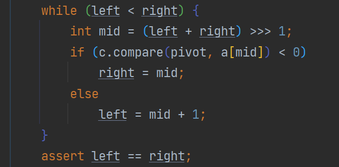

#  Arrays常用方法 

- toString(arr)  返回字符串

  //`System.out.println(Arrays.toString(arr))`

- sort排序（自然排序和定制排序）

  1. 自然排序：冒泡

     //`Arrays.sort(arr)`

  2. 定制排序：sort重载，传入接口Comparator实现定制排序

     ```java
     Arrays.sort(integers, new Comparator() {
      @Override
      public int compare(Object o1, Object o2) {
          Integer i1=(Integer) o1;
          Integer i2=(Integer) o2;
          return i2-i1;//底层通过二叉排序，返回的正负决定排序顺序
      }
     });
     System.out.println(Arrays.toString(integers));
     ```

     

- 模拟定制排序：

  ```java
  /**
   * @author ECHOm6
   * @version 1.0
   * @Summary 模拟sort定制排序
   */
  public class ArraysSortCustom {
      public static void main(String[] args) {
          int[] arr={1,2,6,-1,2,5,99};
          bubble(arr, new Comparator() {
              @Override
              public int compare(Object o1, Object o2) {
                  int i1=(Integer) o1;
                  int i2=(Integer) o2;
                  return i1-i2;
              }
          });
          System.out.println(Arrays.toString(arr));
      }
      public static void bubble(int[] arr, Comparator c){
          int tmp=0;
          for (int i = 0; i <arr.length-1 ; i++) {
              for (int j = 0; j <arr.length-1-i ; j++) {
                  if(c.compare(arr[j],arr[j+1])>0){//进入到匿名内部类
                      tmp=arr[j];
                      arr[j]=arr[j+1];
                      arr[j+1]=tmp;
                  }
              }
          }
      }
  }
  ```

- binarySearch二分查找

  `Arrays.binarySearch(arr,ele);`

   //1.数组必须有序
   //2.如果找到该元素返回：-index
  //3.如果未找到元素返回：-(low+1);low表示该元素在数组所排列位置

- copyOf(arr, length)数组拷贝

   `Integer[] arr=Arrays.copyOf(arr1,length);`

- fill(arr,ele)把数组全部使用ele元素填充

  `Integer[] arr={1,2,3}; `

  `Arrays.fill(arr,0)`//此时arr数组变为：{0,0,0}

  

