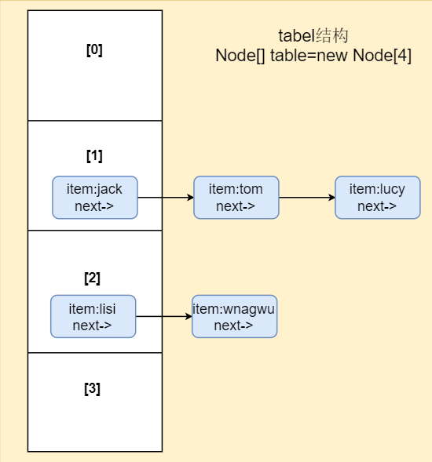
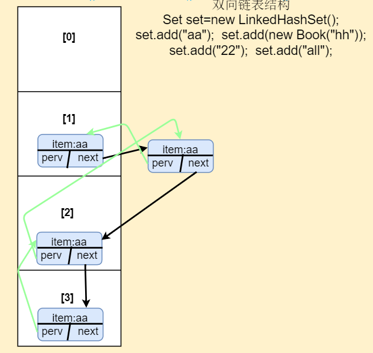

#   Collection接口和常用方法

##  实现类的特点

`public interface Collection<E> extends Iterable<E>`

- 实现子类可以存放多个元素，可以是Object
- 实现类有的能存放重复元素（List），有的不能（Set）
- 实现类有的有序（List），有的无序（Set）
- Collection接口没有直接子类，都是通过子类接口List、Set实现

##  方法

```java
Collection list=new ArrayList();
        //add添加
        list.add("asdsa");
        list.add("asdsa");
        System.out.println(list.toString());
        //remove删除
        list.remove("asdsa");
        System.out.println(list.toString());
        //contains查找
        list.contains("aa");
        //size获取元素个数
        System.out.println(list.size());
        //isEmpty判断是否为空
        System.out.println(list.isEmpty());
        //clear清空
        list.clear();
        //addAll添加多个元素
        List list1=new ArrayList();
        list1.add("bb");
        list1.add("cc");
        list.addAll(list1);
        System.out.println(list.toString());
        //查找多个元素是否都在
        System.out.println(list.containsAll(list1));
        //removeAll删除多个元素
        System.out.println(list.removeAll(list1));
```

##  遍历方法

###  Iterator

1. 使用iterator遍历

2. Iterator对象由于遍历，本身不存放对象

3. 所有实现了Collection接口的类都有iterator方法，返回一个实现了Iterator的对象（迭代器）

   ```java
   Iterator iterator=col.iterator();
           while (iterator.hasNext()) {//判断下一个元素是否存在
               Object next =  iterator.next();//指针指向下一个元素
               System.out.println(next);
           }
           //如果想再次遍历，需要重新指向开头，即重新申明
           iterator=col.iterator();
   ```

###  增强for

```java
 //增强for遍历集合元素
        System.out.println("=====增强for========");
        for(Object books:col){
            System.out.println(books);
        }
```


#  List接口和常用方法

##  介绍

- List是Collection的子接口
- List集合元素*有序，可重复*
- List集合元素*都有对应的顺序索引*

##  方法

```java
 List list=new ArrayList();
        list.add("akko");
        list.add("mk");
        //add(index,ele)指定索引处插入对象
        list.add(1,"durk");
        System.out.println(list.toString());
        //addAll(index,list)指定索引处插入多个元素
        List list1=new ArrayList();
        list1.add("aa");
        list1.add("bb");
        list.addAll(1,list1);
        System.out.println(list.toString());
        //get(index)获取指定索引的元素
        System.out.println(list.get(1));
        //indexOf(obj)返回对象第一次出现的位置索引
        System.out.println(list.indexOf("aa"));
        //lastIndexOf(obj)返回对象最后一次出现的位置
        System.out.println(list.lastIndexOf("akk"));
        //remove(index)移除指定位置的元素
        list.remove(1);
        System.out.println(list);
        //set(index,ele)替换指定索引的元素
        list.set(1,"aa");
        System.out.println(list);
        //subList(fromIndex,toIndex)返回从fromIndex到toIndex的子集合
        List list2=list.subList(0,2);//索引范围[0,2)
        System.out.println(list2);
```

##  遍历方法

- Iterator迭代器
- 增强for循环
- 可以使用索引（普通for）

##  List下的实现类

###  ArrayList、LinkList、Vector

> 都可以使用List提供的方法

###  ArrayList

####  细节

- ArrayList可以存放任意对象，包括null，可重复
- ArrayList通过数组存储数据
- ArrayList基本等同Vector，但是*ArrayList线程不安全*执行效率高）；多线程不建议使用

####  底层机制和源码分析

- ArrayList底层维护了一个Object类型的数组elementData

  `transient Object[] elementData`//transient表示该对象*不会被序列化*

- 创建ArrayList对象时如果使用的是无参构造器，则起始容量为0，*第一次添加*数据后容量为*10*，再次扩容为*当前容量1.5倍*

- 创建ArrayList对象时如果使用的指定大小的构造器，则起始容量为指定大小，在之后扩容为当前容量1.5倍

###  Vector

####  说明

- Vector是*线程同步*的，其方法带有synchronized
- 多线程时考虑使用Vector

```java
public class Vector<E> extends AbstractList<E> implements List<E>,RandomAccess,Cloneable,Serializable
```

####  底层机制和源码分析

- Vector底层也是对象数组

  `protected Object[] elementData`

- 创建Vector对象时如果使用*无参构造器*，则*默认容量为10*，之后以*2倍扩容*

- 创建Vector对象时如果使用的是*有参构造器*，*直接按照2倍扩容*

###  LinkedList

####  说明

- 底层实现了双向链表和双向队列
- 线程不安全

####  底层机制和源码分析

- LinkedList维护了双向链表，和两个属性first和last指向首节点和尾节点
- 每个节点都是一个Node对象，维护了prev、next、item属性，prev指向上一个节点，next指向下一个节点，实现了双向链表
- LinkedList的增加和删除*不是通过数组完成*，*效率相对较高*

####  LinkList的CRUD源码

```java
//add
public boolean add(E e) {
        linkLast(e);
        return true;
    }
void linkLast(E e) {
        final Node<E> l = last;
        final Node<E> newNode = new Node<>(l, e, null);
        last = newNode;
        if (l == null)
            first = newNode;
        else
            l.next = newNode;
        size++;
        modCount++;
    }
```


###  关于List选择

|   实现类   | 线程安全 | 底层结构 | **增删**效率 | **改查**效率 |
| :--------: | :------: | :------: | :----------: | :----------: |
| ArrayList  |  不安全  |   数组   |    效率低    |    效率高    |
|   Vector   |   安全   |   数组   |    效率低    |    效率高    |
| LinkedList | *不安全* |  *链表*  |   效率*高*   |   效率*低*   |

 

# Set接口和常用方法

##  介绍

- Set是Collection的子接口
- Set集合元素*无序*（存入的瞬间是打乱的，已经固定），*最多包含一个null*，*不可重复*（若有添加重复元素操作，返回false）
- Set集合元素*没有对应的索引*（不可使用普通for）

##  方法

> 和Collection接口方法一样，因为Set实现了该接口

##  遍历方法

- Iterator迭代器
- 增强for循环
- *不可使用索引*

##  Set下的实现类

###  HashSet、LinkedHashSet、TreeSet

###  HashSet

####  说明

- 实现Set接口
- HashSet底层是HashMap

####  底层机制和源码分析

- 底层为HashMap，HashMap底层（数组+链表+红黑树）【*数组和元素类型都为Node*】

- 🚩🚩🚩HashSet的add方法剖析

  

  1. 添加操作(得到hash值)--->转换(hash算法)--->索引
  2. 找到*table*中该*索引处*是否有值:
     - 若有值:判断是否相等(*🚩equals由开发者自定义比较内容*) ? 不相等就直接.next加到链表后 : *相等*则*不添加*返回false
     - 若无值:则添加到该索引
  3. 默认容量16，达到当前容量的0.75倍自动2倍扩容
  3. Java8中,当**一条链表***节点数到（TREEIFY_THRESHOLD）8,并且加入次数（加在数组或者链表上都算一次size）（MIN_TREEIFY_CAPACITY）64时;开始树化(红黑树)

  

###   LinkedHashSet

####  说明

- LinkedHashSet是*HashSet的子类*
- *不允许有重复元素*

####  底层机制和源码分析

- 底层是LinkedHashMap（数组+双向链表（有head和tail)）【*数组类型为Node，元素为Entry类型*】

- LinkedHashSet根据元素hashCode决定存储位置 ，用链表维护次序（让输出看上去是存取*有序*）

  

- 每个节点都有before和after属性，形成双向链表

- 在第一次添加操作，先求hash值，再计算索引，确定在table中的位置；然后加入双向链表，若存在相同元素则不添加；

- 操作结束以保证插入和读取顺序一样


###  TreeSet

####  介绍

- 默认情况下无参构造器TreeSet是无序的

- 使用Comparator内部类，可使其有序

  ```java
  TreeSet treeSet=new TreeSet(new Comparator() {
              @Override
              public int compare(Object o1, Object o2) {
                  return ((String)o1).compareTo((String) o2);
                  //这里可以自定义规则
              }
          });
  ```

  
