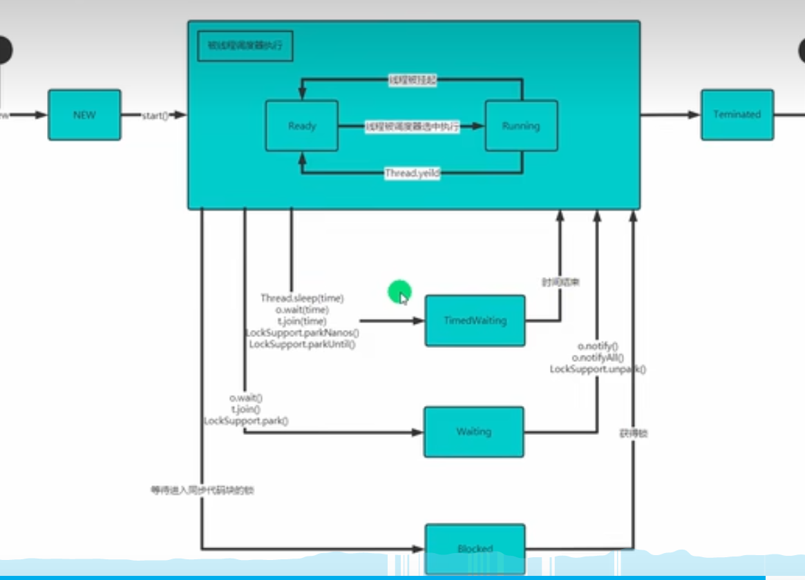

#  多线程基础

##  线程使用

1. 继承Thread

   ```java
   /**
    * @author ECHOm6
    * @version 1.0
    * @Summary 多线程使用
    */
   public class m_Cpu {
       public static void main(String[] args) throws InterruptedException {
           Cat cat = new Cat();
           cat.start();
           //关于为什么不直接调用run方法而是调用start方法：
           //start底层机制会开启多线程并发执行，宏观上，main和cat的线程可以同时执行
           //如果直接调用run不会触发多线程而是串行执行，会把run方法的线程执行完才会继续执行；
           for (int i = 0; i < 10; i++) {
               System.out.println("正在执行主线程"+Thread.currentThread().getName());
               Thread.sleep(1000);
           }
       }
   }
   class Cat extends Thread{
       @Override
       public void run() {
           int count=0;
           //执行输出程序
           while(true){
               try {
                   count++;
                   System.out.println("正在执行线程"+Thread.currentThread().getName());
                   Thread.sleep(1000);
               }catch (Exception e){
                   System.out.println(e);
               }
               if(count==10)break;
           }
       }
   }
   ```

   

2. 实现Runnable（**适合多线程，避免了单继承的限制**）

   ```java
   /**
    * @author ECHOm6
    * @version 1.0
    * @Summary 使用接口可以避免单继承的限制
    */
   public class m_Runnable {
       public static void main(String[] args) {
           System.out.println("这里是线程"+Thread.currentThread().getName());
           Dog dog = new Dog();
           //实现了Runnable但是不能直接使用start方法，
           Thread thread = new Thread(dog);//底层使用代理模式实现
           thread.start();//底层流程start->start0->run(判断target是否为空）->（不为空调用target.run()方法）
       }
   }
   class Dog implements Runnable{
       @Override
       public void run() {
           System.out.println("正在执行线程"+Thread.currentThread().getName());
           try {
              Thread.sleep(1000);
           }catch (InterruptedException e){
               e.printStackTrace();
           }
       }
   }
   ```


##  线程退出

> 使一个线程能控制另一个线程的变量使其退出

```java
/**
 * @author ECHOm6
 * @version 1.0
 * @Summary
 */
public class m_t_Exit {
    public static void main(String[] args) throws InterruptedException {
        Exit_mt exit_mt = new Exit_mt();
        new Thread(exit_mt).start();
        Thread.sleep(10*1000);//使主线程休眠十秒钟，然后停止子线程
        exit_mt.setFlag(false);
        
    }
}
class Exit_mt implements Runnable{
    private boolean flag=true;

    public void setFlag(boolean flag) {
        this.flag = flag;
    }
    @Override
    public void run() {
        while (flag){
            System.out.println("线程"+Thread.currentThread().getName()+"正在执行");
            try {
                Thread.sleep(1000);
            }catch (InterruptedException e){
                e.printStackTrace();
            }
        }
    }
}
```


##  线程常用方法

###  一组

- setName//设置线程名，使其与参数name相同
- getName//返回线程名称
- start//使线程开始执行，jvm底层调用start0方法
- run //调用线程对象run方法
- setPriority//更改线程优先级
- getPriority//获取线程优先级
- sleep//指定毫秒内休眠当前线程
- interrupt//中断线程（*注意不是终止*）

###  二组

- yield//线程礼让（不确定性让出cpu）
- join//线程插队

###  三组

- 守护线程（当其他用户线程结束，自动结束）

  `对象名.setDaemon(true)`

#  线程生命周期

##  示意图



##  七（六）大状态


#  线程同步机制（同一对象下的线程）

##  synchronized

> 同一时刻*只允许一个线程*对某一内存地址进行*操作*

1. 同步代码块

   `synchronized （对象）{}`

2. 方法同步

   `public synchronized void met(){}`

###  同步原理

> *互斥锁*：程序执行效率低，同时刻只能一个线程操作；锁可以是对象/this（同一对象）

- 当synchronized加在*静态方法*中，则*锁加在类上*：**类名.class**

  ```java
  public static void m(){
      synchronized （Sell.class）{//注意不可使用this
          
      }
  } 
  ```

> *死锁*：一个同步代码块里需要使用其他对象锁，并且两个线程同时启动了

- 死锁示例

  ```java
  class Die_block{
      public static void main(String[] args){
   		   D1 d=new D1(true);
          D1 d1=new D1(false);
          Thread t=new Thread(d);
          Thread t1=new Thread(d1);
          //此时两个线程不同对象同时启动
          t.start();
          t1.start();
      }
  }
  class D1 implements Runnable {
      boolean flag;
      public D1(boolean flag){
          this.flag=flag;
      }
      public void met2(){
          if(flag){
              synchronized (t){
                  System.out.println("区块一");
                  synchronized (t1){//此时申请t1锁时，t1已经被占用
                      System.out.println("区块二");
                  }
              }
          }else{
              synchronized (t1){
                  System.out.println("区块一");
                  synchronized (t){//此时申请t锁时，t已经被占用
                      System.out.println("区块二");
                  }
              }
          }
      }
  }
  ```

> *释放锁*：释放时机&不会释放情况

- 释放时机：break、return或该代码块执行完毕；出现异常、方法调用wait方法使线程暂停
- 不释放：线程调用sleep、yield，线程挂起 