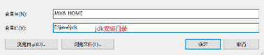

# Java概述

### 起源

- 1995年Java第一个版本发布，gosling

- 技术体系：

  ​			Java SE（Java Standard Edition）标准版

  ​				支持面向桌面应用的Java平台，提供完整Java核心API；

  ​			Java EE（Java Enterprise Edition）企业版

  ​				为企业环境下应用程序提供的解决方案，包含技术：Servlet，JSP等，针对Web应用程序开发

  

### 特点

- 面向对象（object-oriented programming)
- 强类型，异常处理，垃圾回收机制等
- 跨平台性（编译后的xx.class可在多平台运行）
- 解释型语言（编译后不能直接运行，需要解释器）

### JDK/JRE

- JDK全称（Java Development Kit）-->（开发）

  ​			JDK = JRE + Java开发工具【java，javac,javadoc,javap等】

- JRE全称（Java Runtime Environment）-->（运行）

  ​			JRE = JVM + Java核心类库

  

### 环境配置

- 在环境变量新建JAVA_HOME:

  

- 点击PATH添加：

  ​				

### 代码规范

- 用javadoc书写类和方法的注释

- 非javadoc注释，写给开发者阅读

- 源文件编码：UTF-8

  
