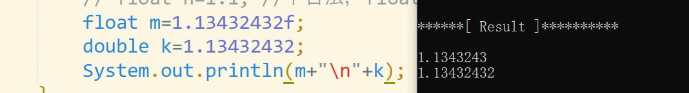
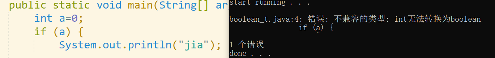
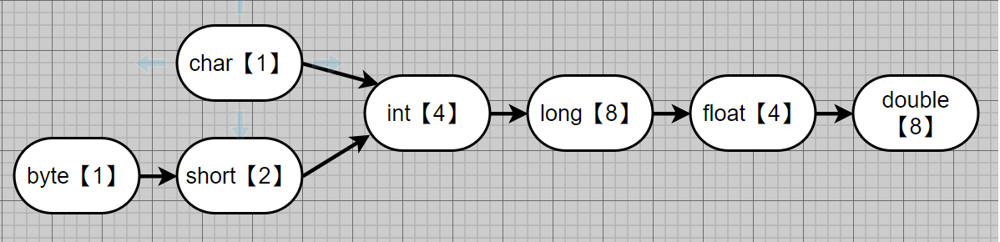
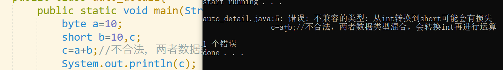

# Java 数据类型、转换

1. ## 基本类型（注意浮点型运算）

   - ### 整型（byte[1], short[2], int[4],long[8]）

     > ​	注意：long型变量值后加‘l'/'L';如：long n=12L 

     ​	

   - ### 🚩浮点型 （float[4], double[8]）数据必须有小数点

     > ​	注意：
     >
     > 1. 🎈Java默认小数为double，float型变量值后加’f'/'F';如：float n=1.1F
     >
     > 2. 🎈推荐使用double，精准度高，可用于未知数据大小
     >
     >    

     ------

     ```JAVA
     /**
     *@notice:🚩🚩🚩浮点数运算结果
     */
     public class float_mis{
         public static void main(String[] args){
             double n=8.1/3,m=3.2;
             Stystem.out.println(n);
             //注意，此时输出的结果为2.69999997，并不是2.7；所以浮点数比较大小时应该用下面方法
             Math.abs(n-m)<0.001;
             //此时精度0.001可以根据实际需求改变
         }
     }
     ```

     > ### 🚩Java中允许小数取模：10.5%3 ===》10.5 - 10.5/3*3=1.5 ;   
     >
     > ### 🚩注意***`小数`***参与运算结果是`近似值` 

     ​		📃资源推荐：

     [Java8 API]: https://www.matools.com/api/java8

     

   - ### 字符型
   
     ​		可参与算术运算，即对应ASCII码计算
   
     > 1. ASCII码只表示了128个字符，一字节可存储256个字符
     > 2. Unicode 字母和汉字都是占用2字节，空间浪费（无乱码现象）
     > 3. utf-8 汉字：3字节，字母：1字节
     > 4. gbk 汉字：2字节，字母：1字节（使用广泛）	

     
   
   - ### 布尔型（boolean只能表示false、true）
   
     ```java
     public class boolean_t{
         public static void main(String[] args){
             boolean isflag=true;
             int a=0;
             /*if(a){
                 //代码块
             }*/
             //🎈这种方法是错误的
             //🎈java中的逻辑判断只能用boolean型
         }
     }
     ```

     

     

     

   ## 2.类型转换

   ### 		 自动转换

   - 所占字节小的自动转换为字节大的进行运算，🎈最后结果类型为表达式以最大字节类型

     赋值时，系统会判断该值是否符合该类型变量大小

   - 🎈<u>byte、short与char不发生自动转换，可进行运算；***都转换成int型计算***</u>	

   - boolean不参与转换

     
   
     ### 	强制转换
   
   > - 内存 大 的转换成内存 小 的
   > - int  a=(int)1.9; 
   > - 会造成内存溢出，精度损失问题

​					

### 						 String类型转换

```java
public class string_detail{
	public static void main(String[] args) {
		//基本类型--->string
		int a=123;
		float b=123f;
		double c=123.4;
		String d1=a+"";
		String d2=b+"";
		String d3=c+"";
        //此时d系列变量为字符串
		System.out.println("这是字符串型：");
		System.out.println(d1);
		System.out.println(d2);
		System.out.println(d3);
		//string--->基本类型
		int n1=Integer.parseInt(d1);
		float n2=Float.parseFloat(d2);
		double n3=Double.parseDouble(d3);
		System.out.println("这是基本型：");
		System.out.println(n1);
		System.out.println(n2);
		System.out.println(n3);

		//取出字符串中某一个字符
		char s=d1.charAt(2);//取出第三个字符，默认从0开始编号
		System.out.println(s);
	}
}
```

