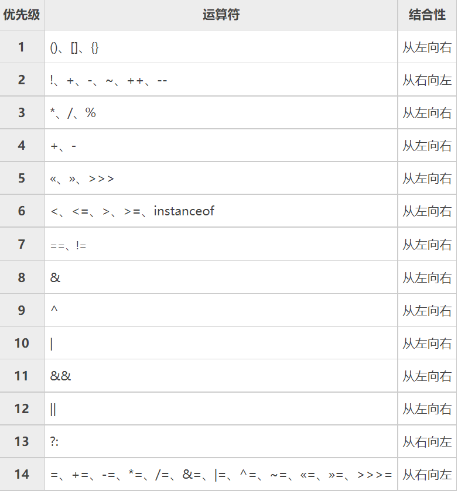

# Java运算符

## 		1.算术运算

```java
public class ArithmeticOperations{
	public static void main(String[] args) {
		System.out.println(10/4);//🎈两数均为整型,结果还是整型
		System.out.println(10.0/4);//🎈有一个数为double，结果为2.5
		double a=10/4;
		System.out.println(a);//🎈结果为2.0，计算结果为整数，后赋值给变量a

		/**取模运算
		* 10 % -3 = 1
		* -10 % 3 = -1
		*🎈取模结果的正负与前面一个数有关
		*/
		System.out.println(-10%3);

		/**
		 * 自增自减
		 * 面试题，讲出为什么
		 */
		int i=1,k=1;
		// 当相同变量出现时会创建临时变量tmp
		i=i++;//1(1)tmp=i;(2)i=i+1;(3)i=tmp;
		k=++k;//2(1)k=k+1;(2)tmp=k;(3)k=tmp;
		System.out.println(k);
	}
}
```


## 		2.关系运算

```java
public class RelationalOperators{
	public static void main(String[] args) {
		int a=1,b=2;
		boolean c;
		System.out.println(a>b);
		System.out.println(a<b);
		/**
		 * 🎈比较后为布尔值因此可以赋值给boolean变量c
		 */
		c=a>=b;
		System.out.println(c);
	}
}
```


## 			3.逻辑运算

> /**
> 		 🎈* 逻辑运算的结果也是boolean型
> 		 🎈* 1.&&和||短路现象，&和|不会
> 		 🎈* 2.！ ^
>
> ​		 🎈* if(a<0 && ++b<4) 当前者判断为false，出现短路，++b不会执行
> ​		 🎈* if(a<0 & ++b<4)  当前者判断为false，还会往后执行
>
> ​		 🎈* if(a<0 || ++b<4)当前者判断为ture，出现短路，++b不会执行
> ​		 🎈* if(a<0 | ++b<4) 当前者判断为ture，继续往后执行
>
> */


## 	4.赋值运算

```java
public class assignmentOperation{
	public static void main(String[] args) {
		/**
		 *🎈 复合运算：+=，-=，*-，/=，%=
		 * 🎈此时会发生强制类型转换
		 */
		byte a=1;
        a++;
		a+=2;
		a=a+2;
		System.out.println(a);//3
	}
}
```

> 注意：🎈a=a+2，**编译报错**，因为byte,short,char运算会**自转为int型**
>
> ​			🎈a+=2和a++运算过程等价a=a+2，但是***两者会类型转换a=(byte)(a+2);***


## 	5.优先级



大致可分为以下大类排序：

1. ()	{}	.	,
2. 单目运算符
3. 算术运算符
4. 比较运算符
5. 逻辑运算符
6. 三目运算符
7. 赋值运算符


##  	6.标识符命名规则与规范

- ### 		规则

> 1. ​	只能由数字，字母，_,$组成
> 2. ​    开头不能为数字，不能包含空格
> 3. ​    严格区分大小写
> 4. ​    不可用关键字和保留字命名

​		

- ### 		规范

> 1. 包名字母小写，形式：aaa.bbb.ccc；如：com.hsp.crm
> 2. 类名，接口名为多单词组成，形式：XxxYyyZzz；如：ThankShotGame
> 3. 变量名，方法名为多单词组成，形式：xxxYyyZzz；如：thankShorGame
> 4. 常量，形式：XXX_YYY_ZZZ；如：TAX_RATE

