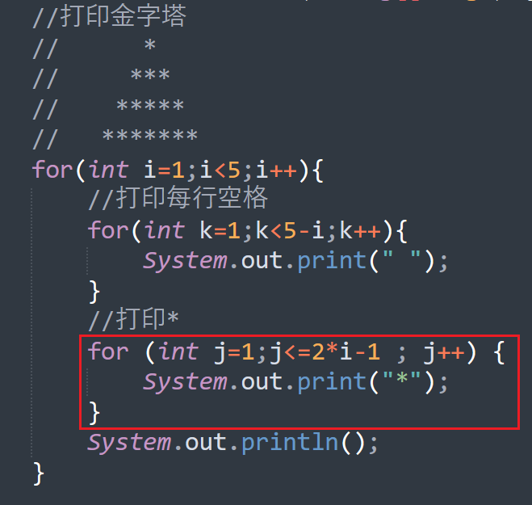
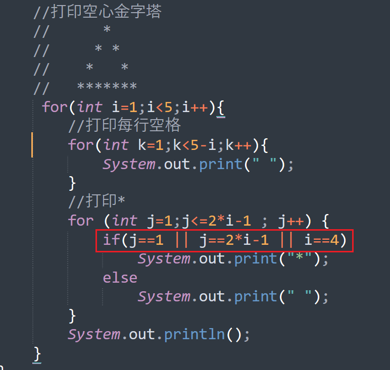
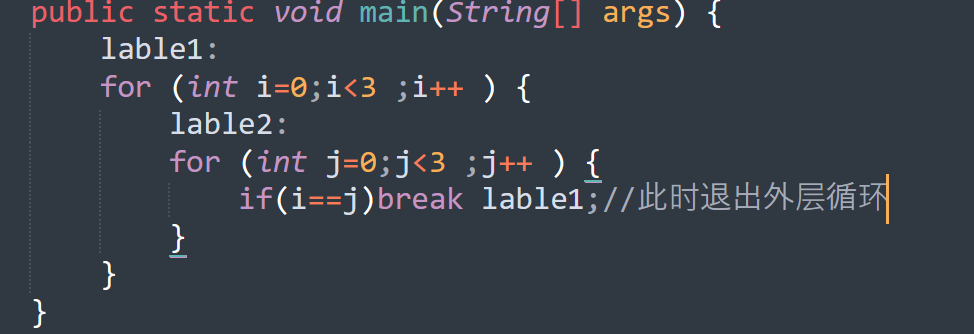
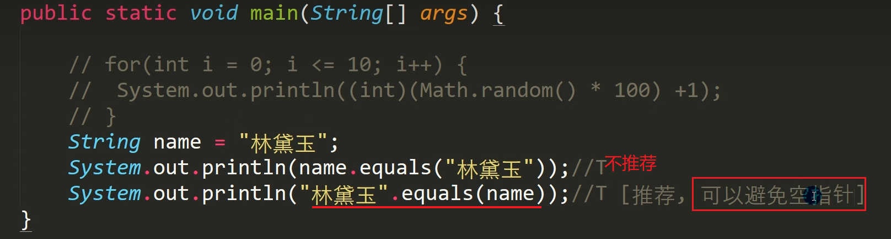

# 顺序结构

### 	即程序从上到下依次执行


# 分支结构

## 		1.if...else{}

> ​	注意：if(表达式)可以为赋值语句；当没有{}时if与最近的else配对。

## 		2.switch（表达式）{}

```java
public class Sw{
    public static void main(String[] arg){
        double a=1.1;
        switch(a){//不合法
            case 1.1://不合法
                a=2;
                break;
        }
    }
}
```

> ​	1.表达式类型只能为：byte，short，int，char，String，enum
>
> ​	2.表达式类型要与case后常量一致，或者表达式可以自动转换为常量对应类型；
>
> ​		如：switch('a'){case 97 :代码块}
>
> 🚩3.注意switch结构中case对应是否有break；


# 循环结构

### 1.for循环

```java
public class for_det{
    public static void main(String[] args){
        for(int i=0;i<5;i++){
            System.out.printIn(i);
        }
    }
}
```


### 2.while循环

#### while

```java
public class whiel_det{
    public statix void main(String[] args){
        int i=0;
        while(i<5){
            Syetem.out.printIn(i);
            i++;
        }
    }
}
```

#### do{	}while();

```java
public class do_det{
    public static void main(String[] args){
        int i=0;
        do{
            System.out.printIn(i);
            i++;
        }while(i<5);
    }
}
```


## 实践






# 拓展

> 1. break不止用于switch；还可用于循环。
> 2. break、continue配合标签可 退出/执行下一次 指定标签的循环（不推荐使用标签）

>   🚩3.String类型比较使用`equals方法`

