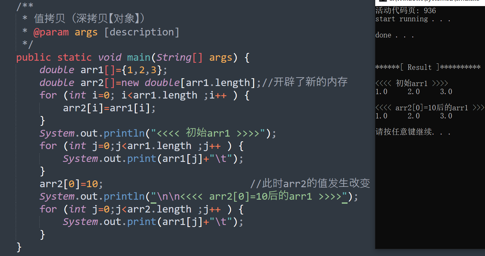
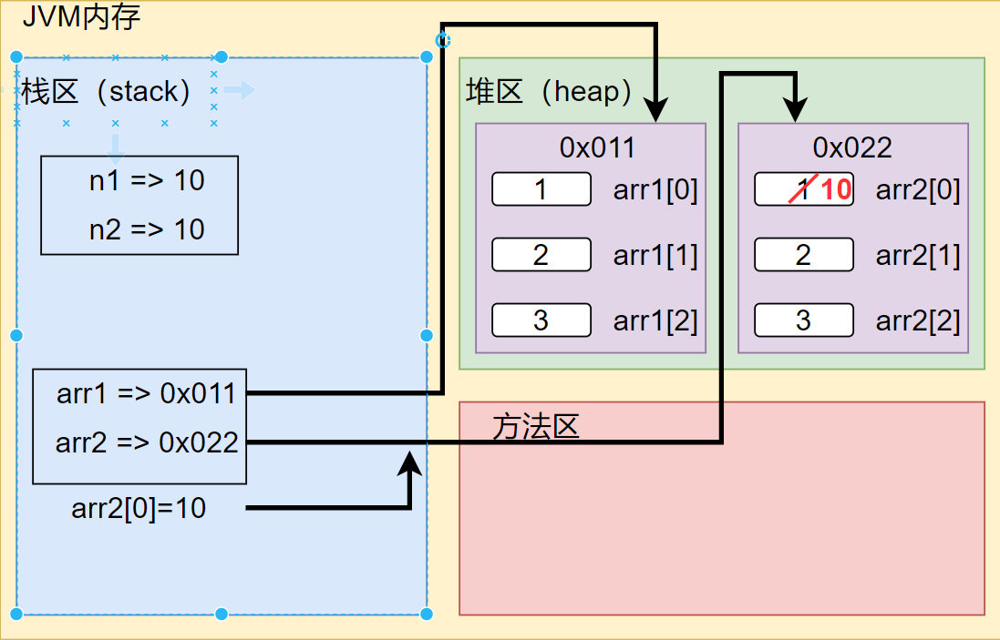
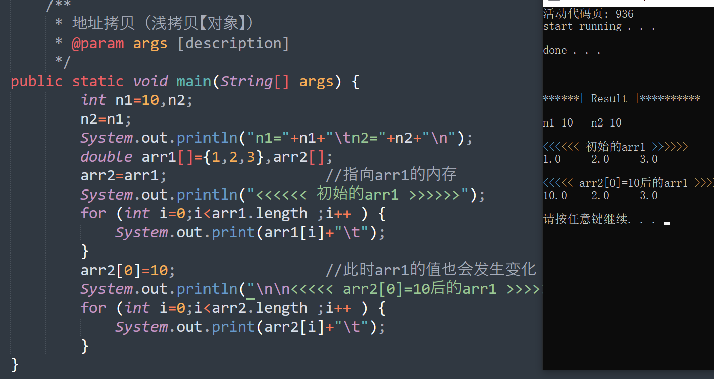
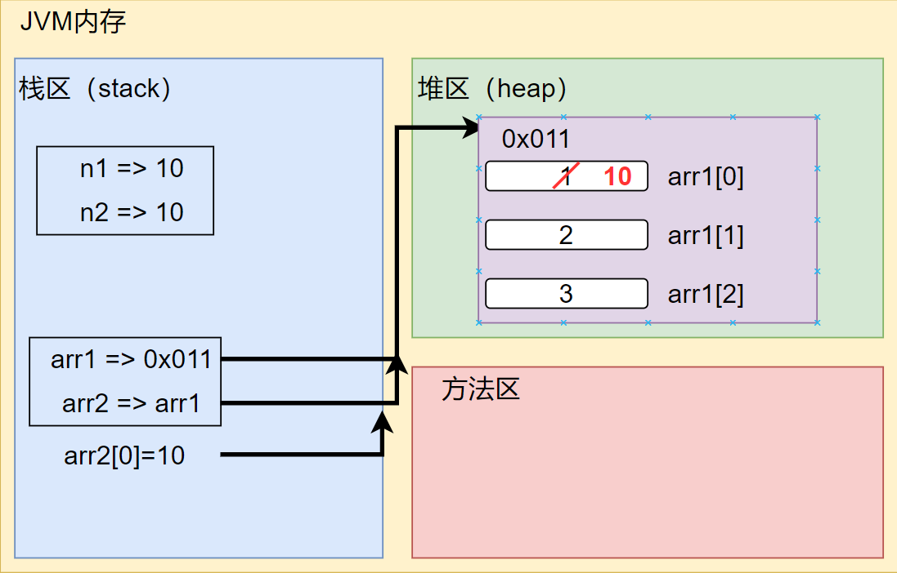

# 数组的使用

## 		1.定义和初始化

1. ​    ` double[] arr=new double[5];`
2. ​    `double[] arr1;  arr1=new double[5];`
3. ​    `double arr2[]={1,2,3};`


## 2.拷贝 

### 			2/1.值拷贝



> 内存分析：
>
> 

### 2/2.地址拷贝



> 内存分析
>
> 


## 3.扩容与缩小

### 3/1.数组扩容

```java
import java.util.Scanner;
public class arrExpand{
	/**
	 * 数组扩容
	 * @param args [description]
	 */
	public static void main(String[] args) {
		Scanner scan=new Scanner(System.in);
		double arr[]={1,2,3};
		char flag;
		do{
		double tmp[]=new double[arr.length+1];
		for (int i=0;i<arr.length ;i++ ) {
			tmp[i]=arr[i];
		}
		System.out.println("请输入扩容数据：");
		tmp[tmp.length-1]=scan.nextInt();
		arr=tmp;
		for (int j=0;j<arr.length ;j++ ) {
			System.out.print(arr[j]+"\t");
		}
		System.out.println("是否继续扩容：（y/n）");
		flag=scan.next().charAt(0);
	}while(flag=='y');
	}
}
```

### 3/2.数组缩小

```java
import java.util.Scanner;
public class arrNarrow{
	public static void main(String[] args) {
		double arr[]={1,2,3};
		Scanner scan=new Scanner(System.in);
		char flag;
		do{
			double tmp[]=new double[arr.length-1];
			if(tmp.length>0){
				for (int i=0;i<tmp.length ;i++ ) {
				tmp[i]=arr[i];
			}
			arr=tmp;
			for (int j=0;j<arr.length ;j++ ) {
				System.out.print(arr[j]+"\t");
			}
			System.out.println("是否继续缩小：（y/n）");
			flag=scan.next().charAt(0);
			}else{
			flag='n';
			System.out.println("不可再缩小！！！");
			}
		}while(flag=='y');
		
	}
}
```

## 4.排序和查找

### 4/1冒泡排序

```java
public class bubbleSort{
	public static void main(String[] args) {
		int arr[]={12,2,34,3,1,55,32,5};
		int tmp;
		for (int i=0;i<arr.length-1 ;i++ ) {
			for (int j=0;j<arr.length-1-i ;j++ ) {
				if(arr[j]>arr[j+1]){
					tmp=arr[j];
					arr[j]=arr[j+1];
					arr[j+1]=tmp;
				}
			}
		}
		for (int i=0;i<arr.length ;i++ ) {
			System.out.print(arr[i]+"\t");
		}
	}
}
```

### 4/1快速查找

```java
import java.util.Scanner;
public class fastSort{
    public static void main(String[] args){
        String arr[]={"Cpro","java","php","python"},content;
        int IndexOf=-1;
        Scanner scan=new Scanner(System.in);
        System.out.println("请输入查找内容：");
        content=scan.next();
        for(int i=0;i<arr.length;i++){
            if(content.equals(arr[i])){
                IndexOf=1;
                System.out.println("已经找到");
            }
        }
        if(IndexOf==-1){
            SyStem.out.println("没有找到你需要的内容");
        }
    }
}
```


# 多维数组

## 1.定义和初始化

1.`double  arr [ ] [ ]=new double [1] [2];`

2.`double arr1[][]={{1,1,1},{2,2,2}};`

> 3.`🚩double arr2[][]=new double[2][];`
>
> ​	`🚩arr2[i]=new double[3]`
>
> ```java
> public class twoDimensional{
> 	public static void main(String[] args) {
> 		//输出
> 		//1
> 		//2 2
> 		//3 3 3
> 		int arr[][]=new int[3][];
> 		for (int i=0;i<arr.length ;i++ ) {
> 			arr[i]=new int[i+1];	//这里需要对一维数组再初始化
> 			for (int j=0;j<arr[i].length ;j++ ) {
> 				arr[i][j]=i+1;
> 				System.out.print(arr[i][j]+"\t");
> 			}
> 			System.out.println();
> 		}
> 	}
> }
> ```


## 2.杨辉三角

```java
public class yangHuiTriangle{
	public static void main(String[] args) {
		int arr[][]=new int[5][];
		for (int i=0;i<arr.length ;i++ ) {
			arr[i]=new int[i+1];//该位置配合第3行代码继续二维数组初始化
			for (int j=0;j<arr[i].length ;j++ ) {
				if(j==0 || j==arr[i].length-1){
					arr[i][j]=1;
				}else{
					arr[i][j]=arr[i-1][j]+arr[i-1][j-1];
				}
				System.out.print(arr[i][j]+"\t");
			}
			System.out.println();
		}
	
		
	}
}
```


# 🚩总结

### 1.数组定义方式

> #### 一维数组：
>
> int arr[]=new int[3];		
>
> int[] arr=new int[3]
>
> #### 二维数组：
>
> int arr[] []=new int [1] [2];	
>
> int [] [] arr=new int [2] [2];	
>
> int[] arr[]=new int[2] [2];
>
> 👇以下用法需要在合适位置进行一维数组初始化（arr[i]=new int [3]）
>
> int [] [] arr=new int[2] [];	

### 2.数组初始化方式

> #### 一维数组：
>
> int arr[]={1,2,3};
>
> int arr[]=new int[`⚡此处不可写具体数字`]{1,2,3};
>
> #### 二维数组：
>
> int arr[] []={{1,2,3},{4,5,6}};
>
> int arr[] []=new int[] []{{1,2,3},{4,5,6}}

