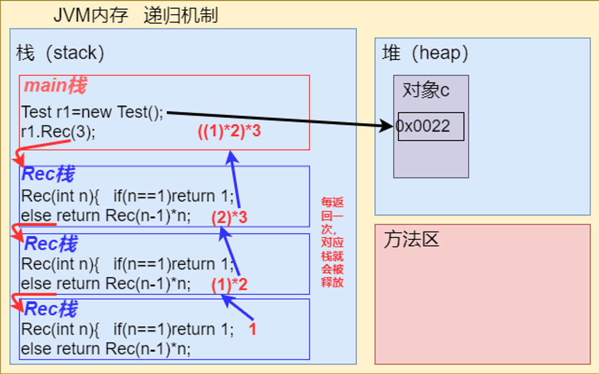

##  方法递归

###  1.递归机制：



### 2.经典案例：

- ####  迷宫问题：

```java
public class maze{
	public static void main(String[] args) {
		int[][] map=new int[8][8];//设置迷宫
		for (int i=0;i<map.length ;i++ ) {
			map[0][i]=1;
			map[i][0]=1;
			map[7][i]=1;
			map[i][7]=1;
		}
		Mig m=new Mig();
		m.prints(map);
		m.findway(map,1,1);
		System.out.println("=======路径========");
		m.prints(map);
	}
}
class Mig{
	public void prints(int[][] map){
		for (int i=0;i<map.length ;i++ ) {
			for (int j=0;j<map.length ;j++ ) {
				System.out.print(map[i][j]+" ");
			}
			System.out.println();
		}
	}
	public boolean findway(int[][] map,int x,int y){
		if(map[6][6]==2){
			return true;
		}else{
			/**
			 * 0表示没有走过，1为障碍，2为可走，3为走过不通
			 */
			if(map[x][y]==0){
				map[x][y]=2;
				//策略为先右后下，先左后上
                //不同策略路径长度不同
				if(findway(map,x,y+1))return true;
				if(findway(map,x+1,y))return true;
				if(findway(map,x,y-1))return true;
				if(findway(map,x-1,y))return true;
				map[x][y]=3;
				return false;
			}else{
				/**
				 * 这里表示1,2,3都不可走，
				 * 2时表示死路在走回头路，路径返回false重新规划路径
				 */
				return false;
			}
		}
	}
}

```


- ####  猴子吃桃：

```java
public class peach{
	public static void main(String[] args) {
		Pea p1=new Pea();
		int total1=p1.monkey(1);
		System.out.println(total1);
	}
}
class Pea{
	public int monkey(int day){
		if(day==10){
			return 1;
		}else{
            //第一天吃了n/2-1,通过回溯，第一天相对第二天个数为:n1=(n2+1)*2
			return (monkey(day+1)+1)*2;
		}
	}
}
```


- ####  汉诺塔：

```java
public class hanooTower{
	public static void main(String[] args) {
		Hn h=new Hn();
		h.move(2,'a','b','c');
	}
}
class Hn{
	public void move(int num,char a,char b, char c){
		if(num==1){
			System.out.println(a+"->"+c);
		}else{
            //把最下面一张作为一个个体，上面所有牌作一个整体
            //所有牌经历一下情况：
            //A->C;C->B;B->A;A->C
		move(num-1,a,c,b);
		System.out.println(a+"->"+c);
		move(num-1,b,a,c);
		}
	}
}
```


##  方法重载

> 1. #####  方法名*必须*相同
>
> 2. #####  形参类型 或 形参顺序或形参个数不同（⚡形参名不同不可认为是重载）
>
> 3. #####  返回类型，无要求特定类型

```java
public class overLoad{
	public static void main(String[] args) {
		Oload o=new Oload();
		o.sum(1,2);
		System.out.println(o.sum('A'));
	}
}
class Oload{
	public void sum(int a,int b){
		System.out.println(a+b);
	}
	public char sum(char c){
		return (char)(c+32);
	}
}
```


##  可变参数

> #####  形式：public void varpar(int...  nums){ }
>
> #####  本质：数组
>
> #####  注意：
>
> 1. ⚡实参可以是数组
> 2. ⚡可变参数在参数列表最后
> 3. ⚡一个形参列表只能有一个可变参数

```java
public class varParameter{
	public static void main(String[] args) {
		Varp v=new Varp();
		System.out.println(v.score("jack",60,91));
	}
}
class Varp{
	public String score(String name,double... score){
		double sum=0;
		for (int j=0;j<score.length ;j++ ) {
			sum+=score[j];
		}
		return name+"总共有"+score.length+"门课；总成绩为："+sum;
	}
}
```


##  作用域

> 1. java中变量主要分为成员属性和局部变量（在代码块中）
> 2. 若有同名局部变量和属性，就近使用
> 3. 初始化：⚡成员属性可以不初始化（有默认值），局部变量必须初始化（没有默认值）
> 4. 生命周期：局部变量随方法销毁而销毁，属性随对象销毁而销毁
> 5. 修饰符：**局部变量不可加修饰符**

```java
public class Scope{
	public static void main(String[] args) {
		Sp s=new Sp();
		s.s2();
		s.s3();
		System.out.println(s.v);
	}
}
class Sp{
	int v=1;
	public void s1(){
		int n=1;
		System.out.println(n);
	}
	public void s2(){
		v=10;	System.out.println(v);
	}
	public void s3(){
		System.out.println(v);
	}
	
}
```


##  构造器

> 1. 与类名一致
>
> 2. **没有返回值**，不能写上void，
>
>    形式：`public Per(){  }`
>
> 3. 构造器由系统**自动**调用（在new的时候触发）
>
> 4. 作用：对新对象的**初始化**
>
> 6. 注意：
>
>    - 和方法一样支持重构
>   - 和方法一样形参列表
>    - 没有定义构造器默认会创建构造器：`Per(){}`
>    - 🚩若定义构造器后，再次创建新对象必须传参：`Per p=new Per("name");`如果***想继续无参创建对象***需要**显式定义**无参构造器：`Per(){}`

```java
public class Constructor{
	public static void main(String[] args) {
		Cons c=new Cons("OG8",399);
		System.out.println(c.name);
		Cons c1=new Cons("Fl");
		System.out.println(c1.name);
	}
}
class Cons{
	String name;
	int price;
	//Constructor
	public Cons(String Cname ,int Cprice){
		System.out.println("Constructor is called");
		name=Cname;
		price=Cprice;
	}
	//Constructor overload
	public Cons(String Cname){
		System.out.println("Constructor overload");
		name=Cname;
	}
}
```

