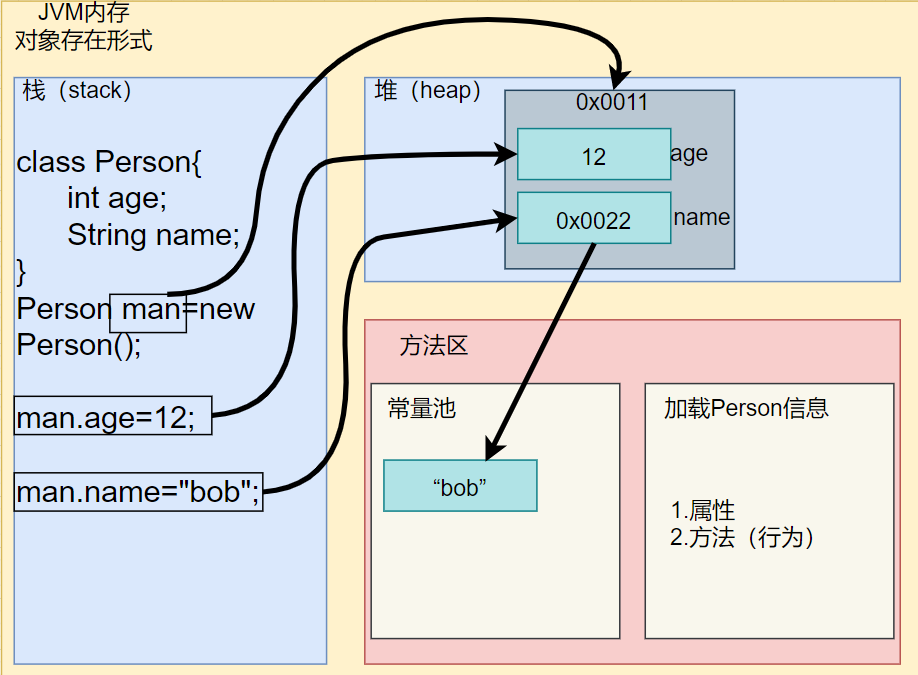
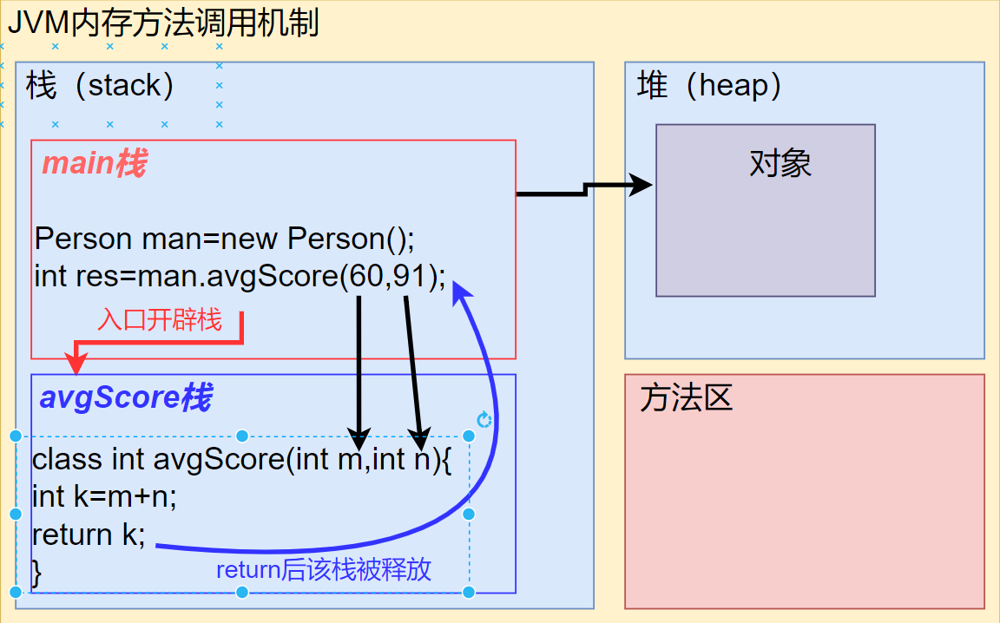
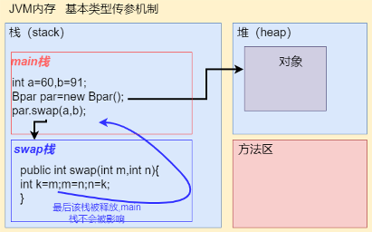
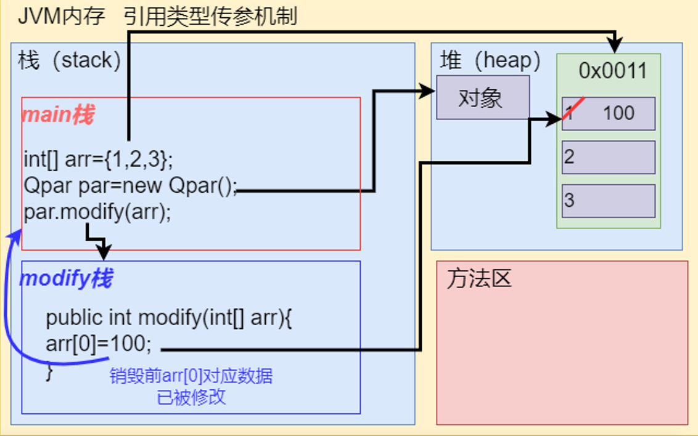
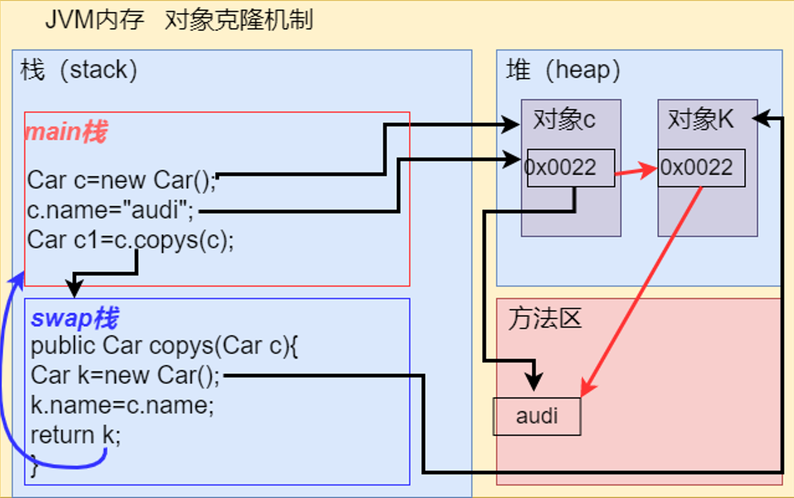

# 类与对象

## 1.定义类与实例化对象

```java
public class Obj01{
    public static void main(String[] args){
        //实例化对象
       Cat xde=new Cat();
        
    }
}
//定义人类
class Cat{
     int age;
     String name;
}
```

## 2.成员属性和方法定义

```java
class Cat{
    //访问修饰符 类型 属性名
    public int name;
    //访问修饰符 返回值类型 方法名(){}
    public int avg(int n,int m){
        //具需求
        return 0;
    }
    //若返回类型为void则不需要return
}
```

## 3.属性使用，方法调用

```java
public class Obj02{
    public static void main(String[] args){
        Person man=new Person();
        man.age=12;
        man.name="bob";
        int res=man.avgScore(60,91);
    }
}
class Person{
    public int age;
    public String name;
    //返回多个结果用数组，类型为int[]
    public int avgScore(int n,int m){
        int res=m+n;
        return res;
    }
}
```





> 1.方法可以有0或多个返回值
>
> 2.返回值类型可以为任意类型（基本、数组，对象）必须与定义的一致，或可发生自动转换

### 3/1.🚩本类调用和跨类调用方法

```java
public class Obj03{
    public static void main(String[] arg){
        Per m=new Per();
    }
}
class p1{
    public void f1(){
        System.out.println("f1")；
    }
    public void f2(){
        //⚡调用本类f1，直接调用
        f1();
    }
    public void f3(){
        //⚡调用p2类g1方法
        //⚡此时要实例化p2
        p2 n=new p2();
        n.g1();
    }
}
class p2{
    public void g1(){
        System.out.println("g1")
    }
}
```

### 3/2.🚩基本类型传参和引用类型传参（值传递，址传递）

#### 3/2/1.basicParameter

```java
public class basicParameter{
	public static void main(String[] args) {
		int a=10;
		int b=20;
		System.out.println("未调用前a,b："+a+","+b);
		Bpar par=new Bpar();
		par.swap(a,b);
		System.out.println("main调用Bpar的swap方法后a,b："+a+","+b);
	}
}
class Bpar{
	public void swap(int a, int b){
		int tmp;
		tmp=a;
		a=b;
		b=tmp;
		System.out.println("swap方法内a,b："+a+","+b);
	}
}

```




#### 3/2/2.quoteParameter

```java
public class quoteParameter{
	public static void main(String[] args) {
		int[] arr={1,2,3};
		System.out.println("初始arr");
		for (int i=0;i<arr.length ;i++ ) {
			System.out.print(arr[i]+"\t");
		}
		Qpar par=new Qpar();
		par.modify(arr);
		System.out.println("\n\n调用Qpar的modify方法后arr:");
		for (int i=0;i<arr.length ;i++ ) {
			System.out.print(arr[i]+"\t");
		}
	}
}
class Qpar{
	public void modify(int[] arr){
		arr[0]=100;
		System.out.println("\n\nmodify方法内arr:");
		for (int i=0;i<arr.length ;i++ ) {
			System.out.print(arr[i]+"\t");
		}
	}
}
```




## 4.对象拷贝

```java
public class objCopy{
	public static void main(String[] args) {
		Car c1=new Car();
		c1.name="audi";
		c1.price="40w";
		System.out.println("c1:价格\t品牌"+"   "+c1.price+"\t"+c1.name);
		System.out.println();
		Car c2=c1.copys(c1);
		System.out.println("c2:价格\t品牌"+"   "+c2.price+"\t"+c2.name);
		c2.name="BMW";		//此时name重新开辟内存
		System.out.println();
		System.out.println("c2修改后:价格\t品牌"+"   "+c2.price+"\t"+c2.name);
	
	}
}
class Car{
	String price;
	String name;
	public Car copys(Car audi){
		Car cp=new Car();
		cp.name=audi.name;
		cp.price=audi.price;
		return cp;
	}
}
```

