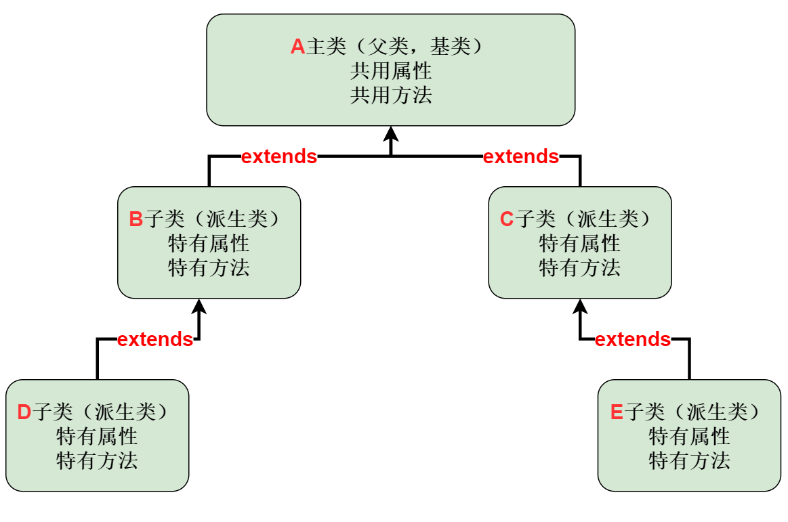
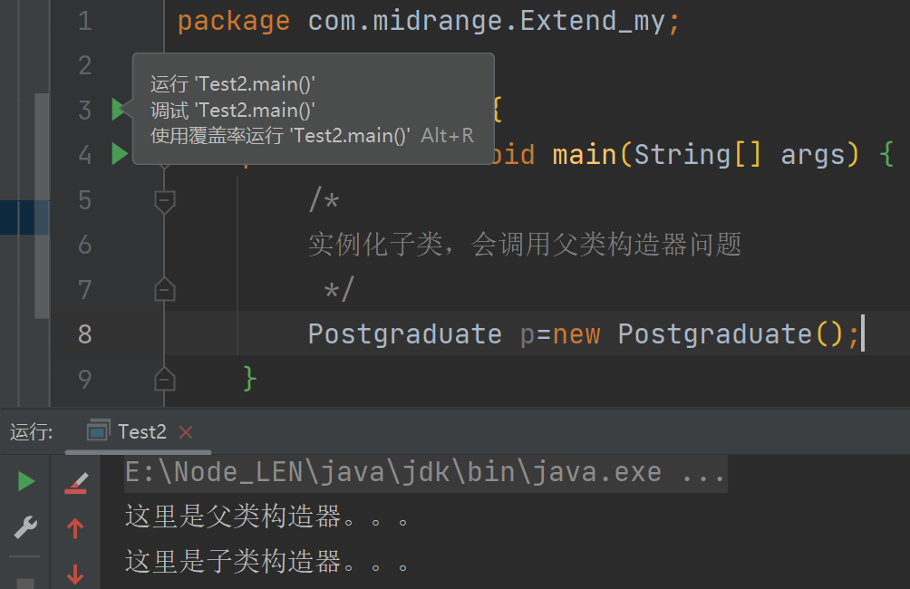
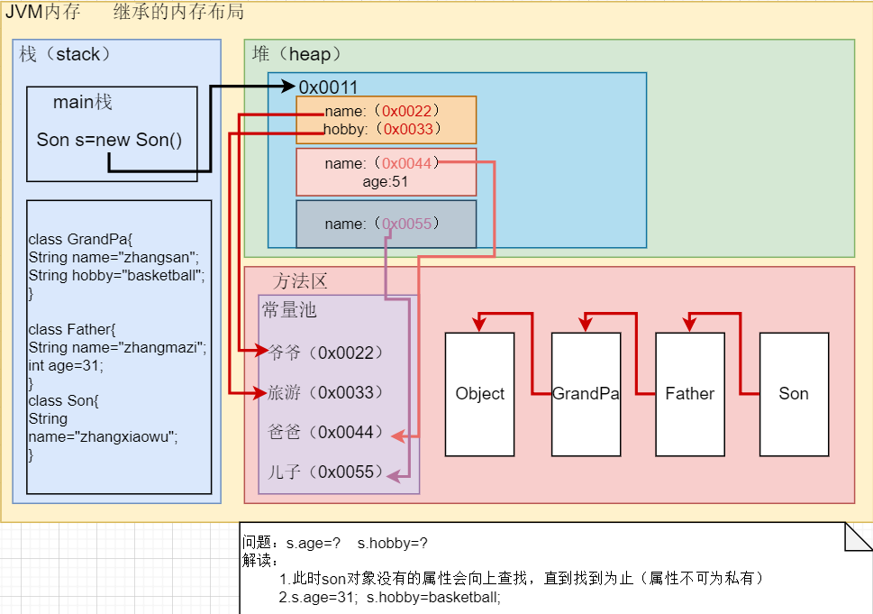

[TOC]


#  面向对象三个基本特征

##  1.封装（encapsulation）

> ~把属性和方法"封装 "在一起，数据被保护在内部，程序其他部分只有"授权"才能操作

###  实现封装的步骤：

- 将属性私有化（private）

- 提供公共（public）set()方法，用于对属性赋值，判断；（可使用快捷键ALT+INS)  

  ```java
  public 数据类型 setXxx(形参){//Xxx表示某个属性
      //业务逻辑
     //属性=参数
  }
  ```

- 提供公共（public）get()方法，用于获取属性值；

  ```java
  public 数据类型 getXxx(){//Xxx表示某个属性
      return Xxx;
  }
  ```


###  使用构造器配合setXxx()方法

```java
package com.midrange.Encapsulation;

public class Encap01 {
    public static void main(String[] args) {
/*
要求：
    创建Person类，有姓名，年龄，工资，职位
    年龄，工资，职位不可看
 */
        Person p = new Person("Jack",21,30000);
        /*p.setName("OG80");
        p.setAge(21);
        p.setSalary(499);*/
        System.out.println(p.info());
        System.out.println(p.getAge());
    }
}

class Person {
    public String name;
    private int age;
    private double salary;
    Person(String name,int age,double salary){
        setName(name);
        setAge(age);
        setSalary(salary);
    }

    public String info(){
        return "name:"+this.name+"\nage:"+this.age+"\nsalary:"+this.salary;
    }
    public String getName() {
        return name;
    }

    public void setName(String name) {
        if(name.length()>=2 && name.length()<=6) {
            this.name = name;
        }else{
            System.out.println("名字不合法，长度必须在2~6，已经设置默认名字：OG8");
            this.name="OG8";
        }


    }

    public int getAge() {
        return age;
    }

    public void setAge(int age) {
        if(age>=1 && age<=120){
            this.age = age;
        }else{
            System.out.println("年龄不合法，必须在1~120之间，已经设置·默认年龄：18");
            this.age=18;
        }

    }

    public double getSalary() {
        return salary;
    }

    public void setSalary(double salary) {
        this.salary = salary;
    }
}

```


##  2.继承（extends）

> ~解决代码复用，当多个类都有共同属性或者方法时可以使用继承

###  继承示意图



###  继承示例

```java
package com.midrange.Extend_my;

public class Test {
    public static void main(String[] args) {
        College c=new College();
        c.name="李华";c.age=21;
        c.setScore(44);
        c.show();
    }
}
//父类
class Student {
    public String name;
    protected int age;
    private double score;

    public void setScore(double score) {
        this.score = score;
    }
    public void show(){
        System.out.println("name:"+this.name+"\tage:"+this.age+"\tsocre:"+this.score);
    }
}
//子类大学生类
class College extends Student{
    public void test(){
        System.out.println("大学生"+name+"正在考试。。。");
    }
}
```


 ###  继承的细节问题

1. > 子类继承父类**所有**属性和方法，⚡父类的私有属性和方法不可被子类直接访问，需要通过公共类访问
   >
   
   ```java
   public class Test{
       public static void main(String[] args){
      //如果子类想调用修饰符为private的属性和方法，需要借助公共方法间接访问
           Sub s=new Sub();
           s.setAddress();
           s.setF3();
       }
   }
   //父类
   class Father{
       public String name;
       protected int age;
       private String address;
       public void f1(){
   
       }
       protected void f2(){
   
       }
       private void f3(){
   
       }
       //公共方法用于访问私有属性address
       public String setAddress(){
           return this.address;
       }
       //公共方法用于访问私有方法f3
       public void setF3(){
           f3();
       }
   }
   //子类
   class Sub{
       public void s1(){
           f1();f2();//子类可以直接调用这两个方法
           System.out.println(name+"\t"+age);//子类可以访问这两个属性
       }
   }
   ```


2. > 子类会调用父类构造器，完成父类初始化（⚡**涉及`super()`**）
   >

   ```java
   public class Test2{
   	public static void main(String[] args){
   	Postgraduate p=new Postgraduate();
   	}
   }
   //父类学生类
   class Student{
   	Student(){
   	System.out.println("父类构造器。。。")
   	}
   }
   //子类研究生类
   class Postgraduate extends Student {
   	Postgraduate(){
           //super();//开发者不写这个方法，编译时系统也会自动调用
   	System.out.println("子类构造器...");
   	}
       public void test(){
           System.out.println("研究生"+name+"正在考试。。。");
       }
   }
   ```

   

   🚩此时子类构造器在编译时会自动调用super();此时**默认调用父类无参构造器**用于完成父类初始化

3. > 🚩🚩当父类定义有参构造器后（此时无参构造器被覆盖），**子类**构造器必须**显式调用**`super(父类构造器参数列表)`（⚡用参数列表区分调用指定父类构造器）
   >

   ```java
   //类同上述2中一直，此代码展示子类构造器调用super()
   //父类有参构造器
   Student(String name,int age){
   
   }
   //子类构造器可以有参和无参
   Postgraduate(){
       super("zhang",18)//⚡此时参数列表必须一致
   }
   /*Postgraduate(String name,int age){
       super(name,age)//⚡此时参数列表必须一致
   }*/
   ```

4. > `super()`必须在子类构造器首行

5. > `super();  this();`两个方法在同一个构造器中**只能存在一个**

6. > java中的所有类都是Object的子类

7. > Java继承机制为：单继承


###  继承内存分布



> ~若子类没有该属性，则向上查找属性；若查找的属性为私有则编译失败


##   3.多态（Polymor）

###  介绍

> ~方法和对象有多种形态；建立在封装和继承基础之上

1. *方法的多态*（重载和重写体现多态）

2. 🚩🚩🚩*对象的多态*（**核心，重难点**）

   - ⚡对象编译类型和运行类型可以不一致
   - ⚡编译类型在定义对象就已经确定，不可改变
   - ⚡运行类型可变
   - ⚡编译类型定义看  =  左边；运行类型看 =  右边

   > 示例：`Animal animal=new Dog();`        //编译类型为animal；运行类型为Dog
   >
   > ​             `animal=new Cat();`                     //编译类型为animal；运行类型为Cat

###  实战

---   省略动物，食物类细节

```java
//核心对比
//主类调用区别


 public static void main(String[] args) {
        /*
        对象的多态：
        打破传统方法实现多态
       对象多态更加灵活
         */
        Master master=new Master("汤姆");
        Animal animal=new Dog("阿拉斯加");
        Food food=new Bone("狗粮");
        master.showpro(animal,food);
        //此时区别明显，当再次变化动物类和食物类；showpro()方法不需要再次被重载
        System.out.println("=================");
        Animal animal1=new Cat("银渐层");
        Food food1=new Food("猫条");
        master.showpro(animal1,food1);
     /*
     传统多态
     最主要差别
     */
     master.show(cat,fish);
        System.out.println("===============");
        master.show(dog,bone);
    }


/*
    传统思路实现多态
    每次新加子类，必须重构方法
    代码臃余
     */
//人类的方法
    public void show(Cat cat,Fish fish){
        System.out.println(this.name+"正在给"+cat.getName()+"投喂"+fish.getName());
    }
    public  void  show(Dog dog,Bone bone){
        System.out.println(this.name+"正在给"+dog.getName()+"投喂"+bone.getName());
    }


    /*
    对象多态
    
     */
    public void showpro(Animal animal,Food food){
        System.out.println(this.name+"正在给"+animal.getName()+"投喂"+food.getName());
    }
```


###  细节

####  1.向上转型

> ​	本质：父类的引用指向子类
>
> ​	语法：父类类型   引用名= new 子类类型();
>
> ​	特点：
>
> - ​			可调用父类所有成员，
> - ​			不可调用子类特有方法（不是私有方法）；
> - ​			⚡可以调用重写父类的方法（即父类相同的方法）。

####   2.向下转型

> ​	语法：**子类类型   引用名 = （子类类型）父类引用**；
>
> ​	示例：`Dog  dog = (Dog) animal;`
>
> ​	特点：
>
> - ​			强转的是父类的**引用**，不是父类的对象
> - ​          父类引用指向当前类型的对象（`Animal animal=new Dog()`）
> - ​          向下转型后 可以调用子类所有成员

####  3.属性没有重写之说

​	与方法不同：

1. 多态属性调用：

   > Animal animal=new Dog();
   >
   > animal.name;
   >
   > //此时如果两个类都定义了name属性，系统会按照编译类型即Animal的name会被调用

2. 多态方法调用

   > Animal animal=new Dog();
   >
   > animal.info();
   >
   > //此时如果Dog没有info方法，会向上查找（依据运行类型，即Dog）。若有则调用Dog的info方法

####  4.instanceof方法

> 比较操作符：`引用名 instanceof  xx类型`
>
> 用于比较对象类型是否为xx类型或者xx类型的子类型
>
> 判断的是**运行类型**
>
> 
