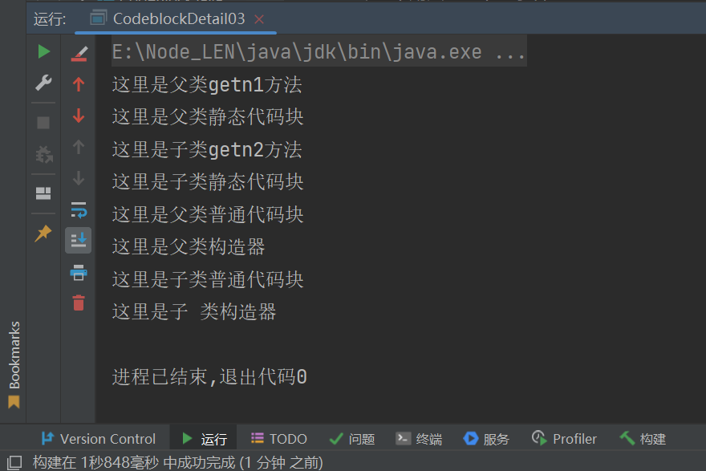

[TOC]


#  代码块

##  介绍

> 1. 代码块有称为初始化块，属于类成员；类似于方法，将逻辑语句封装在`{}`中
> 2. 与方法不同，代码块无参，无名，无返回
> 3. 不通过类名和对象名显式调用，**在加载类或实例对象时隐式调用**

##  基本语法

`[修饰符]{ 逻辑语句  }`

示例：static{ 逻辑语句}；

> - 修饰符可加可不加；加上也只能是`static`
> - 代码块分为静态代码块（即为有修饰符static），普通代码块（无修饰符）

##  好处

> 相当于另外一种形式的构造器（可对构造器进行补充）；做初始化操作
>
> 当多个构造器有重复语句，可抽取到代码块；提高复用性

```java
class Block{
    private String name;
    private int height;
    private  int weight;

    {
        //可以把相同的语句抽离到这里
    }
    static{
        //静态代码块
    }
    public Block(String name) {
        System.out.println("代码块");
        this.name = name;
    }

    public Block(String name, int height) {
        System.out.println("代码块");
        this.name = name;
        this.height = height;
    }

    public Block(String name, int height, int weight) {
      
       this(name,height);
        System.out.println("代码块");
        this.weight = weight;
    }
    
}
```

🚩无论执行哪个构造器；代码块的运行**优先**于构造器


------

##  细节与注意🚩🚩🚩

- 静态代码块**只会执行一次**（类加载时）；**普通代码块随对象产生而执行**

- 类何时被加载：🚩🚩🚩

  1. 创建对象时（new）

  2. 创建子类实例对象时，父类也会被加载

  3. 只使用子类静态成员时（类方法和类变量），父类被加载；静态代码块被调用，普通代码块不会调用

     ```java
     public class Code_block{
         public static void main(String[] args){
             //创建对象
             B1 b=new B1(12);//此时调用父类静态代码块，再调用构造器
            
             System.out.println(B2.num1);//此时静态代码块调用
         }
     }
     class B1{
         public static int num=10;
         static {
             System.out.println("父类B1静态代码块");
         };
         public B1(int n){
             this.num+=n;
         }
     }
     class B2 extends B1{
         public static int num1=100;
         static {
             System.out.println("子类B2静态代 码块");
         }
         public B2(int n,int n1){
             super(n);
             this.num1+=n1;
         }
     }
     ```

- 创建**一个对象**，**一个类**中调用顺序：

  1. **静态代码块和静态属性**初始化，两者优先级一样；当有多个时，按照定义顺序执行
  2. **普通代码块和普通属性**初始化，两者优先级一样；当有多个时，按照定义顺序执行
  3. 调用构造器

  > 🚩总结：
  >
  > 对象里调用顺序，**静态**代码块(属性初始化) **>** **普通**代码块(属性初始化) **>** 构造器

  ```java
   private static int n1=getn1();
  private int n2=getn2();//静态属性初始化
  {
      System.out.println("这里是普通代码块");
  }
  static{
      System.out.println("这里是静态代码块");
  }
  public static int getn1(){
      System.out.println("这里是getn1方法");
  }
  public int getn2(){
      System.out.println("这里是getn2方法");
  }
  
  //当main方法中创建对象时：
  new N1();
  /**
  *(1)这里是getn1方法   
  *(2)这里是静态代码块 
  *(3)这里是getn2方法
  *(4)这里是普通代码块
  */
  //遵守优先级一样，先定义先调用;当有静态和普通先调用静态
  ```

  

- 在**构造器**里的调用顺序：

  1. 调用super()
  2. 隐藏的调用普通代码块
  3. 构造器

  ```java
  class CodeB01{
  {
  System.out.println("这里是父类普通代码块");
  }
  public CodeB01(){
  //隐藏的super()
  //隐藏调用普通代码块
      System.out.println("这是父类构造器");
  }
  }
  class CodeB02 extends CodeB01{
      {
          System.out.println("这里是子类普通代码块");
      }
      public CodeB02(){
  //隐藏的super()
  //隐藏调用普通代码块
      System.out.println("这是子类构造器");
  }
  }
  
  //在main方法创建实例
  CodeB02 c2=new CodeB02();
  /**
  *(1).这里是父类普通代码块
  *(2).这是父类构造器
  *(3).这里是子类普通代码块
  *(4).这是子类构造器
  */
  ```

  

- **创建子类对象**时，静态代码块，静态属性，普通代码块，普通属性，构造器调用顺序：

  1. 父类静态代码块，静态属性初始化（优先级一样，取决定义顺序）
  2. 子类静态代码块，静态属性初始化（优先级一样，取决定义顺序）
  3. 父类普通代码块，普通属性初始化（优先级一样，取决定义顺序）
  4. 父类构造器
  5. 子类普通代码块，普通属性初始化（优先级一样，取决定义顺序）
  6. 子类构造器

  ```java
  public class CodeblockDetail03 {
      public static void main(String[] args) {
  		    Cbd03_child cbd03_child = new Cbd03_child();
      }
  }
  class CbD03{
      private static int n1=getn1();
      public static int getn1(){
          System.out.println("这里是父类getn1方法");
          return 100;
      }
      {
          System.out.println("这里是父类普通代码块");
      }
      static{
          System.out.println("这里是父类静态代码块");
      }
      public CbD03() {
          System.out.println("这里是父类构造器");
      }
  }
  class Cbd03_child extends CbD03{
      private static int n2=getn2();
      public static int getn2(){
          System.out.println("这里是子类getn2方法");
          return 200;
      }
      {
          System.out.println("这里是子类普通代码块");
      }
      static{
          System.out.println("这里是子类静态代码块");
      }
      public Cbd03_child() {
          System.out.println("这里是子 类构造器");
      }
  }
  ```

  

- 静态代码块只能直接调用静态成员（静态方法，静态属性），普通代码块可调用任何成员

  

  