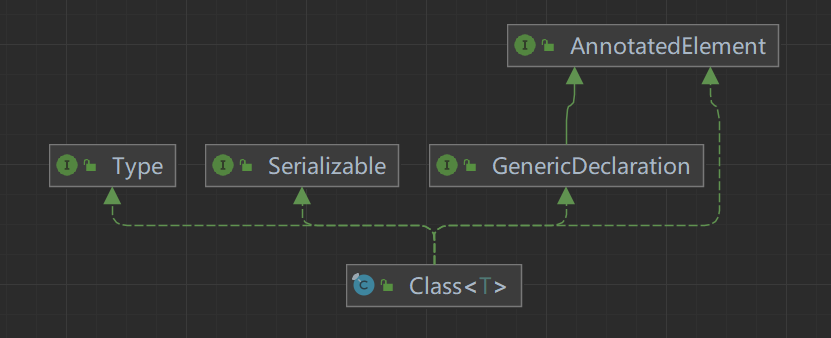

## Class类

###  类图：




###  基本介绍：

- Class也是类，继承了Object类
- Class对象不是new出来的，而是系统自动创建
- 对于某类的Class类在*堆中只有唯一一个*，因此*只加载一次*

```java
public static void main(String[] args) throws Exception {
        String classPath="com.java_learn.reflection.Dog";
        Class<?> aClass = Class.forName(classPath);
        System.out.println(aClass);
        System.out.println(aClass.getClass());//获取运行类型
        System.out.println(aClass.getPackage().getName());//获取类所在包
//        创建对应类的实例
        Object o = aClass.newInstance();
        Field name = aClass.getField("name");//获取单个属性
        name.set(o,"柯基");//将o对象实例的name值改为柯基
        Field[] fields = aClass.getFields();//获取所有属性
        for(Field f:fields){
            System.out.println(f.getName());
        }
    }
```


###  有Class对象的类型：

- 基本数据类型，void
- 外部类，成员、静态、局部、匿名内部类
- 接口(interface)，数组(Array)，枚举(enum)，注解(annotation)

使用：类型.class

###  获取Class对象的方式：

1. Class cls=Class.forName("全类名")

   *前提：已知一个类的全类名*

   应用场景：多用于配置文件，读取全类名加载类

2. Class cls=类名.class

   *前提：已知具体类名，该方式最安全，性能最高*

   应用场景：多用于传参，通过反射得到对应构造器对象

3. Class cls=对象.getClass()

   *前提：已知该类对象*

4. Class=对象.getClass().getClassLoader().loadClass("全类名")

   *前提：已知该类对象*

5. 基本数据类型获取Class类对象：Class cls=基本数据类型.class

6. 基本数据类型包装类获取class类对象：Class cls=包装类.TYPE
