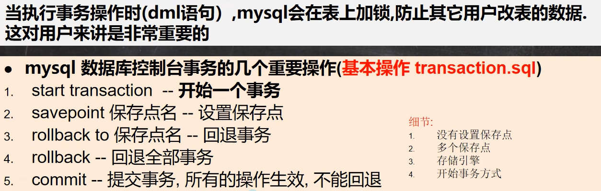
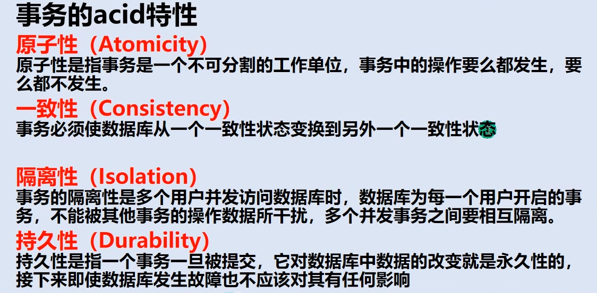

##  事务

> InnoDB支持事务，MyISAM不支持

###  操作

###  隔离级别

> 在多用户连接开启各自事务操作数据库时，数据库负责隔离操作；保证各个连接获取数据的准确性

|            级别             | 脏读 | 不可重复读 | 幻读 | 是否加锁 |
| :-------------------------: | :--: | :--------: | :--: | :------: |
| 读未提交（Read uncommitted) |  ✔   |     ✔      |  ✔   |    ✖     |
| 读已提交（Read committed）  |  ✖   |     ✔      |  ✔   |    ✖     |
| 可重复读（Repeatable read） |  ✖   |     ✖      |  ✖   |    ✖     |
| *可串行化（Serializable）*  |  ✖   |     ✖      |  ✖   |   *✔*    |

> -- 查看事务隔离级别
> SELECT @@tx_isolation
> -- 设置隔离级别 set session transaction isolation level 级别
> SET SESSION TRANSACTION ISOLATION LEVEL READ UNCOMMITTED

###  特性

