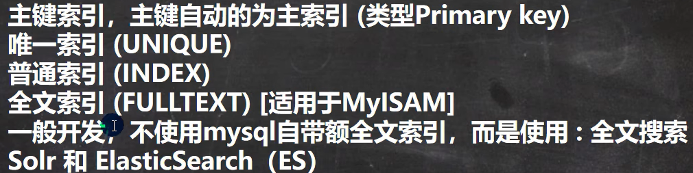
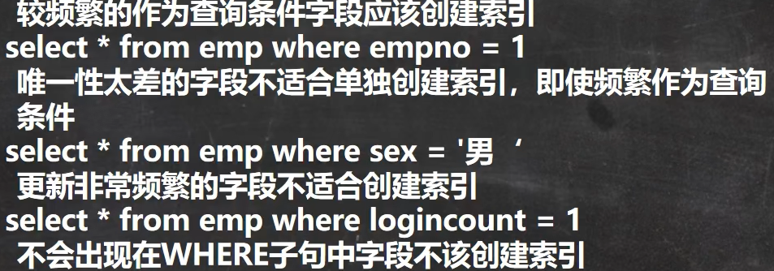

##  索引

会牺牲磁盘空间（不占用内存）以提高查询速度

> 创建：create [索引类型] index 索引名 on 表名(字段)
>
> ​			 alter table 表名 add index 索引名（字段）
>
> 删除：drop index 索引名 on 表名

###  原理：

无索引----->无论是否找到，都全表扫描

有索引----->建立二叉树，提高查找效率；（*占用磁盘空间*，对该字段查提高效率，但是对该字段*增删改*有影响）

###  类型

###  选择

