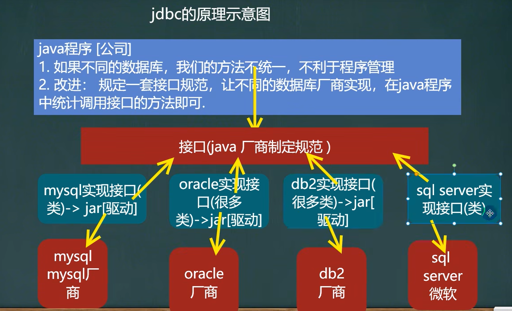
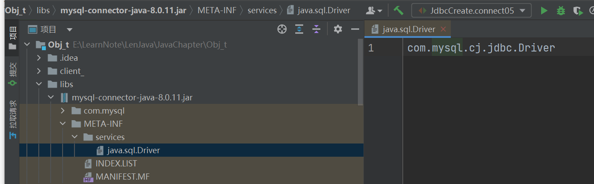

##  JDBC

> 相关类与接口：java.sql、javax.sql

###   原理




###  java连接数据库

```java
public static void main(String[] args) throws SQLException {
        //1.首先将mysql连接的驱动添加到项目；右键jar文件，添加到项目
        //2.注册驱动
        Driver driver = new Driver();//静态加载。灵活性差，依耐性强

        //3.获得连接
        String url = "jdbc:mysql://localhost:3306/mydat";
        //获取配置文件的数据
        Properties properties = new Properties();
        //注意：user和password是接口规定，不可自定义
        properties.setProperty("user", "root");
        properties.setProperty("password", "111111");
        Connection connect = driver.connect(url, properties);
        
        //4.操作数据库
        String sql = "insert into dat values('1','dd',12)";
        Statement statement = connect.createStatement();
        int rows = statement.executeUpdate(sql);//受影响行数
        
        //5.关闭连接
        statement.close();
        connect.close();
    }
```

> 缺点：   Driver driver = new Driver();//静态加载。灵活性差，依耐性强

###  其他方式连接

- 📙通过反射+配置文件连接（推荐使用，简化代码)

  ```java
  Class.forName("com.mysql.jdbc.Driver");
  //✨可不写此句（建议写上，更加清晰），在高版本jdbc中会自动加载（libs/mysql-connector-java.jar/META-INF/services/java.sql.Driver）
  
   Properties properties = new Properties();
          properties.load(new FileInputStream("src\\mysql.properties"));
  //获取配置文件
          String user = properties.getProperty("user");
          String password = properties.getProperty("password");
          String url = properties.getProperty("url");
          String driver = properties.getProperty("driver");
  //建立连接（省略了DriverManager.registerDriver()手动注册）；由于反射会加载Driver静态代码块
  /**
   static {
          try {
              DriverManager.registerDriver(new Driver());//✨会自动注册
          } catch (SQLException var1) {
              throw new RuntimeException("Can't register driver!");
          }
      }
      */
   Connection connection = DriverManager.getConnection(url, user, password);
  
  
  //操作数据库
   //4.操作数据库
          String sql = "insert into dat values('1','dd',12)";
          Statement statement = connection.createStatement();
          int rows = statement.executeUpdate(sql);//受影响行数
          
          //5.关闭连接
          statement.close();
          connect.close();
  ```

  > 🔍可忽略`Class.forName("com.mysql.jdbc.Driver");`原因：

  

- 其他繁琐方式（参：jdbc_/Jdbc_Create.java)
