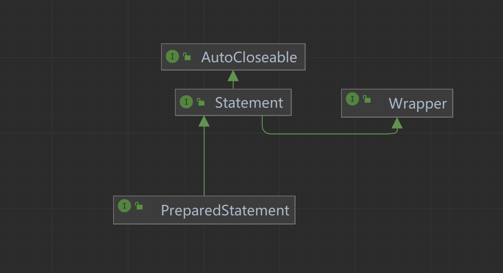

##  Statement

> 存在SQL注入问题，实际开发使用PreparedStatement【预处理】

##  PreparedStatement



```java
String sql="select * from l827 where name=?  and pass= ?";
        PreparedStatement preparedStatement = connection.prepareStatement(sql);//预处理
        preparedStatement.setString(1,name);//设置第一个?对应参数
        preparedStatement.setString(2,pass);
        //select使用executeQuery();
		//而(update/delete/insert)使用executeUpdate();
		//❗注意：预处理时使用sql，此处括号中没有sql语句，
        ResultSet resultSet = preparedStatement.executeQuery();
```


##  事务

```java
public static void main(String[] args) {
        Connection connection = JDBCUtils.getConnection();
        String sql="update l827 set pass=222 where name='张三'";
        String sql1="update l827 set pass=333 where name='李四'";
        PreparedStatement preparedStatement = null;
        ResultSet resultSet = null;
        try {
            //设置不自动提交
            connection.setAutoCommit(false);
            preparedStatement = connection.prepareStatement(sql);
            preparedStatement.executeUpdate();
            int i=1/0;//异常发生点
            preparedStatement = connection.prepareStatement(sql1);
            preparedStatement.executeUpdate();
            //这里设置提交事务
            connection.commit();
        } catch (SQLException e) {
             System.out.println("执行异常，进行回滚中。。。");
            try {
                connection.rollback();//执行回滚操作
            } catch (SQLException ex) {
                throw new RuntimeException(ex);
            }
            e.printStackTrace();
        } finally {
            JDBCUtils.close(resultSet, preparedStatement, connection);
        }
    }
```

