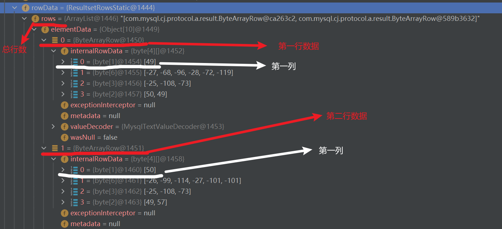

##  ResultSet原理实现

###  结构图（使用byte数组存放数据）



```java
ResultSet resultSet = statement.executeQuery(sql);
        //使用循环输出结果集
        while (resultSet.next()){
            int id resultSet.getInt("id")//❗推荐使用字段名获取
 
           int id= resultSet.getInt(1);//获取改行的第1列
            String name=resultSet.getString(2);
            String sex=resultSet.getString(3);
            int age=resultSet.getInt(4);
            System.out.println(id+"\t"+name+"\t"+sex+"\t"+age+"\t");
        }
```

