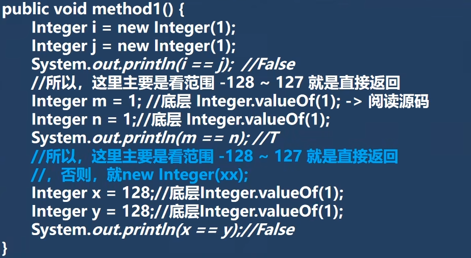

1. **三元运算符为一个整体**

   `Object obj1 = true ? new Integer(1) : new Double(2.0);`

   以上代码输出：1.0

   > 因为*三元运算符*为整体，会以最大字节类型为结果类型；所以是1.0而不是1
   >
   > if...else则不是一个整体。不适用以上结论

2. **关于Integer创建机制**

   

   > 注意Integer取值范围的差异：当超过-128~127后直接new的对象，如果在范围内则从*cache数组*返回该值

3. **String创建对象机制**

   `String s="aaa";s="ccc"`

   > 上述创建了两个对象，aaa对象最后会被回收

   `String s="aa"+"cc"`

   > 上述只创建了一个对象，编译器底层会优化成：String s="aacc";

4. **StringBuffer对象创建机制**

   ```java
   String str = null;
   StringBuffer sb=new StringBuffer();
   sb.append(str);//底层调用父类的appendNull
   System.out.println(sb.length);//4
   
   StringBuffer sb1=new StringBuffer(str);
   //由于在使用的有参构造器，底层会判断str.length；此时抛出空指针异常
   ```

5. HashSet的add方法底层如何实现添加？

6. 

7. 