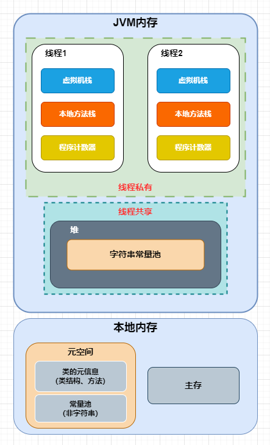
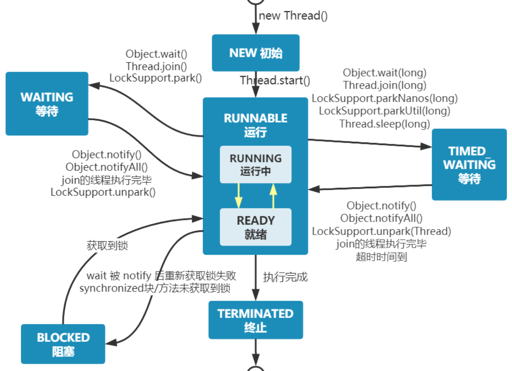

##  线程基础

### 相关概念

- **并行**

  概念：同一时刻，多个处理器同时处理多个不同的任务；

  目的：提高程序执行速度；

  解决问题：数据分割和分配任务，以及如何同步和合并结果；

- **并发**

  概念：同一时间段内，单个处理器交替处理不同的任务；

  目的：提高资源利用率和程序响应

  解决问题：任务之间的同步，互斥，死锁问题；


- **进程**

  程序的一次执行过程，是系统运行程序的基本单位，因此进程是动态的。系统运行一个程序即是一个进程从创建，运行到消亡的过程

- **线程**

  一个进程在其执行的过程中可以产生多个线程。与进程不同的是同类的多个线程<u>共享进程的堆和方法区资源</u>，但每个线程有自己的<u>程序计数器</u>、<u>虚拟机栈</u>和<u>本地方法栈</u>


###  JMM

概念：Java内存模型（Java Memory Model）

内存定义：

三大特性：

- 原子性：通过synchronized和Lock等机制来保证操作的原子性。
- 可见性：通过volatile关键字和synchronized块来确保一个线程对共享变量的修改能被其他线程看到。
- 有序性：通过happens-before原则来保证操作的有序性，防止指令重排序。




###  Java中使用线程

> 在继承或者实现方法中，需要调用start方法才可以启动线程；不能直接调用run方法，因为会当做普通方法执行，属于串行执行。

- 继承类

  - Thread类

- 实现接口

  打破单继承限制，根据实际选择下述方法

  - Runnable接口

    run方法无返回值，且不能抛出异常

  - Callable接口

    call方法可以有返回值，且**可以配合Future对象**捕获异常、获取异步结果；


####  继承Thread类

```java
public class ExtendsThreadExample {
    public static void main(String[] args) {
        MyThread myThread = new MyThread();
        //继承了Thread可以直接调用start方法启动线程
        myThread.start();
    }
}
class MyThread extends Thread {
   @Override
   public void run() {
       System.out.println(Thread.currentThread().getName());
   }
}
```


####  实现Runnable接口示例

```java
public class ImplementsRunnableExample {
    public static void main(String[] args) {
        MyRunnable myR = new MyRunnable();
        //实现Runnable接口的对象需要new Thread()，将对象传入后调用start()进行线程启动
        Thread t = new Thread(myR);
        t.start();
    }
}
class MyRunnable implements Runnable {
   @Override
   public void run() {
       System.out.println(Thread.currentThread().getName());
   }
}
```


####  实现Callable接口示例

```java
public class ImplementsCallableExample {
    public static void main(String[] args) {
        MyCallable myC = new MyCallable();
        //实现Callable接口的对象需要使用FutureTask对象才能获取返回值，将其传入new Thread()，将对象传入后调用start()进行线程启动
        FutureTask<Integer> futureTask = new FutureTask<>(myC);
        Thread t = new Thread(futureTask);
        t.start();
        // 获取异步执行的结果
        Integer result = futureTask.get();
    }
}
class MyCallable implements Callable {
    public Integer count=0;
   @Override
   public Integer run() {
       this.count++;
       System.out.println(Thread.currentThread().getName());
       return this.count;
   }
}
```


###  线程状态

*运行/就绪状态 统称为可运行状态（ Runnable）。 Java 程序中，线程在运行/就绪状态之间的切换由 JVM 自动调度。线程之间的调度采用优先级多队列时间片轮转算法。进程在执行完 CPU 时间片切换到就绪状态之前会先保存自己的状态，下次进入运行状态时再重新加载。*

- 运行：CPU 正在执行线程。
- 就绪：线程一切就绪，等待 CPU 执行。
- 阻塞：线程因缺少其他资源暂停执行，获得资源后进入就绪状态。
- 等待：线程接受了等待指令，释放资源暂停执行。在超时/接受唤醒指令后进入就绪状态。



### 线程交互

- Thread类中定义的方法

  1. `yield`：

     线程礼让，当前线程运行到`Thread.yield()`时，线程从运行变为就绪状态；后续何时变为运行由JVM调度，无法自主控制。

  2. `sleep`：

     线程休眠，当前线程运行到`Thread.sleep(1000)`时，线程从运行变为阻塞状态；但仍保持对象锁，其他线程无法访问其资源；直到超过传入的毫秒后进入就绪状态，需捕获`InterruptException `异常。

  3. `join`:

     线程插队，底层调用`wait`方法实现；调用`t.join()`后，方法会停止运行并释放对象锁，将其放入对象等待池；也可调用`t.join(1000)`指定时间后自动唤醒，

  4. `interrupt`：

     线程中断，调用`t.isInterrupted()`查看线程中断标识，调用`t.interrupt()`设置中断标识为`true`，调用`t.interrupted()`设置中断标识为`false`。


- Object类中定义的方法

  1. `obj.wait`：

     线程等待，当前线程停止运行并释放对象锁obj，进入obj对象等待池；其他线程可访问其资源，直到被`notify`唤醒才会进入就绪状态；`wait(1000)`可以设置休眠时间，超时自动唤醒。

  2. `obj.notify`：

     线程唤醒，从obj对象等待池中**随机唤醒**一个线程，当前线程不会释放obj对象锁，只有执行完当前线程，才会继续执行被唤醒的线程；若想唤醒后立即执行被唤醒线程，可在`notify`后执行`wait`方法。

  3. `obj.notifyall`：

     线程全部唤醒，从obj对象等待池唤醒全部线程。