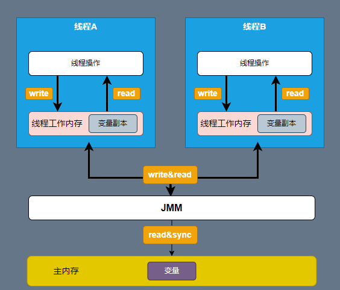
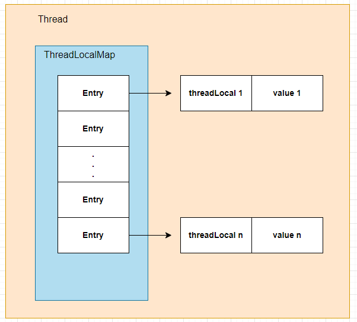
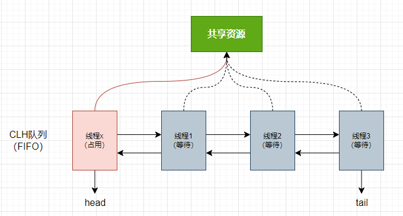

## 线程安全

### 多线程风险

描述：在 Java 程序中，存储数据的内存空间分为共享内存和本地内存。线程在读写主存的共享变量时，会先将该变量拷贝一份副本到本地内存，然后在本地内存中对该变量进行操作，完成操作之后再将结果同步至主内存。当多个线程某一时刻，同时访问一个数据时可能会破坏数据一致性。


### 行为规范

JMM定义了共享内存在多线程读写时的行为规范，从而保证数据的原子性、可见性、顺序性




### volatile 关键字

**修饰成员变量，每次被线程访问时，强迫从主存中读写该成员变量的值。**如果CPU一直满载，会使用本地内存中的变量副本而没有空闲同步主存变量的数据

> 注：只能保证可见性，不能保证原子性。
>

#### 双重校验锁实现单例（线程安全）

```java
public class Singleton {
	private volatile static Singleton uniqueInstance;
	private Singleton() {}
	public  static Singleton getUniqueInstance() {
   //先判断对象是否已经实例过，没有实例化过才进入加锁代码
    	if (uniqueInstance == null) {
        //类对象加锁
        	synchronized (Singleton.class) {
            	if (uniqueInstance == null) {
                	uniqueInstance = new Singleton();
            	}
        	}
    	}
    	return uniqueInstance;
	}
}
```


### 线程锁

#### 实现方式

##### 1.使用`synchronized`关键字

> 修饰方法或代码块。<u>*在JVM层面实现*</u>，被访问时由线程抢占锁，直到执行完毕自动释放锁；

- 当修饰实例方法时，实际是给对象上锁（不同对象拥有不同锁）
- 当修饰静态方法时，实际是给类上锁


##### 2.使用`ReenTrantLock`类

> 与`synchronized`类似，不同的是`ReenTrantLock`在JDK层面实现；需要手动调用lock和unlock方法配合try/finally使用

```java
public class ReentrantLockTest {
    // 创建锁对象
    static Lock lock = new ReentrantLock();
    public static void main(String[] args) throws InterruptedException {
        for(int i = 0; i < 5; i++){
            new Thread(new MyThread()).start();
        }
    }

    static class MyThread implements Runnable {
        @Override
        public void run() {                                   
            try {
                // 加锁，通常在 try 语句里完成
                lock.lock();
                Thread.sleep(500);
                System.out.println(Thread.currentThread().getName() + "excute");
            } catch (InterruptedException e) {}
            finally{
                // 解锁，必须在 finally 语句里完成
                lock.unlock();    
            }                      
            }
        }
    }
}
```

注：*`ReenTrantLock` 比 `synchronized` 增加了一些高级功能，主要有以下三点：*

1. ###### 实现等待中断

   ```java
   public class ThreadDemo {
       // 创建锁对象
       static Lock lock = new ReentrantLock();
   
       public static void main(String[] args) throws InterruptedException {
           Thread t1 = new Thread(new MyThread(),"thread1");
           Thread t2 = new Thread(new MyThread(),"thread2");
           t1.start();
           t2.start();
           Thread.sleep(500);
           // 提前中断线程
           t2.interrupt();                                      
       }
   
       static class MyThread implements Runnable {
           @Override
           public void run() {
               System.out.println(Thread.currentThread().getName() + "begin");
               try {
                   // 加可中断锁
                   lock.lockInterruptibly();                    
                   Thread.sleep(2000);
               } catch (InterruptedException e) {
                   System.out.println(Thread.currentThread().getName() + "out");
               } finally{
                   try{
                       lock.unlock();
                   } catch(IllegalMonitorStateException e) {}  
                   System.out.println(Thread.currentThread().getName() + "end");
               }
           }
       }
   }
   ```

   注：使用`tryLock`方法可从线程内部破坏死锁，可设置超时时间：`lock.tryLock(1, TimeUnit.SECONDS)`

   ```java
   public class ThreadDemo {
       // 创建锁对象
       static Lock lock = new ReentrantLock();
   
       public static void main(String[] args) throws InterruptedException {
           Thread t1 = new Thread(new MyThread(),"thread1");
           Thread t2 = new Thread(new MyThread(),"thread2");
           t1.start();
           t2.start();                                  
       }
   
       static class MyThread implements Runnable {
           @Override
           public void run() {
               System.out.println(Thread.currentThread().getName() + "begin");
               try {
                   // 加锁失败直接退出
                   if(!lock.tryLock()) {                         
                       System.out.println(Thread.currentThread().getName() + "out");
                       return;
                   }                  
                   Thread.sleep(2000);
               } catch (InterruptedException e) {
                   e.printStackTrace();
               } finally{
                   try{
                       lock.unlock();
                   } catch(IllegalMonitorStateException e) {}
                   System.out.println(Thread.currentThread().getName() + "end");
               }
           }
       }
   }
   ```

2. ###### 实现公平锁

   允许先等待的线程先获取锁，默认为非公平锁

   ```java
    // 创建锁对象，且声明为公平锁
       static Lock lock = new ReentrantLock(true);
   ```

3. ###### 选择性通知

   `ReentrantLock`对象可创建多个`Condition`对象，实现线程间的等待通知机制；调用`condition.await()`方法释放锁并等待，调用`condition.signal()`方法唤醒线程。

   ```java
   public class ThreadDemo {
       static ReentrantLock lock = new ReentrantLock();
   	//创建Condition对象
       static Condition condition = lock.newCondition();
   
       public static void main(String[] args) throws InterruptedException {
           lock.lock();
           new Thread(new MyThread()).start();
           System.out.println("主线程等待通知");
           try {
               condition.await();
           } finally {
               lock.unlock();
           }
           System.out.println("主线程恢复运行");
       }
   
       static class MyThread implements Runnable {
           @Override
           public void run() {
               lock.lock();
               try {
                   condition.signal();
                   System.out.println("子线程通知");
               } finally {
                   lock.unlock();
               }
           }
       }
   }
   ```

#### 锁分类

1. 互斥锁和自旋锁

   > `synchronized` 和 `ReentrantLock`都是互斥锁

   - 互斥锁：阻塞锁，未获得锁的线程将挂起，不消耗CPU资源；适用锁保持时间长的情况。
   - 自旋锁：非阻塞锁，<u>线程不断消耗CPU时间尝试获取锁，没有用户态和内核态调度与上下文切换的开销</u>；适用锁保持时间短的情况。

2. 悲观锁和乐观锁

   - 悲观锁：（多写场景，竞争激烈），这样可以避免频繁失败和重试影响性能，悲观锁的开销是固定的。`synchronized` 和` ReentrantLock` 等独占锁都是悲观锁
   - 乐观锁：（多读场景，竞争较少），这样可以避免频繁加锁影响性能，可能出现频繁失败和重试。CAS 算法和版本号机制都是乐观锁

3. 公平锁和非公平锁

   > synchronized为非公平锁，ReentrantLock可通过设置`Lock lock = new ReentrantLock(true);`实现公平锁，默认非公平

   - 公平锁：先到等待队列先拿到锁
   - 非公平锁：通过两次CAS操作抢锁，没抢到继续在队列等待唤醒

4. 可重入锁（递归锁）

   允许一个线程对同一对象多次上锁。由 JVM 记录对象被线程加锁次数，只有当线程释放掉所有锁（加锁次数为0）时，其他线程才获准进入。
   
   synchronized 和 ReentrantLock 等锁结构都是可重入锁。


### 乐观锁实现

> 避免频繁加锁影响性能，可能出现频繁失败和重试

#### 版本号机制

一般是在数据表中加上一个数据版本号 `version` 字段，表示数据被修改的次数。当数据被修改时，`version` 值会加一。当线程 A 要更新数据值时，在读取数据的同时也会读取 `version` 值，在提交更新时，若刚才读取到的 version 值 = 当前数据库中的 `version` 值相等时才更新，否则重试更新操作，直到更新成功

#### CAS算法

CAS 涉及到三个操作数：

- **V**：要更新的变量值(Var)
- **E**：预期值(Expected)
- **N**：拟写入的新值(New)

当且仅当 V = E 时，CAS 通过原子方式用新值 N 来更新 V 的值。如果不等，说明已经有其它线程更新了 V，则当前线程放弃更新。由于 CAS 操作可能会因为并发冲突而失败，因此通常会与`while`循环搭配使用，在失败后不断重试，直到操作成功。这就是 **自旋锁机制** ；

注：存在ABA问题


### Atomic原子类

> `Atomic`原子类也是通过CAS + 自旋机制实现

```java
public class ThreadDemo {

    public static void main(String[] args) {
        MyThread t = new MyThread();
        Thread t1 = new Thread(t);
        Thread t2 = new Thread(t);
        t1.start();
        t2.start();
    }
}

class MyThread implements Runnable {
    AtomicInteger count = new AtomicInteger(0);       // 定义整型地原子类
    @Override
    public void run() {
        for (int i = 0; i < 10000; i++) {
            count.incrementAndGet();                  // 原子性自增操作
        }
        System.out.println("final x: " + count);      // 最后输出的数据为 20000
    }
}
```


---


### ThreadLocal线程本地对象

> `ThreadLocal`类会给每个线程创建副本，来保存其私有数据，其他线程无法访问

```java
ThreadLocal threadLocal = new ThreadLocal();        // 构造 ThreadLocal
ThreadLocal<T> threadLocal = new ThreadLocal<>();   // 支持泛型

threadLocal.get();                      // 获取当前线程中保存的变量副本
threadLocal.set(10);                    // 设置当前线程中变量的副本
threadLocal.remove();                   // 移除当前线程中变量的副本
```

```java
// 两个线程从同一个 MyThread 对象取值，但结果不同。
public class ThreadLocalExample {
    public static void main(String[] args) {
        MyThread t = new MyThread();
        Thread thread1 = new Thread(t);
        Thread thread2 = new Thread(t);
        thread1.start();
        thread2.start();
    }
}

class MyThread implements Runnable {

    private ThreadLocal threadLocal = new ThreadLocal();

    @Override
    public void run() {
        threadLocal.set((int) (Math.random() * 100D));
        try {
            Thread.sleep(2000);
        } catch (InterruptedException e) {}
        System.out.println(threadLocal.get());
    }
}
```

#### 内存泄露风险

ThreadLocal数据结构

`ThreadLocalMap` 中使用的 key 为 `ThreadLocal` 的弱引用，而 value 是强引用。所以，如果 `ThreadLocal` 没有被外部强引用的情况下，在垃圾回收的时候，key 会被清理掉，而 value 不会被清理掉。

这样一来，`ThreadLocalMap` 中就会出现 key 为 null 的 Entry。假如我们不做任何措施的话，value 永远无法被 GC 回收，这个时候就可能会产生内存泄露。`ThreadLocalMap` 实现中已经考虑了这种情况，在调用 `set()`、`get()`、`remove()` 方法的时候，会清理掉 key 为 null 的记录。使用完 `ThreadLocal`方法后最好手动调用`remove()`方法


### AQS框架

> 全称AbstractQueuedSynchronizer类，用于构造锁和同步器；

#### 核心思想

建立线程阻塞等待和唤醒时锁分配机制

- 被请求的共享资源空闲，将当前线程设为有效工作线程，且共享资源设为锁定状态。

- 被请求的共享资源占用，将获取不到资源的线程封装为一个节点，加入到虚拟的双向队列CLH中。（*CLH 不存在真实的队列，仅存在结点之间的关联关系*）

  

  **AQS存储状态**

  1. 维护`volatile int state`成员变量，表示资源状态；
  2. 维护FIFO的线程等待队列CLH

  抢占资源时通过CAS尝试修改状态，成功则表示获取锁成功，失败进入等待队列

#### 资源共享方式

- **Exclusive（独占）**

  只有一个线程能执行，如 ReentrantLock。state初始化为0，表示未锁定状态。加一后锁定。

- **Share（共享）**

  多个线程可同时执行，如Semaphore、CountDownLatCh、 CyclicBarrier、ReadWriteLock 。返回 state 负数表示失败；0表示成功，但没有剩余可用资源；正数表示成功，且有剩余资源。

#### 自定义同步器

> 同步器的设计是模板方法的经典应用，同步类实现时将自定义同步器（sync）定义为内部类，供自己调用；同步类本身（Mutex）则实现对应接口，对外服务

- `isHeldExclusively()`：该线程是否正在独占资源。

- 独占式：

  ` tryAcquire(int)`：独占方式。尝试获取资源，成功则返回true，失败则返回false。

  `tryRelease(int)`：独占方式。尝试释放资源，成功则返回true，失败则返回false。 

- 共享式：

  `tryAcquireShared(int)`：共享方式。尝试获取资源。负数表示失败；0表示成功，但没有剩余可用资源；正数表示成功，且有剩余资源。

  ` tryReleaseShared(int)`：共享方式。尝试释放资源，如果释放后允许唤醒后续等待结点返回true，否则返回false。

```java
class Mutex implements Lock, java.io.Serializable {
    // 自定义同步器
    private static class Sync extends AbstractQueuedSynchronizer {
        // 判断是否锁定状态
        protected boolean isHeldExclusively() {
            return getState() == 1;
        }

        // 尝试获取资源，立即返回。成功则返回true，否则false。
        public boolean tryAcquire(int acquires) {
            assert acquires == 1; // 这里限定只能为1个量
            if (compareAndSetState(0, 1)) {//state为0才设置为1，不可重入！
                setExclusiveOwnerThread(Thread.currentThread());//设置为当前线程独占资源
                return true;
            }
            return false;
        }

        // 尝试释放资源，立即返回。成功则为true，否则false。
        protected boolean tryRelease(int releases) {
            assert releases == 1; // 限定为1个量
            if (getState() == 0)//既然来释放，那肯定就是已占有状态了。只是为了保险，多层判断！
                throw new IllegalMonitorStateException();
            setExclusiveOwnerThread(null);
            setState(0);//释放资源，放弃占有状态
            return true;
        }
    }

    // 真正同步类的实现都依赖继承于AQS的自定义同步器！
    private final Sync sync = new Sync();

    //lock<-->acquire。两者语义一样：获取资源，即便等待，直到成功才返回。
    public void lock() {
        sync.acquire(1);
    }

    //tryLock<-->tryAcquire。两者语义一样：尝试获取资源，要求立即返回。成功则为true，失败则为false。
    public boolean tryLock() {
        return sync.tryAcquire(1);
    }

    //unlock<-->release。两者语文一样：释放资源。
    public void unlock() {
        sync.release(1);
    }

    //锁是否占有状态
    public boolean isLocked() {
        return sync.isHeldExclusively();
    }
}
```


### 其他同步工具类

#### Semaphore 

线程执行时调用 acquire 方法申请信号量，如果剩余信号量不足则必须等待其他线程执行完毕后调用 release 方法释放信号量。

```java
Semaphore semaphore = new Semaphore(0);       
Semaphore semaphore = new Semaphore(20, true);  
// Semaphore 构造方法设定了初始信号量，可以为 0。默认为非公平锁，设定属性 true 则为公平锁。

semaphore.acquire();              // 线程获取一个信号量
semaphore.acquire(5);             // 线程获取五个信号量

semaphore.release();              // 线程释放一个信号量
semaphore.release(5);             // 线程释放五个信号量

semaphore.availablePermits();     // 读取剩余信号量
```

#### CountDownLatch  

其通过 await 方法设置一个屏障，线程到达后被阻塞。直到其他线程调用 countDown 方法达到 N 次后才允许向后执行。常用来协同多个线程之间的执行顺序，比如主线程需要等待多个组件加载完毕之后再继续执行。

注： CountDownLatch 类是一次性的，计数器值只能在构造方法中初始化一次，不能被重复使用。

```java
import java.util.concurrent.CountDownLatch;

public class ThreadDemo {

    final static CountDownLatch latch = new CountDownLatch(5);

    public static void main(String[] args) throws InterruptedException {
        for(int i = 0; i < 5; i++) {
            new MyThread().start();
        }
        latch.await(); // 线程等待门闩，个数为 0 后向后执行
        System.out.println("主线程继续执行");
    }

    static class MyThread extends Thread {
        @Override
        public void run() {
            try {
                System.out.println(getName() + "打开门闩");
            } finally {
                latch.countDown(); // 解锁门闩，门闩个数减一
            }
        }
    }
}
```

#### CyclicBarrier 

通过 await 方法设置一个屏障，线程到达后被阻塞。只有当 N 个线程都到达屏障后才允许这些线程向后执行。常用于多线程计算数据，最后合并计算结果的场景。

注：和 CountDownLatch 不同，CyclicBarrier 可循环利用。

```java
CyclicBarrier barrier = CyclicBarrier(10); 
CyclicBarrier barrier = CyclicBarrier(10, ()-> System.out.println("open"));

// CyclicBarrier 构造方法设定了参与线程的个数 N，也可以选择设定在第 N 个线程到达屏障时执行方法。

barrier.await();                             // 线程必须等到 N 个线程才能向后执行
barrier.await(20, TimeUnit.SECONDS);         // 线程等待规定时间后无论如何都会向后执行
```

如下示例可以输出两次到达栅栏：

```java
import java.util.concurrent.CyclicBarrier;

public class CyclicBarrierDemo {  
    public static void main(String[] args) {  
        for(int i = 0; i < 10; i++) {
            new MyThread().start();
        }
    } 
}

class MyThread extends Thread {
    static CyclicBarrier barrier = new CyclicBarrier(5, new Runnable() {
        @Override
        public void run() {
            System.out.println("栅栏开启");
        }
    });

    @Override
    public void run() {
        try {
            Thread.sleep(1000);
            System.out.println(getName() + " 到达栅栏");
            barrier.await();
            System.out.println(getName() + " 冲破栅栏");
        } catch (Exception e) {
            e.printStackTrace();
        }
    }
}
```
