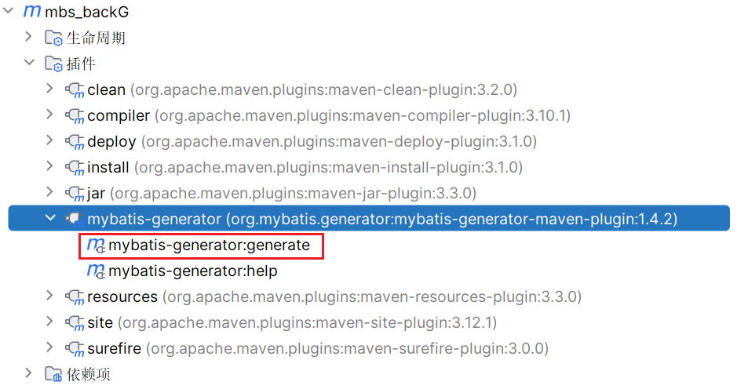

##  逆向工程

###  创建步骤

1. 引入依赖

   ```xml
   <build>
           <plugins>
               <plugin>
                   <groupId>org.mybatis.generator</groupId>
                   <artifactId>mybatis-generator-maven-plugin</artifactId>
                   <version>1.4.2</version>
                   <dependencies>
                       <dependency>
                           <groupId>org.mybatis.generator</groupId>
                           <artifactId>mybatis-generator-core</artifactId>
                           <version>1.4.2</version>
                       </dependency>
                       <!-- Druid 连接池依赖 -->
                       <dependency>
                           <groupId>com.alibaba</groupId>
                           <artifactId>druid</artifactId>
                           <version>1.2.16</version>
                       </dependency>
                       <dependency>
                           <groupId>mysql</groupId>
                           <artifactId>mysql-connector-java</artifactId>
                           <version>8.0.33</version>
                       </dependency>
                   </dependencies>
               </plugin>
               <plugin>
                   <groupId>org.apache.maven.plugins</groupId>
                   <artifactId>maven-compiler-plugin</artifactId>
                   <configuration>
                       <source>8</source>
                       <target>8</target>
                   </configuration>
               </plugin>
           </plugins>
       </build>
   ```

   

2. 配置文件（generatorConfig.xml）

   ```xml
   <?xml version="1.0" encoding="UTF-8"?>
   <!DOCTYPE generatorConfiguration
           PUBLIC "-//mybatis.org//DTD MyBatis Generator Configuration 1.0//EN"
           "http://mybatis.org/dtd/mybatis-generator-config_1_0.dtd">
   <generatorConfiguration>
       <!-- 配置数据库连接 -->
       <context id="DB2Tables" targetRuntime="MyBatis3">
           <jdbcConnection driverClass="com.mysql.jdbc.Driver"
                           connectionURL="jdbc:mysql://localhost:3306/mybatisdb"
                           userId="root"
                           password="">
           </jdbcConnection>
   
           <!-- 设置生成的实体类的包名和位置 -->
           <javaModelGenerator targetPackage="com.loy.mybatis.pojo" targetProject=".\src\main\java">
               <property name="enableSubPackages" value="true"/>
               <property name="trimStrings" value="true"/>
           </javaModelGenerator>
   
           <!-- 设置生成的 SQL Mapper 的包名和位置 -->
           <sqlMapGenerator targetPackage="com.loy.mybatis.mapper" targetProject=".\src\main\resources">
               <property name="enableSubPackages" value="true"/>
           </sqlMapGenerator>
   
           <!-- 设置生成的 DAO 接口的包名和位置 -->
           <javaClientGenerator type="XMLMAPPER" targetPackage="com.loy.mybatis.mapper" targetProject=".\src\main\java">
               <property name="enableSubPackages" value="true"/>
           </javaClientGenerator>
   
           <!-- 配置生成的表及对应的实体类、SQL Mapper 和 DAO 接口 -->
           <!--<table tableName="table_name" domainObjectName="TableName" enableCountByExample="false" enableUpdateByExample="false"
                  enableDeleteByExample="false" enableSelectByExample="false" selectByExampleQueryId="false">
               <property name="useActualColumnNames" value="false"/>
               <generatedKey column="id" sqlStatement="Mysql" identity="true"/>
           </table>-->
           <table tableName="employee" domainObjectName="Employee"></table>
           <table tableName="department" domainObjectName="Department"></table>
       </context>
   </generatorConfiguration>
   ```

3. 点击插件运行逆向工程

   

4. 测试

   ```java
   public class TestBG {
       EmployeeMapper mapperObj = MapperUtils.getMapperObj(EmployeeMapper.class);
       @Test
       public void testSelect(){
   //        查询全部数据
           List<Employee> employees = mapperObj.selectByExample(null);
           employees.forEach(emp-> System.out.println(emp));
   //        根据条件查询
           EmployeeExample example = new EmployeeExample();
           example.createCriteria().andEnameEqualTo("aa");
           //使用or()方法实现or关键字查询
   //        example.or().andDidIsNotNull();
           List<Employee> employeeList = mapperObj.selectByExample(example);
           employeeList.forEach(employee -> System.out.println(employee));
       }
   
       @Test
       public void testUpdate(){
   //        updateByPrimaryKey当某个字段为空时会更改该字段为null
           mapperObj.updateByPrimaryKey(new Employee( 5,null, (short) 22,1));
   //        updateByPrimaryKeySelective当某个字段为空，不会更改该字段的值
           mapperObj.updateByPrimaryKeySelective(new Employee( 1,null, (short) 22,1));
       }
       
   }
   ```

   