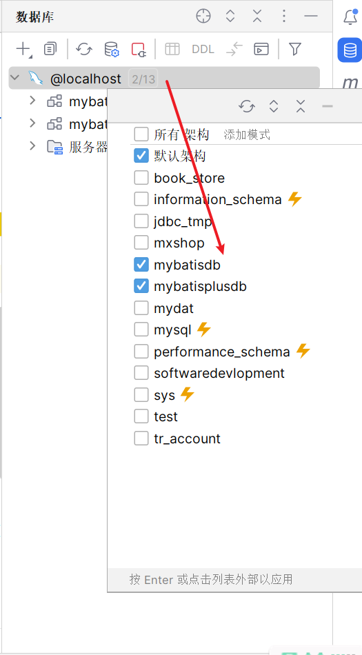
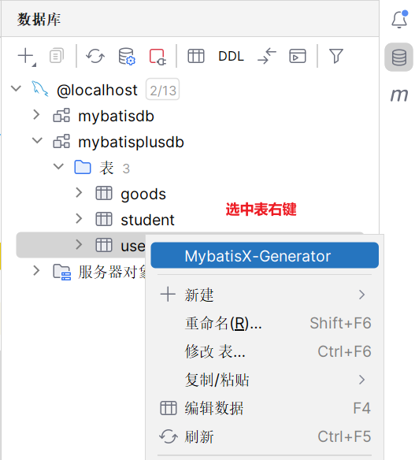
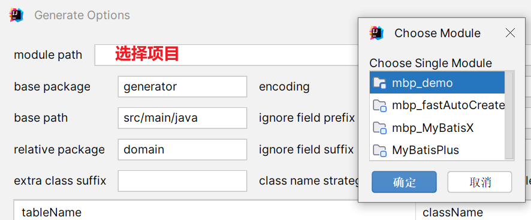
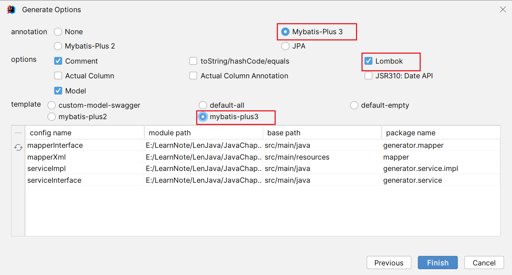

##  MyBatisX

[MyBatisX示例](https://baomidou.com/pages/ba5b24/#%E5%8A%9F%E8%83%BD)

安装

在idea中的插件商城搜索

使用：

###  1.

------

###  2.

----

###  3.

###  编写mapper接口

在使用时，用英文语义编写接口后按住 `ctrl+enter`快速生成对应的映射文件和sql语句