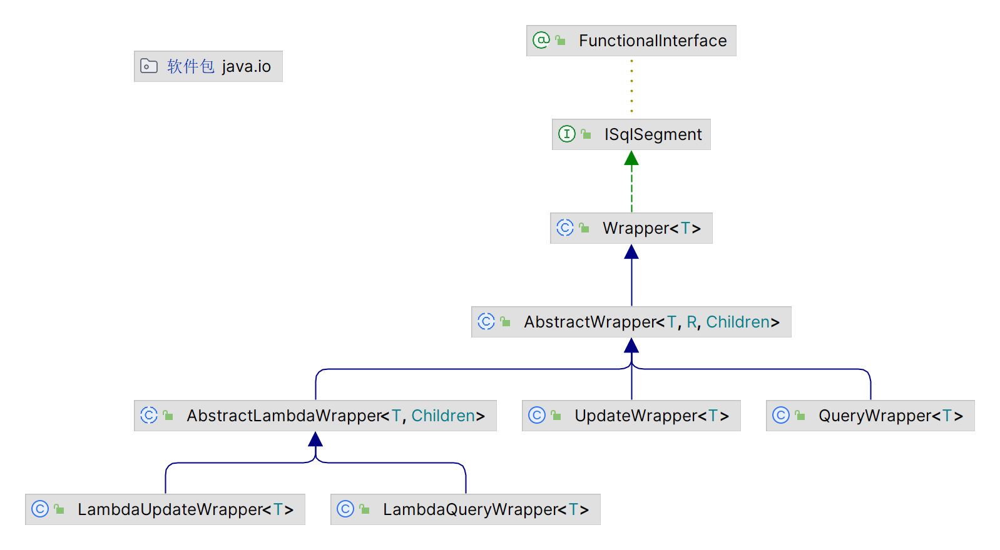

##  Wrapper

描述：条件构造器抽象类，顶端父类；

**作用：用于where后的条件构造**



- wrapper：条件构造器抽象类，顶端父类
- AbstractWrapper：用于条件封装，生成sql的where条件
- QueryWrapper：封装查询条件
- UpdateWrapper：封装更新条件
- AbstractLambdaWrapper：使用Lambda语法
- LambdaQueryWrapper：用Lambda语法使用查询Wrapper
- LambdaUpdateWrapper：用Lambda语法使用更新Wrapper


###  QueryWrapper

```java
	@Test
    public void testQueryWrapperForSelect() {
//        查询用户名包含a，年龄在20-80
        QueryWrapper<User> queryWrapper = new QueryWrapper<>();
        queryWrapper.like("name", "a")
                .between("age", 20, 80);
        List<User> users = userMapper.selectList(queryWrapper);
        users.forEach(System.out::println);

    }

    @Test
    public void testUpdateWrapperForUpdate() {
        QueryWrapper<User> queryWrapper = new QueryWrapper<>();
        queryWrapper.gt("age", 20)
                .ge("age", 100)
                .or().isNull("name");
        User user = new User();
        user.setName("张三");
        user.setAge(100);
        int update = userMapper.update(user, queryWrapper);
        System.out.println(
                update
        );
    }

    @Test
    public void testQueryWrapperForDelete() {
//        当有逻辑字段时不会删除数据库数据
        QueryWrapper<User> queryWrapper = new QueryWrapper<>();
        queryWrapper.like("name", "a");
        int delete = userMapper.delete(queryWrapper);
        System.out.println(delete);
    }

    @Test
    public void testOrder() {
//        查询信息，按年龄降序，若年龄相同按id升序排序
        QueryWrapper<User> queryWrapper = new QueryWrapper<>();
        queryWrapper.orderByDesc("age").orderByAsc("id");
        List<User> users = userMapper.selectList(queryWrapper);
        users.forEach(System.out::println);
    }


    @Test
    public void testPriority() {
//        条件优先级：
//        情形一：条件1 and 条件2 or 条件3
//    queryWrapper.like("name", "a") .ge("age", 100)
//                .or().isNull("name");

//        情形二：条件1 and （条件2 or 条件3）
//    queryWrapper.like("name", "a") .and(wrapper->wrapper.ge("age", 100)
//                                   .or().isNull("name"));
        //优先级Lambda中的高，为情形二
    }

    @Test
    public void testSelectPartOfTheField(){
        //上述测试方法都是返回全列，该方法返回指定列
        QueryWrapper<User> queryWrapper = new QueryWrapper<>();
        queryWrapper.select("name","age");
        List<Map<String,Object>> users = userMapper.selectMaps(queryWrapper);
        users.forEach(System.out::println);
    }

    @Test
    public void testTheSubquery(){
        //in子查询
        QueryWrapper<User> queryWrapper = new QueryWrapper<>();
        queryWrapper.inSql("id","select id from user where id<20");
        List<User> users = userMapper.selectList(queryWrapper);
        users.forEach(System.out::println);
    }
```


###  UpdateWrapper

```java
@Test
    public void testUpdateWrapper(){
        //更新操作
        UpdateWrapper<User> updateWrapper = new UpdateWrapper<>();
        updateWrapper.like("name","a").and(
                wrapper->wrapper.gt("age",20).or().isNull("name")
        );
        //此方法不需要创建实体类
        updateWrapper.set("name","李四").set("age",30);
        int update = userMapper.update(null, updateWrapper);
        System.out.println(update);
    }
```


###  condition

作用：用与判断参数后再拼接条件

```java
@Test
    public  void  testLikeSelect(){
        String likeStr="a";
        Integer startAge=20;
        Integer endAge=100;
        QueryWrapper<User> queryWrapper = new QueryWrapper<>();
        queryWrapper.like(StringUtils.isNotBlank(likeStr),"name",likeStr)
                .ge(startAge !=null,"age",startAge)
                .le(endAge!=null,"age",endAge);
        List<User> users = userMapper.selectList(queryWrapper);
        users.forEach(System.out::println);
    }
```


###  LambdaQueryWrapper

描述：与condition不同的是字段使用Lambda表达式（User::getName）

```java
@Test
    public void testLambdaQueryWrapper(){
        String likeStr="a";
        Integer startAge=20;
        Integer endAge=100;
        LambdaQueryWrapper<User> queryWrapper = new LambdaQueryWrapper<>();
        //注意区别第二个参数
        queryWrapper.like(StringUtils.isNotBlank(likeStr),User::getName,likeStr)
                .ge(startAge !=null,User::getAge,startAge)
                .le(endAge!=null,User::getAge,endAge);
        List<User> users = userMapper.selectList(queryWrapper);
        users.forEach(System.out::println);
    }
```


###  LambdaUpdateWrapper

描述：与condition不同的是字段使用Lambda表达式（User::getName）

```java
@Test
    public void testLambdaUpdateWrapper(){
        LambdaUpdateWrapper<User> updateWrapper = new LambdaUpdateWrapper<>();
        updateWrapper.like(User::getName,"a").and(
                wrapper->wrapper.gt(User::getAge,20).or().isNull(User::getName)
        );
        updateWrapper.set(User::getName,"李四").set(User::getAge,30);
        int update = userMapper.update(null, updateWrapper);
        System.out.println(update);
    }
```

