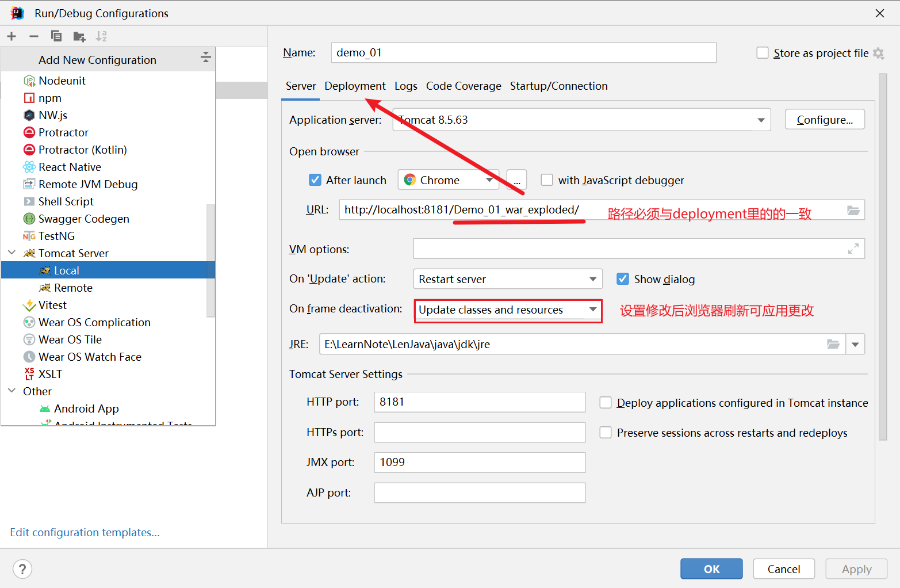

##  tomcat

> 提供对jsp和servlet的支持，是一个轻量级的javaweb服务器；
>
> servlet 2.5使用最为广泛（可使用xml）

###  安装

目录介绍

bin                专门存放服务器可执行程序

conf              存放服务器配置文件

lib                 存放服务器jar包

logs              存放服务器运行时输出日志信息

temp            存放服务器运行时产生的临时数据

webapps      存放部署的web工程

work             服务器工作时目录。将jsp翻译为Servlet源码，和Session钝化的目录


###  启动

1. 配置环境变量

2. 启动服务器
   - 服务器文件下的bin/startup.bat双击运行
   - 进入服务器文件下的bin文件夹，运行`.\catalina run`
3. 浏览器输入http://localhost:8080/工程目录

###  配置

- 修改默认端口：修改conf/servlet.xml文件

  ```xml
  <!--将port改为自定义内容-->
  <Connector port="8181" protocol="HTTP/1.1"
             connectionTimeout="20000"
             redirectPort="8443" />
  ```

- 部署web工程

  - 将工程放入webapps目录下

  - 在conf\Catalina\localhost文件下配置

    ```xml
    <!--path：表示浏览器访问时相对路径；docBase：表示web工程项目所在位置绝对路径-->
    <Context path="/myFirstDemo" docBase="E:\LearnNote\LenJava\JavaChapter\Java_framework\javaWeb\myFirstDemo" />
    ```
    

- 字符集设置：修改conf/logging.properties文件

```properties
java.util.logging.ConsoleHandler.encoding = GBK
```


###  部署动态web工程

配置tomcat服务器


新建web工程项目：

1. 在idea中新建java工程（file->New->Module）
2. 右键点击Add framework support，选择web application；将java工程改为java web工程


描述：

- src：存放项目开发的java源代码
- web：存放web工程资源文件（html...）
  - |--WEB-INF：受服务器保护的目录
  - |--lib：存放第三方jar包
  - |--web.xml：整个工程的配置部署文件，可配置很多的web工程组件；如：Servlet程序、Filter、Listener、Session . . . 等


###  启动web工程

​	编辑tomcat运行实例



