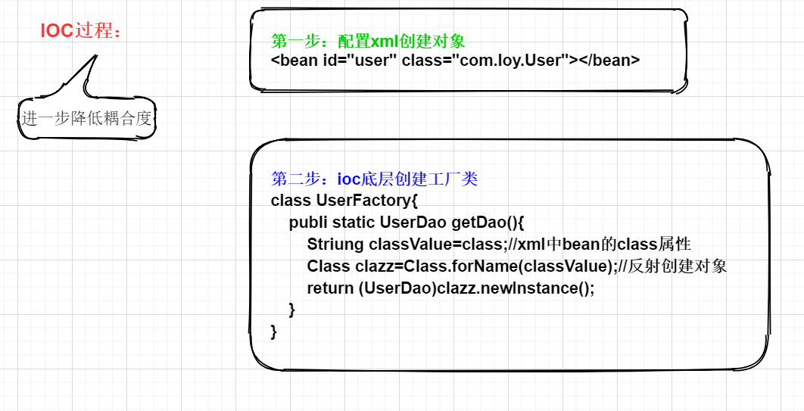
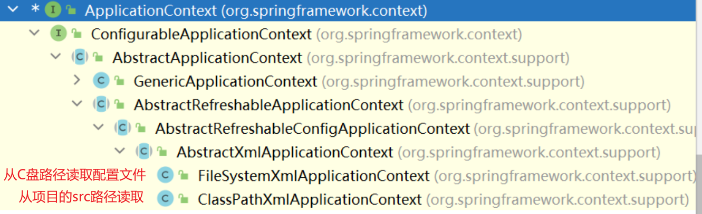
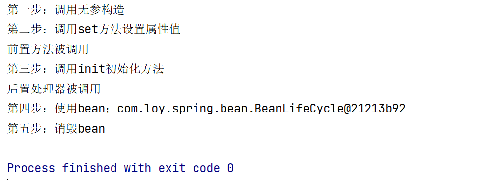

##  IOC容器


###  IOC底层原理

> xml解析，工厂模式，反射



----

###  IOC接口（BeanFactory）

> 基于IOC容器完成，容器底层就是对象工厂

**spring提供实现IOC容器的两种方式（两个接口）：**

- BeanFactory（开发中不常用，是spring内部使用）

  *加载配置文件不会创建对象，在获取时创建

- `ApplicationContext`（BeanFactory的子接口，提供给开发者使用）

  *加载配置文件即创建对象

  *该接口的实现类：

  


###  IOC中的Bean管理

> 指的是：由spring创建对象，注入属性；（创建对象时调用默认的无参构造）

####  Bean两种类型

- 普通bean

  在xml配置中定义bean类型和返回类型一致

- 工厂bean（FactoryBean）

  在xml配置中定义bean类型和返回类型不一致

  ```java
  public class MyBean implements FactoryBean<Student> {
      @Override
      public Student getObject() throws Exception {
          Student student = new Student();
          student.setCourse(new String[]{"list"});
          return student;//返回类型为student，定义bean类型为MyBean
      }
  
      @Override
      public Class<?> getObjectType() {
          return null;
      }
  
      @Override
      public boolean isSingleton() {
          return FactoryBean.super.isSingleton();
      }
  }
  ```

---

#### Bean作用域

spring可以设置bean是单实例还是多实例对象（📌`默认为单实例`）

📌设置xml配置文件bean标签的scope属性值：

1. singleton（默认值）：加载配置文件时创建对象
2. prototype：在调用getBean()时创建对象，每次调用返回不同的对象实例

```xml
    <bean id="mybean" class="com.loy.spring.factorybean.MyBean" scope="prototype"></bean>
```

---

####  Bean生命周期（完整七个步骤）

1. 构造器创建bean实例
2. 为bean设置属性值和引用其他bean；2.1将bean实例传递给前置处理器
3. 调用bean的初始化方法；3.1将bean实例传递给后置处理器
4. 使用bean
5. 关闭容器后，销毁bean 

BeanLifeCycle.java

```java
package com.loy.spring.bean;
public class BeanLifeCycle {
    //演示bean生命周期
    private String beanName;

    public BeanLifeCycle() {
        System.out.println("第一步：调用无参构造");
    }

    public void setBeanName(String beanName) {
        this.beanName = beanName;
        System.out.println("第二步：调用set方法设置属性值");
    }
    public void init(){
        System.out.println("第三步：调用init初始化方法");//需要在xml文件bean标签设置init-method属性，值为该方法名（init）
    }
    public void destroy(){
        System.out.println("第五步：销毁bean");
    }
}

```

BeanPostLift.jva

```java
public class BeanPostLift implements BeanPostProcessor {
//    配置前后置处理器
@Override
public Object postProcessBeforeInitialization(Object bean, String beanName) throws BeansException {
    System.out.println("前置方法被调用");
    return bean;
}

    @Override
    public Object postProcessAfterInitialization(Object bean, String beanName) throws BeansException {
        System.out.println("后置处理器被调用");
        return bean;
    }
}
```

TestBeanLife.java

```java
public class TestBeanLife {
    public static void main(String[] args) {
        ClassPathXmlApplicationContext cla = new ClassPathXmlApplicationContext("beanLife.xml");
        BeanLifeCycle beanLife = cla.getBean("beanLife", BeanLifeCycle.class);
        System.out.println("第四步：使用bean；"+beanLife);
        cla.close();
    }
}
```

beanLife.xml

```xml
<bean id="beanLife" class="com.loy.spring.bean.BeanLifeCycle" init-method="init" p:beanName="mybean" destroy-method="destroy"></bean>
<!--    配置前后置处理器，在本配置文件的bean都会被创建处理器-->
    <bean id="beanpost" class="com.loy.spring.bean.BeanPostLift"></bean>
```



---

####  外部属性文件

使用xml配置连接池（设置名称空间context）

```xml
<?xml version="1.0" encoding="UTF-8"?>
<beans xmlns="http://www.springframework.org/schema/beans"
       xmlns:xsi="http://www.w3.org/2001/XMLSchema-instance" 
       xmlns:p="http://www.springframework.org/schema/p"
       xmlns:context="http://www.springframework.org/schema/context"
       xsi:schemaLocation="http://www.springframework.org/schema/beans 				                  http://www.springframework.org/schema/beans/spring-beans.xsd
       http://www.springframework.org/schema/context http://www.springframework.org/schema/context/spring-context.xsd
"> 
<!--    引入外部属性文件-->
    <context:property-placeholder location="classpath:jdbcdruid.properties"></context:property-placeholder>
<!--    配置连接池-->
    <bean id="dataSource" class="com.alibaba.druid.pool.DruidDataSource">
        <property name="driverClassName" value="${driverClassName}"></property>
        <property name="url" value="${url}"></property>
        <property name="username" value="${username}"></property>
        <property name="password" value="${password}"></property>
    </bean>    
</beans>
```


####  实现管理的两种主要方式

1. ####  基于xml

   ①创建xml配置文件，创建对象

   ```xml
   <bean id="user" class="com.loy.spring.User"></bean>
   <!--
   bean标签常用属性：
   - id：唯一标识
   - class：对应类的全类名
   -->
   ```

   ②依赖注入（DI）：也称属性注入

   **需要该属性的set方法**

   1. 属性为*基本数据类型*

      - 方式一：通过property标签设置

        ```xml
            <bean id="user" class="com.loy.spring.User">
                <!--方式一：-->
        <!--    使用property完成属性注入（类似set方法）
                name：类里的属性名
                value：属性名的值
        -->
                <property name="userId" value="1011"></property> 
            </bean>
        
            <!--     方式二：
                    🎯通过 p:属性名="值"，简化property标签
            -->
            <bean id="user" class="com.loy.spring.User" p:userId="10021"></bean>
        
        <!--属性值有特殊符号时：-->
        <!--        1.null值设置
                    <property name="userId"><null/></property>
        
                    2.特殊字符设置
                    <property name="address">
                        <value><![CDATA[<<上海>>]]></value>
                    </property>
        -->
        ```

      - 方式二：通过constructor-arg标签有参构造

        ```xml
         <!--    创建对象-->
            <bean id="user1" class="com.loy.spring.User">
                <!--    使用constructor-arg完成属性注入（类似有参构造方法）
                        多个参数使用多个标签进行注入
                        <constructor-arg name="userId" value="1002"></constructor-arg>
                        <constructor-arg name="userName" value="张三"></constructor-arg>
                -->
               <constructor-arg name="userId" value="1002"></constructor-arg>
            </bean>
        ```

   2. 属性为*对象类型*

      - 方式一：注入外部bean

        （场景：一个对象内需要创建另外一个类调用其方法时）

        ```xml
        <!--创建bookDaoImpl对象-->	
        <bean id="bookDao" class="com.loy.spring.dao.impl.BookDaoImpl"></bean>
        <!--创建bookService对象-->
        <bean id="bookService" class="com.loy.spring.service.BookService">
                <!--
                外部bean注入：
                 -   注入BookDaoImpl对象
                 -   ref：上述id为 bookDao
                -->
                <property name="bookDaoImpl" ref="bookDao"></property>
        </bean>
        ```

      - 方式二：注入内部bean

        （场景：一个bean中涉及其他bean属性时，例如员工与部门中，员工bean有部门对象属性）

        ```xml
        <!--    注入内部bean-->
            <bean class="com.loy.spring.bean.Emp" id="emp">
                <property name="eName" value="张三"></property>
                <property name="eGender" value="男"></property>
                
        <!--        设置部门属性-->
                <property name="dept">
                    <bean id="dept" class="com.loy.spring.bean.Dept">
                        <property name="dName" value="技术部"></property>
                    </bean>
                </property>
            </bean>
        
        
        <!--    方式2：类似外部注入-->
            <bean class="com.loy.spring.bean.Emp" id="emp1">
                <property name="eName" value="李四"></property>
                <property name="eGender" value="男"></property>
                <!--        设置部门属性-->
        <!--        写法1：-->
                <property name="dept" ref="dept1"></property>
        <!--        写法2：（此方式要求Emp类需要有getDept方法）
                      <property name="dept.dName" value="研发部"></property>
        -->
              
            </bean>
            <bean id="dept1" class="com.loy.spring.bean.Dept">
            <property name="dName" value="技术部"></property>
            </bean>
        ```

   3. 属性为*集合类型*

      ```xml
      <?xml version="1.0" encoding="UTF-8"?>
      <beans xmlns="http://www.springframework.org/schema/beans"
             xmlns:xsi="http://www.w3.org/2001/XMLSchema-instance"
             xmlns:p="http://www.springframework.org/schema/p"
             <!--📌定义util空间 -->
             xmlns:util="http://www.springframework.org/schema/util"
             xsi:schemaLocation="http://www.springframework.org/schema/beans http://www.springframework.org/schema/beans/spring-beans.xsd
              <!--📌定义util空间 -->
             http://www.springframework.org/schema/util http://www.springframework.org/schema/util/spring-util.xsd"
      >
      
      <!--    用于提取集合注入的操作-->
        <util:list id="courseList">
            <value>张三</value>
        </util:list>
        <util:map id="map">
             <entry key="java" value="java"></entry>
        </util:map>
          <bean id="Stu" class="com.loy.spring.bean.Student" p:list-ref="courseList" p:map-ref="map"></bean>
      </beans>
      ```

2. ####  📌**基于注解**

   > 注解：是一种代码特殊标记；格式：@注解名(属性名=值，属性名=值...)
   >
   > Spring针对bean管理提供的注解：
   >
   > 1. @Component
   > 2. @Service（推荐service层使用）
   > 3. @Controller（推荐web层使用）
   > 4. @Repository（推荐dao层使用）

   ​    准备：引入aop包

   开启组件扫描

   ```xml
   <?xml version="1.0" encoding="UTF-8"?>
   <beans xmlns="http://www.springframework.org/schema/beans"
          xmlns:xsi="http://www.w3.org/2001/XMLSchema-instance"
          xmlns:context="http://www.springframework.org/schema/context"
          xsi:schemaLocation="http://www.springframework.org/schema/beans http://www.springframework.org/schema/beans/spring-beans.xsd
   http://www.springframework.org/schema/context http://www.springframework.org/schema/context/spring-context.xsd
   ">
   
       <!--    开启组件扫描:
       多个包用逗号隔开，或者直接写到该包上层目录
       📌一般不建议扫描全部类，使用下述自定义扫描
       -->
       <context:component-scan base-package="com.loy.spring" ></context:component-scan>
       
       <!--自定义扫描：-->
       <context:component-scan base-package="com.loy.spring" use-default-filters="false" >
   <!--        表示扫描注解类型为Controller的类会被扫描-->
           <context:include-filter type="annotation" expression="org.springframework.stereotype.Controller"></context:include-filter>
   <!--        表示不扫描Repository类型的注解-->
           <context:exclude-filter type="annotation" expression="org.springframework.stereotype.Repository"></context:exclude-filter>
       </context:component-scan>
   </beans>
   ```

   ①使用注解创建对象

   ```java
   package com.loy.spring.service;
   import org.springframework.stereotype.Component;
   import org.springframework.stereotype.Service;
   /* 注解方式创建对象
   *  @Service(value="anttService") 默认为小写类名，可省略不写
   *  等同xml方式配置的<bean id="anttService" class=..../>
   * */
   @Service
   public class AnttService {
       public void add(){
           System.out.println("this is add method");
       }
   }
   
   ```

   ②注解方式实现属性注入

   **不需要属性的set方法即可进行属性注入**

   DaoImpl.java

   ```java
   @Repository(value = "antDaoImpl1")//value用于配合@Qualifier使用
   public class AntDaoImpl implements AntDao {
       @Override
       public void add(){
           System.out.println("this is AntDao add method");
       }
   }
   ```

   AntService.java

   ```java
   /* 注解方式创建对象
   *  @Service(value="anttService") 默认为小写类名，可省略不写
   *  等同xml方式配置的<bean id="anttService" class=..../>
   * */
   @Service
   public class AnttService {
       private AntDao antDao;//不使用注解
       public void add(){
           antDao.add();
           System.out.println("this is add method;调用了AntDao类中的add方法 ");
       }
   }
   ```

   

   1. @AutoWired：根据属性类型自动装配

      ```java
      @Autowired
      private AntDaoImpl antDaoImpl;//当dao接口有多个实现类，此方法不可用;
      ```

   2. @Qualifier：根据属性名注入（与@Autowired一起使用）

      ```java
      @Autowired
      @Qualifier(value = "antDaoImpl1")
      private AntDao antDao;//此时将会注入到具体实现类
      ```

   3. @Resource：可以根据属性类型/属性名注入（javax内置，不建议使用）

      根据名称注入格式：@Resource(name="value")

   4. @Value：注入普通类型属性

      ```java
      @Value(value = "loy")
      private String name;
      ```

      


