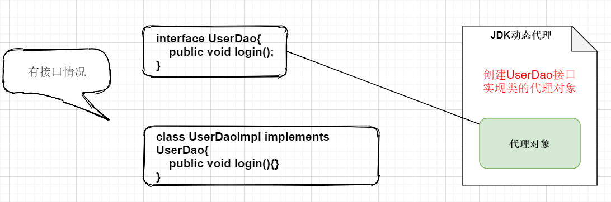
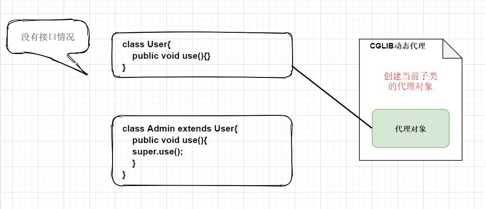
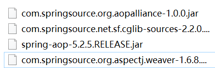

##  AOP

> 在不修改已有源代码的情况下，增加新功能

###  AOP术语

- 连接点

  **可以**被增强的方法，称为连接点

- 切入点

  **实际**被增强的方法，称为连接点

- 通知（增强）

  在实际被增强方法里，新添加的代码逻辑称为通知

  1. 前置通知（切入点前执行）
  2. 后置通知（切入点后执行）
  3. 环绕通知（切入点前后都执行）
  4. 异常通知（增加的代码逻辑出现异常执行）
  5. 最终通知（类似try/catch中的finally）

- 切面

  把通知应用到切入点的过程

---

###  AOP底层原理

两种动态代理情况：

1. 有接口情况，使用JDK动态代理

   

   ```java
   public class JdkProxy {//    jdk动态代理底层原理
   
       //    创建接口实现类代理对象
       public static void main(String[] args) {
           Class[] interfaces = {UserDao.class};
       /*方式一：使用匿名内部类实现
       Proxy.newProxyInstance(JdkProxy.class.getClassLoader(), interfaces, new InvocationHandler() {
           @Override
           public Object invoke(Object proxy, Method method, Object[] args) throws Throwable {
               return null;
           }
       });
       */
   
   //    方式二：使用对象实现InvocationHandler接口
           UserDao userDao = (UserDao) Proxy.newProxyInstance(JdkProxy.class.getClassLoader(), interfaces, new UserDaoProxy(new UserDaoImpl()));
           System.out.println(userDao.add(1, 2));
       }
       
   static class UserDaoProxy implements InvocationHandler {
           //    代理对象
           private Object object;
           //将代理对象传入
           public UserDaoProxy(Object object) {
               this.object = object;
           }
   
           @Override
           public Object invoke(Object proxy, Method method, Object[] args) throws Throwable {
               //        需要增强的方法之前执行的代码
               System.out.println(method.getName() + "执行前输出；传递的参数：" + Arrays.toString(args));
   //            被增强的方法执行
               Object invoke = method.invoke(object, args);
   
               //        需要增强的方法之前执行的代码
               System.out.println("方法执行之后" + object);
               return invoke;
           }
       }
   }
   ```

   

2. 没有接口情况，使用CGLIB动态代理

   

---

###  AOP操作

> spring框架一般基于AspectJ实现AOP操作；
>
> AspectJ：是独立的框架，不是Spring组成部分，经常将两者结合实现AOP操作

####  基于AspectJ实现AOP操作

引入依赖：



预备知识：

切入点表达式：`execution([权限修饰符] [返回类型] [全类名] [方法名]( [参数列表] ) )`

示例：(语法规则，参数列表使用 .. 占位，不需要写实际参数)

- 对指定方法增强：`execution(* com.loy.dao.UserDao.add(..))`
- 对指定类所有方法增强：`execution(* com.loy.UserDao.*(..))`
- 对所有类中所有方法增强：`execution(* com.loy.*.*(..))`

1. #### xml方式（了解）

   ```xml
   <?xml version="1.0" encoding="UTF-8"?>
   <beans xmlns="http://www.springframework.org/schema/beans"
          xmlns:xsi="http://www.w3.org/2001/XMLSchema-instance"
          xmlns:aop="http://www.springframework.org/schema/aop"
          xsi:schemaLocation="http://www.springframework.org/schema/beans http://www.springframework.org/schema/beans/spring-beans.xsd
       http://www.springframework.org/schema/aop http://www.springframework.org/schema/aop/spring-aop.xsd
   ">
   
       <bean id="book" class="com.loy.aop.xml.Book"></bean>
       <bean id="bookProxy" class="com.loy.aop.xml.BookProxy"></bean>
   <!--    配置aop增强-->
       <aop:config>
   <!--        切入点-->
           <aop:pointcut id="add" expression="execution(* com.loy.aop.xml.Book.getId(..))"></aop:pointcut>
   <!--        配置切面-->
           <aop:aspect ref="bookProxy">
   <!--            增强在切入点上-->
               <aop:before method="before" pointcut-ref="add"></aop:before>
           </aop:aspect>
       </aop:config>
   </beans>
   ```

   

2. #### 注解方式（📌推荐开发中使用）

   配置类

   ```java
   @Configuration
   @ComponentScan(basePackages = "com.loy.aop")
   @EnableAspectJAutoProxy(proxyTargetClass = true)//开启生成代理对象
   public class SpringConfig {
   }
   ```

   增强类

   ```java
   @Service
   @Aspect//生成代理对象
   @Order(1)//设置优先级
   public class UserProxy {//增强类
   //   📌 抽取相同切入点
     /*  @Pointcut(value = "execution(* com.loy.aop.ant.User.add(..))")
       public void point(){}
       @Before(value = "point()")
       public void beforeNotice() {
           System.out.println("前置通知");
       }*/
          
       //    配置前置通知
       @Before(value = "execution(* com.loy.aop.ant.User.add(..))")
       public void beforeNotice() {
           System.out.println("前置通知");
       }
   
       //    配置后置通知
       @AfterReturning(value = "execution(* com.loy.aop.ant.User.add(..))")
       public void finallyNotice() {
           System.out.println("后置通知");
       }
   
       //异常通知
       @AfterThrowing(value = "execution(* com.loy.aop.ant.User.add(..))")
       public void throwNotice() {
           System.out.println("异常通知");
       }
   
       //    环绕通知
       @Around(value = "execution(* com.loy.aop.ant.User.add(..))")
       public void aroundNotice(ProceedingJoinPoint proceedingJoinPoint) throws Throwable {
           System.out.println("环绕通知前");
   //调用切入点
           proceedingJoinPoint.proceed();
           System.out.println("环绕通知后");
       }
   
       //最终通知
       @After(value = "execution(* com.loy.aop.ant.User.add(..))")
       public void afterNotice() {
           System.out.println("最终通知");
       }
   }
   ```

   注：

   抽取公共切入点：`@Pointcut(value="execution(* com.loy.aop.ant.User.add(..))")`

   当有多个增强类对同一个方法进行增强，使用 `@Order(数值)`设置优先级；数值越小优先级越高