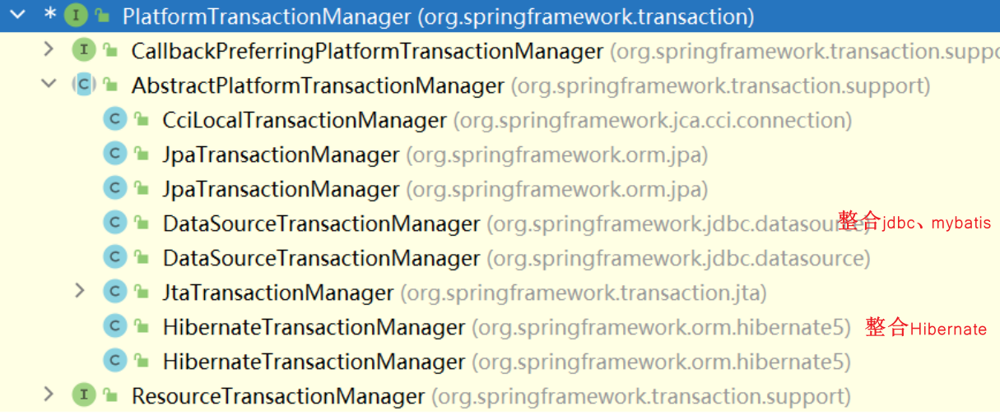
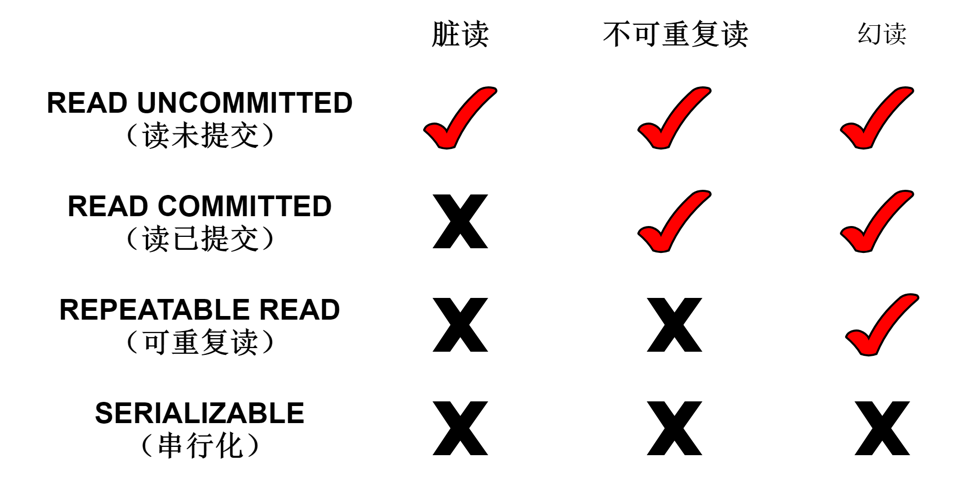

##  Sping事务

> ACID：
>
> 注：涉及事务，数据库引擎必须是InnoDB

引入依赖：

`spring-tx-5.2.5.RELEASE.jar`//事务的依赖


###  事务操作

> 事务一般添加到service层
>

######  事务管理中的API

针对不同框架提供不同的实现类



###### 两种事务管理：

1. 编程式事务管理

   缺点：在需要事务时，都要写一遍下述代码，冗余度高

   ```java
   public void transfer(){
           try {
   //        1.开启事务
   
   //        2.业务操作
               //张三（id=1）向李四（id=2）微信转账三百块
               accountDaoImpl.outcome(1, 300);
   //            模拟异常
   //            int i=10/0;
               accountDaoImpl.income(2, 300);
   //        3.若没有异常，提交事务
           }catch (Exception e) {
   //        4.若有异常，回滚事务
           }
       }
   ```

2. **声明式事务管理**（📌推荐使用，底层为AOP原理）

   - **使用注解方式实现**：（主要学习注解式）

     提高代码可复用性，简化开发

     ```java
         @Transactional(事务参数)
         public void transferByTx(){
             //张三（id=1）向李四（id=2）微信转账三百块
             accountDaoImpl.outcome(1, 300);
     //            模拟异常
     //            int i=10/0;
             accountDaoImpl.income(2, 300);
         }
     ```

     准备步骤：

     1. 配置类方式（完全注解，配置类）(推荐使用)

        ```java
        @Configuration
        @ComponentScan(basePackages = "com.loy.tx")
        @EnableTransactionManagement//开启事务
        public class SpringConfig {
        //    数据库连接池
            @Bean
            public DruidDataSource getDruidDataSource(){
                DruidDataSource druidDataSource = new DruidDataSource();
                druidDataSource.setDriverClassName("com.mysql.cj.jdbc.Driver");
                druidDataSource.setUrl("jdbc:mysql://localhost:3306/tr_account?&rewriteBatchedStatements=true&serverTimezone=GMT%2B8&useSSL=false");
                druidDataSource.setUsername("root");
                druidDataSource.setPassword("");
                return druidDataSource;
            }
        
        //    创建jdbcTemplate对象
            @Bean
            public JdbcTemplate getJdbcTemplate(DataSource dataSource){
                JdbcTemplate jdbcTemplate = new JdbcTemplate();
        //        注入dataSource
                jdbcTemplate.setDataSource(dataSource);
                return jdbcTemplate;
            }
        
        //    创建事务管理器
            @Bean
            public DataSourceTransactionManager getDataSourceTransactionManager(DataSource dataSource){
                DataSourceTransactionManager dataSourceTransactionManager = new DataSourceTransactionManager();
                dataSourceTransactionManager.setDataSource(dataSource);
                return dataSourceTransactionManager;
            }
        }
        
        ```

        

     2. 配置xml

        - xml中配置事务管理器

          ```xml
          <!--    创建事务管理器-->
              <bean id="transactionManager" class="org.springframework.jdbc.datasource.DataSourceTransactionManager">
          <!--        注入数据源-->
                  <property name="dataSource" ref="dataSource"></property>
              </bean>
          ```

        - 引入名称空间tx

          ```xml
           xmlns:tx="http://www.springframework.org/schema/tx"
           http://www.springframework.org/schema/tx http://www.springframework.org/schema/tx/spring-tx.xsd
          ```

        - 开启事务注解

          ```xml
          <!--    开启事务注解-->
              <tx:annotation-driven transaction-manager="transactionManager"></tx:annotation-driven>
          ```

        - 在service类上添加事务注解

          添加类上：该类所有方法添加事务

          添加方法上：该方法持有事务

     

   - 使用xml配置实现：

     ```xml
     <!--    使用xml方式配置事务-->
     <!--    配置通知-->
         <tx:advice id="txAdvice">
     <!--        配置事务参数-->
             <tx:attributes>
                 <tx:method name="transfer" propagation="REQUIRED"/>
             </tx:attributes>
         </tx:advice>
         <aop:config>
     <!--        配置切入点-->
             <aop:pointcut id="pt" expression="execution(* com.loy.tx.service.AccountService.transfer(..))"/>
     <!--        配置切面-->
             <aop:advisor advice-ref="txAdvice" pointcut-ref="pt"></aop:advisor>
          </aop:config>
     ```

######  事务参数

- Propagation：事务传播行为

  - REQUIRED：如果有事务运行，当前的方法就在该事务内运行；如果没有，则启动新事务并在其中运行

  - REQUIRED_NEW：当前方法必须启动新事务，并在自己的事务内运行，如果有事务运行必须将其挂起

  - SUPPORTS：如果有事务在运行，当前方法就在此事务内运行；如果没有事务运行，则当前方法可不运行在事务中

- Isolation：事务隔离级别

  

- timeout：超时时间

  事务需要在一定时间进行提交，若不提交则回滚；默认值-1，设置时间以秒为单位

- readOnly：是否只读

  （true）读：查询操作；（默认值false）写：添加/修改/删除操作

- rollbackFor：回滚

  设置出现哪些异常进行事务回滚

- noRollbackFor：不回滚

  设置出现哪些异常不进行事务回滚