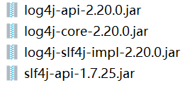

##  新功能

###  整合日志框架

> spring5框架代码基于java8，运行时兼容jdk9

####  spring5自带通用日志封装

- spring5移除了Log4jConfigListener，官方建议使用Log4j2

- spring5整合Log4j2

  步骤：

  1. 导入相关包

     

  2. 创建log4j2.xml（文件名固定不可修改）

     ```xml
     <?xml version="1.0" encoding="UTF-8"?>
     <!--
     日志级别优先级：
         OFF > FATAL > ERROR > WARN > INFO > DEBUG > TRACE > ALL
     -->
     
     <!--status用于设置log4j2自身内部信息输出，设置为trace时，可输出各种log4j2的内部详细消息-->
     <Configuration status="TRACE" xmlns="http://logging.apache.org/log4j/2.0/config">
     <!--定义所有的appender-->
         <Appenders>
             <!--    输出日志到控制台-->
             <Console name="Console" target="SYSTEM_OUT">
     <!--            控制日志输出格式-->
                 <PatternLayout pattern="%d{yyyy-MM-dd HH:mm:ss.SSS} [%t] %-5level %logger{36} - %msg%n}"></PatternLayout>
             </Console>
         </Appenders>
     <!--    定义logger，引入appender；才能使appender生效-->
         <Loggers>
              <Root level="info">
                  <AppenderRef ref="Console"></AppenderRef>
              </Root>
         </Loggers>
     </Configuration>
     ```

---

###  Nullable注解

> @Nullable注解可使用在方法、属性、参数上；表示可以为空

---

###  支持函数式注册对象（Lambda表达式）

> 提供接口实现类：GenericApplicationContext

```java
  public static void main(String[] args) {
        GenericApplicationContext context = new GenericApplicationContext();
//        注册对象
        context.refresh();
        context.registerBean("use",User.class,()->new User());
//        获取在spring中注册的对象
        Object use = context.getBean("use");
        System.out.println(use);
    }
```

---

###  Junit测试框架

引入包：spring-test-5.2.5.RELEASE

1. 整合junit4

   ```java
   @RunWith(SpringJUnit4ClassRunner.class)
   @ContextConfiguration("classpath:springconfig.xml")
   public class JTest {
       @Autowired
       private Ju ju;
       @Test
       public void test(){
           ju.test();
       }
   }
   
   ```

   

2. 整合junit5

   - 方式一

     ```java
     @ExtendWith(SpringExtension.class)
     @ContextConfiguration("classpath:springconfig.xml")
     public class J5Test {
     @Autowired
         private Ju ju;
         @Test
         public void  test(){
             ju.test();
         }
     }
     
     ```

   - 方式二

     ```java
     @SpringJUnitConfig(locations = "classpath:springconfig.xml")
     public class J5Test {
     @Autowired
         private Ju ju;
         @Test
         public void  test(){
             ju.test();
         }
     }
     
     ```

     