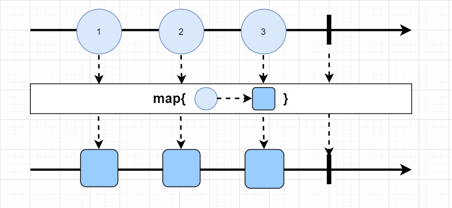
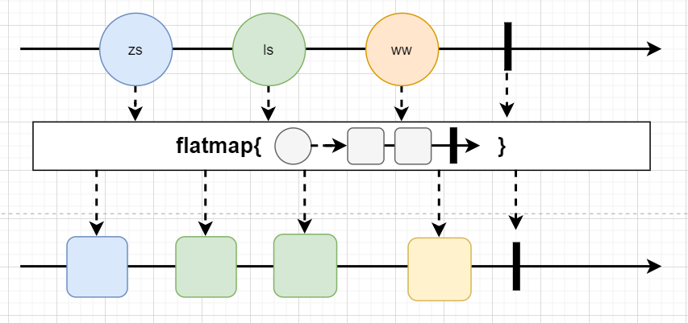
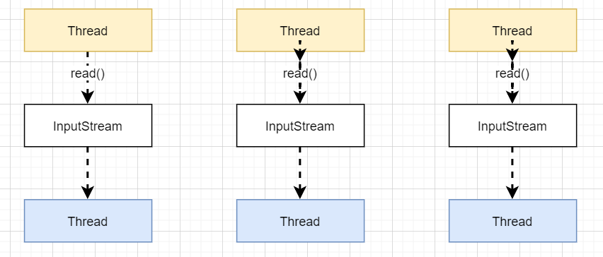
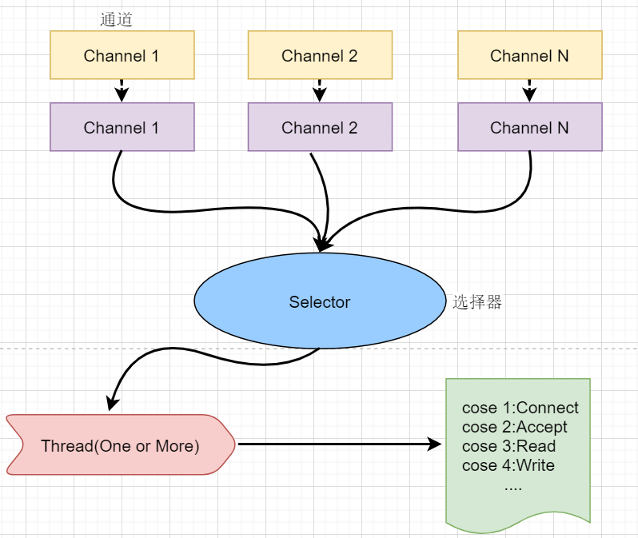

##  WebFlux

介绍：

​		Spring5新增模块，用于web开发，功能类似SpringMVC，使用函数式（Lambda）编程

###  异步非阻塞特性

**异步非阻塞**的框架，核心基于Reactor相关API实现

- 调用者：（发送请求）

  同步（发送请求*等待响应*然后继续执行其它代码）、异步（发送请求*不等待响应*继续执行其他代码）

- 被调用者（接收请求）

  阻塞（接收请求后，*完成操作再给出反馈*）、非阻塞（收到请求后，*立即给出反馈再完成操作*）

###  WebFlux与SpringMVC比较

使用场景：WebFlux适用高并发，SpringMVC适合传统web开发

- 两个框架都可使用注解，都运行在容器中
- SpringMVC采用命令式编程；WebFlux采用异步响应式编程
- **SpringMVC是同步阻塞方式，基于SpringMVC+Servlet+Tomcat实现**
- **SpringWebFlux是异步非阻塞方式，基于SpringWebFlux+Reactor+Netty实现**


---

###  响应式编程

> 响应式编程是一种面向数据流和变化传播的编程范式；当数据发生改变，对应被调用数据的结果响应发生改变

####  历程：

- java8及以前，使用Observer和Observable两个观察者模式类实现伪响应式；
- java9及后续版本使用Flow类实现真正的响应式

 ####  Reactor框架实现📌

> 基于java9中的Flow封装实现

- 两个核心类：Mono和Flux，实现了Publisher接口

  Flux对象实现发布者，返回N个元素

  Mono对象实现发布者，返回0或1个元素

  ```java
  public static void main(String[] args) {
  //        使用just方法直接声明
          Flux<Integer> just = Flux.just(111, 222, 333);
          Mono<Integer> just1 = Mono.just(111);
          
  //        使用其他方式
  //        1.fromArray：数组
          Integer[] intArr={1,2,3};
          Flux<Integer> integerFlux = Flux.fromArray(intArr);
  //        2.fromIterable：集合
          List<Integer> list= Arrays.asList(intArr);
          Flux<Integer> integerFlux1 = Flux.fromIterable(list);
  //        3.fromStream：流
          Stream<Integer> stream=list.stream();
          Flux<Integer> integerFlux2 = Flux.fromStream(stream);
      }
  ```

- Flux和Mono都是数据流的发布者，可发出三种数据信号（元素值、【错误信号、完成信号】（也称终止信号））；终止信号用于告诉订阅者数据流结束。并且错误信号和完成信号只能存在一个

- 使用just或者其他方法只是声明流，只有订阅（subscribe()）后才会触发数据流；

  ```java
          Flux<Integer> just = Flux.just(111, 222, 333);
          just.subscribe(System.out::println);
  ```

- 提供丰富的操作符

  1. map：将元素映射为新的元素
  
     
  
  2. flatMap：将每个元素转换为流，转换之后将多个流合并为一个流
  
     

####  WebFlux执行流程与核心API

> WebFlux基于Reactor实现，使用容器为Netty

#####  Netty（高性能的NIO异步非阻塞框架）

- BIO（阻塞）

  

- NIO（非阻塞）（Netty默认使用）

  

#####  核心控制器DispatchHandler

用于处理请求

- HandleMapping：请求查询到处理的方法
- HandlerAdapter：负责请求处理
- HandleResultHandler：响应结果处理

#####  实现接口WebHandler

#####  实现函数式编程

实现了RouterFunction和HandlerFunction接口

---

###  注解编程模型（重点📌）

```java
@RestController
public class UserController {
    //注入service
    @Autowired
    private UserService userService;
    //id查询
    @GetMapping("/user/{id}")
    public Mono<User> getUser(@PathVariable int id){
        return userService.getUserById(id);
    }

//    查询所有用户
    @GetMapping("/allUser")
    public Flux<User> getAll(){
        return userService.getAllUser();
    }
    @PostMapping("/saveUser")
    public Mono<Void> save(@RequestBody User user){
        Mono<User> just = Mono.just(user);
        return userService.saveUser(just);
    }
}
```


###  函数式编程模型（了解）

- springWebflux请求和响应不再是ServletRequset和ServletResponse；而是SeverRequest和ServerResponse
- RouterFunction：实现路由功能，请求转发给对应handler
- HandlerFunction：处理请求生成响应

实现步骤：

1. 创建spring boot项目；创建handler编写逻辑
2. 配置服务器，编写路由；完成适配

