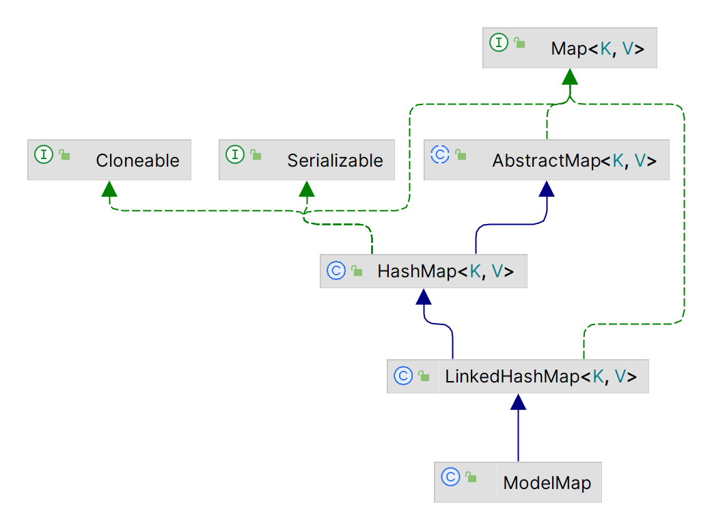
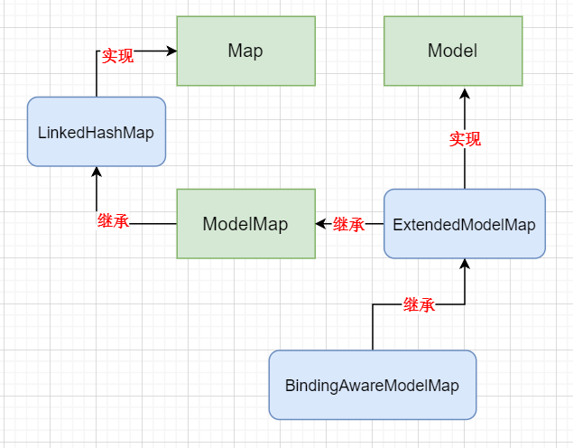

##  域对象共享数据

###  向request中共享

- servlet api实现（框架已封装，不推荐使用）

  ```java
  @RequestMapping("/testRequestByServlet")
      public String testRequestByServlet(HttpServletRequest request) {
          //使用servlet api 向request对象共享数据
          request.setAttribute("requestScope", "data");
          return "success";
      }
  ```

- ModelAndView实现（建议使用📌）

  ```java
  @RequestMapping("/testModelAndView")
      public ModelAndView testModelAndView() {
          //使用ModelAndView向request对象共享数据
          ModelAndView modelAndView = new ModelAndView();
          modelAndView.addObject("mdv", "ModelAndView");
  //        设置视图名称
          modelAndView.setViewName("success");
          return modelAndView;
      }
  ```

- Model实现

  ```java
  @RequestMapping("/testModel")
      public String testModel(Model model) {
          //使用Model向request对象共享数据
          model.addAttribute("model","model");
          return "success";
      }
  ```

- Map实现

  ```java
  @RequestMapping("/testMap")
      public String testMap(Map<String,Object> map) {
          //使用Map向request对象共享数据
          map.put("map","map");
          return "success";
  ```

- ModelMap实现

  ```java
  @RequestMapping("/testModelMap")
      public String testModelMap(ModelMap modelMap) {
          //使用Map向request对象共享数据
          modelMap.addAttribute("modelMap","modelMap");
          return "success";
      }
  ```

model、map、modelmap三者之间关系：

> 底层都使用了BindingAwareModelMap实现类，最后都会将数据封装到`ModelAndView`

```
public interface Model{}
public class ModelMap extends LinkedHashMap<String, Object>{}
public class ExtendedModelMap extends ModelMap implements Model
public class BindingAwareModelMap extends ExtendedModelMap{}
```




###  向session中共享

```java
  //向session域对象共享数据：
    @RequestMapping("/testSession")
    public String testSession(HttpSession session) {
        session.setAttribute("sessionScope","session");
        return "success";
    }
```


###  向application中共享

```java
//向Application域对象共享数据：
    @RequestMapping("/testApplication")
    public String testApplication(HttpSession session) {
        ServletContext context = session.getServletContext();
        context.setAttribute("applicationScope","application");
        return "success";
    }
```


