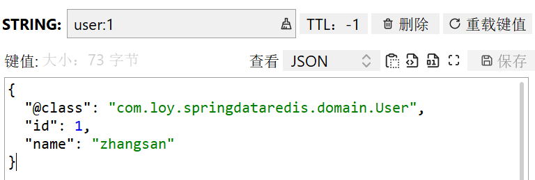
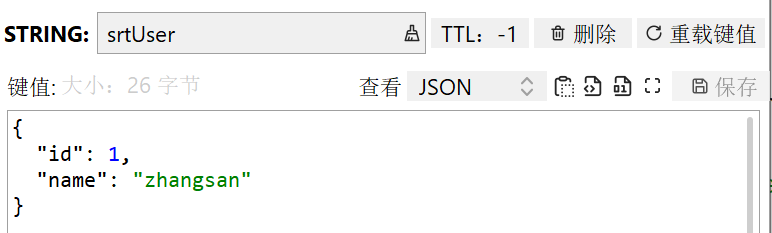

## redis的java客户端

描述：提供两种客户端，jedis和SpringDataRedis；推荐使用SpringDataRedis


### Jedis

#### 引入依赖

```xml
	<dependency>
      <groupId>redis.clients</groupId>
      <artifactId>jedis</artifactId>
      <version>3.8.0</version>
    </dependency>
```

注：jedis本身是线程不安全的，频繁创建和销毁连接会产生性能消耗；推荐使用Jedis连接池代替

#### jedis连接池

```java
public class JedisConnectionFactory {
    private static final JedisPool jedisPool;
    static {
        JedisPoolConfig jedisPoolConfig = new JedisPoolConfig();
        //最大连接
        jedisPoolConfig.setMaxTotal(8);
        //最大空闲连接
        jedisPoolConfig.setMaxIdle(8);
        //最小空闲连接
        jedisPoolConfig.setMinIdle(0);
        //设置最长等待时间，ms
        jedisPoolConfig.setMaxWaitMillis(200);
          jedisPool = new JedisPool(jedisPoolConfig, "192.168.240.133", 6379, 1000, "111111");

    }
    public static Jedis getJedis(){
        return jedisPool.getResource();
    }
}
```

#### 示例

```java
public class TestJedisPool {
    private Jedis jedis;
     @BeforeEach
    void setUp(){
         jedis=JedisConnectionFactory.getJedis();
         jedis.auth("111111");
         jedis.select(0);
     }
     @AfterEach
     void tearDown(){
         if(jedis!=null){
             jedis.close();
         }
         @Test
    public void testHash(){
         HashMap<String, String> map = new HashMap<>();
         map.put("name","zhangsan");
         map.put("id","1");
         Long hset = jedis.hset("javaUser:1", "name","zhangsan");
         Long hset1 = jedis.hset("javaUser:2", map);
         System.out.println(hset1+"\n"+hset);
     }
     }
```


### SpringDataRedis（推荐）✨

描述：集成redis模块；[参考文档](https://spring.io/projects/spring-data-redis)

特点：

- 提供针对不同客户端的整合（Jedis和Lettuce）
- 提供RedisTemplate统一的API操作redis
- 支持redis发布订阅模型
- 支持Redis哨兵和集群
- 支持基于Lettuce响应式编程
- 支持基于JDK、Json、字符串、Spring对象的数据序列化与反序列化
- 支持基于Redis的JDKCollection实现


#### RedisTemplate

常用API：

| API           | 返回值类型      | 描述                  |
| ------------- | --------------- | --------------------- |
| opsForValue() | ValueOperations | 操作String类型数据    |
| opsForHash()  | HashOperations  | 操作Hash类型数据      |
| opsForList()  | ListOperations  | 操作List类型数据      |
| opsForSet()   | SetOperations   | 操作Set类型数据       |
| opsForZSet()  | ZSetOperations  | 操作SortedSet类型数据 |


#### 引入依赖

```xml
		<dependency>
            <groupId>org.springframework.boot</groupId>
            <artifactId>spring-boot-starter-data-redis</artifactId>
        </dependency>
        <!--        连接池依赖-->
        <dependency>
            <groupId>org.apache.commons</groupId>
            <artifactId>commons-pool2</artifactId>
        </dependency>
```

#### 核心配置文件

```yaml
spring:
  redis:
    host: 192.168.240.133
    password: 111111
    port: 6379
    lettuce:
      pool:
        max-active: 8
        max-idle: 8
        min-idle: 0
        max-wait: 100ms
```

#### 示例

```java
@SpringBootTest
public class TestSDR {
    @Autowired
    private RedisTemplate redisTemplate;
    @Test
    public void testRedisString(){
        redisTemplate.opsForValue().set("SDRname","springdataredis");
        Object o = redisTemplate.opsForValue().get("SDRname");
        System.out.println(o);
    }
}
```

#### 自定义redis序列化机制

场景引出：默认的jdk序列化，会将字符串转为字节存储；可读性差，且将对象也转换为字符串，取出无法使用

##### 方式一（自动转换）

自定义配置：RedisConfig

```java
@Configuration
public class RedisConfig {
    @Bean
    public RedisTemplate<String, Object> redisTemplate(RedisConnectionFactory connectionFactory) {
        //创建RedisTemplate对象
        RedisTemplate<String, Object> redisTemplate = new RedisTemplate<>();
        //设置连接工厂
        redisTemplate.setConnectionFactory(connectionFactory);
        //创建json序列化工具
        GenericJackson2JsonRedisSerializer jsonRedisSerializer = new GenericJackson2JsonRedisSerializer();
        //设置key的序列化
        redisTemplate.setKeySerializer(RedisSerializer.string());
        redisTemplate.setHashKeySerializer(RedisSerializer.string());
        //设置value序列化（以便存储对象）
        redisTemplate.setValueSerializer(jsonRedisSerializer);
        redisTemplate.setHashValueSerializer(jsonRedisSerializer);
        return redisTemplate;
    }
}
```

存在的问题：在存入对象时，redis会默认将该类全类名存入；会消耗性能




##### 方式二（手动转换）

描述：无需配置，提供了StringRedisTemplate

使用：

```java
@SpringBootTest
public class TestStringRt {
    @Autowired
    private StringRedisTemplate stringRedisTemplate;
    //使用springmvc提供的json转换工具
    private static final ObjectMapper objectMapper=new ObjectMapper();
    @Test
    public void testStringRt() throws JsonProcessingException {
        //创建对象
        User user = new User(1, "zhangsan");
        //手动序列化
        String userStr = objectMapper.writeValueAsString(user);
        //写入数据
        stringRedisTemplate.opsForValue().set("srtUser", userStr);
        //获取数据
        String jsonUser = stringRedisTemplate.opsForValue().get("srtUser");
        //手动反序列化
        User user1 = objectMapper.readValue(jsonUser, User.class);
        System.out.println(user1);
    }
}
```

