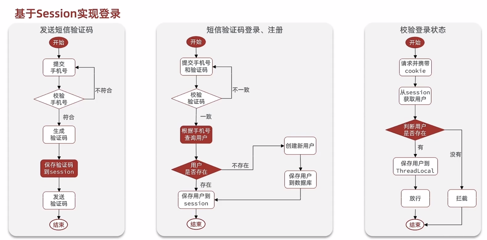

##  基于session实现短信验证

### 思路分析




### 发送短信验证码

1. 定义controler

   ```java
   @Autowired
   private UserService userService;
   
   @RequestMapping("/user/code")
   public ResponseResult loginUser(@RequestParam("phone") String phone, HttpSession session){
       return userService.sendCode(phone,session);
   }
   ```

2. 定义service

   ```java
   public ResponseResult sendCode(String phone, HttpSession session) {
       //1.校验手机号
       if (!RegexUtils.isPhoneInvalid(phone)) {
           //1.1不合法，返回错误信息
           return new ResponseResult(440,"error","手机号格式错误");
       }
   
       //1.2合法：生成验证码
       String code = RandomUtil.randomNumbers(6);
   
       //2保存验证码到session
       session.setAttribute("code", code);
       //TODO:3发送验证码，需第三方的sdk，此处使用日志打印
       log.info("发送验证码成功："+code);
       return new ResponseResult(200,"success","已发送验证码请查收");
   }
   ```

### 短信验证码登录、注册

1. 定义controller

   ```java
   @RequestMapping("/user/login")
   public ResponseResult loginOrRegister(User user,String code,HttpSession session){
       return  userService.login(user,code,session);
   }
   ```

2. 定义service

   ```java
    @Autowired
       DataCenter dataCenter;
       public ResponseResult login(User user,String code,HttpSession session){
   //        1.校验手机号
           String phone = user.getPhone();
           if (!RegexUtils.isPhoneInvalid(phone)){
   //            手机号不合法
               return new ResponseResult(466,"error","手机号不合法");
           }
   //        2.校验验证码
           String cacheCode = (String) session.getAttribute("code");
           if(code==null || !cacheCode.equals(code)){
               return new ResponseResult(466,"error","验证码错误");
           }
   
   //        3.TODO:前面校验都通过，则从数据库查询用户是否存在；此处使用写死数据Datacenter中获取
           Map<String, User> userMao = dataCenter.getMap();
           User user1 = userMao.get(phone);
   //        4.不存在则创建用户
           if(user1==null){
               user1=new User(3,"rand",phone);
           }
           dataCenter.insertUserMap(user1);
           log.info(dataCenter.getMap().toString());
   //        5.将用户信息保存到session中
           session.setAttribute("user",user1);
   return new ResponseResult(200,"success","登录成功");
       }
   ```

### 校验登录状态

定义拦截器

```java
public class LginInterceptor implements HandlerInterceptor {
    @Override
    public boolean preHandle(HttpServletRequest request, HttpServletResponse response, Object handler) throws Exception {
        //1.获取session
        HttpSession session = request.getSession();
        //2.获取session中的用户
        User user = (User) session.getAttribute("user");
        //3.判断用户是否存在
        if (user==null){
            //4.不存在，拦截
            response.setStatus(401);
            return false;
        }

        //5.存在，保存用户信息到ThreadLocal中
        UserThreadLocal.saveUser(user);
        //6.放行
        return true;
    }

    @Override
    public void afterCompletion(HttpServletRequest request, HttpServletResponse response, Object handler, Exception ex) throws Exception {
        //执行完成之后
        UserThreadLocal.removeUser();
    }
}
```

定义ThreadLocal

```java
public class UserThreadLocal {
    private static final ThreadLocal<User> t1= new ThreadLocal();
    public static void saveUser(User userId){
        t1.set(userId);
    }
    public static User getUser(){
        return t1.get();
    }
    public static  void removeUser(){
        t1.remove();
    }

}
```

配置拦截器

```java
@Configuration
public class WebConfig implements WebMvcConfigurer {

    @Override
    public void addInterceptors(InterceptorRegistry registry) {
        registry.addInterceptor(new LginInterceptor()).excludePathPatterns("/user/**");
    }
}
```


### 存在的共享问题

描述：当微服务中，集群的共享问题；早期tomcat提出session拷贝，但内存空间浪费存取相同数据，以及多态服务器之间数据拷贝存在延迟

