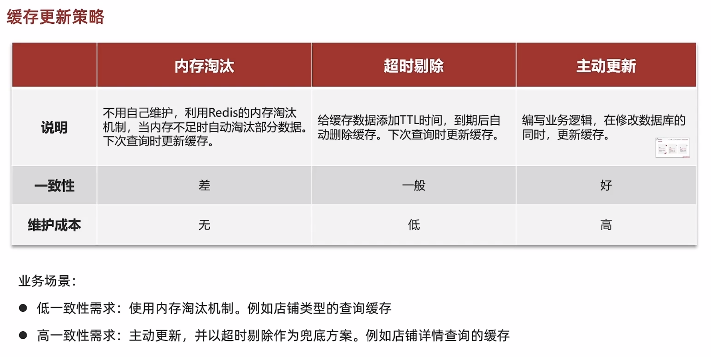

##  缓存更新策略



### 主动更新策略

#### 1、`Cache Aside Pattern`

描述：由缓存调用者，在更新数据库的同时更新缓存✨（推荐使用）

常用场景：删除缓存，更新数据库时让缓存失效，查询时再更新查询

保持一致性：单体系统（将缓存与数据库操作放入事务）；分布式系统（利用TTL分布式事务）

读操作：

- 命中直接返回
- 未命中则查询数据库，并写入缓存，设定超时时间

写操作：

- **先写数据库，再删缓存**
- 确保数据库与缓存原子性


### 2、Read/Write Through Pattern

描述：缓存与数据库整合为一个服务，由服务维护一致性，调用者调用服务；无需关心一致性

### 3、Write Behind Caching Pattern

描述：调用者只操作缓存，其他线程异步将缓存写入数据库


### 示例

更新操作

```java
public ResponseResult updateUserById(Long id) {
    //1、判断用户是否存在
    Map map = dataCenter.getMap();
    Object o = map.get(id);
    if (o==null){
        return new ResponseResult<>(466,"error","商户不存在");
    }
    //2.存在则更新数据库
    map.put(1,new User(1,"zhangsan","张三的商户修改了信息"));
    //3.删除缓存
    stringRedisTemplate.delete("cache:shop:"+id);
    return new ResponseResult(200,"success","更新成功");
}
```