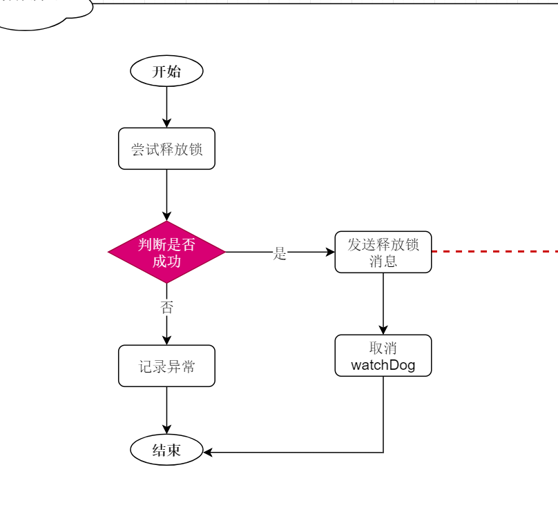

##  Redisson

问题引入：基于redis的分布式锁可有以下优化；

1. 不可重入：同一线程无法多次获取同一把锁
2. 不可重试：获取锁失败后立即返回false，没有重试机制
3. 超时释放：虽然可避免死锁，但当业务耗时较长；存在安全问题
4. 主从一致性：主从同步存在延迟

描述：Redisson是在redis基础上实现的java工具集合，包含多种场景服务；其中包含分布式锁的实现

[Redisson参考文档]()


### Redisson使用

#### 引入依赖

```xml
<dependency>
    <groupId>org.redisson</groupId>
    <artifactId>redisson</artifactId>
    <version>3.23.1</version>
</dependency>
```

#### 配置Redisson

```java
@Configuration
public class RedisConfig {
    @Bean
    public RedissonClient redissonClient(){
//        配置类
        Config config = new Config();
        //添加redis地址，这里添加的单节点，若要添加集群节点则使用useClusterServers()
        config.useSingleServer().setAddress("redis://192.168.170.129:6379").setPassword("111111");
        //创建客户端
        return Redisson.create(config);
    }
}
```

#### 测试

```java
public class TestRedisson {
    @Autowired
    private RedissonClient redissonClient;
    public void testRedisson() throws InterruptedException {
        //获取锁，指定锁名称
        RLock anyLock = redissonClient.getLock("anyLock");
        //尝试获取锁，参数分别为：最大等待时间，自动释放时间，时间单位
        boolean lock = anyLock.tryLock(1, 10, TimeUnit.SECONDS);
        //判断锁是否获取成功
        if (lock){
            try {
                System.out.printf("执行业务中。。。");
            } finally {
                //释放锁
                anyLock.unlock();
            }
        }
    }
}
```


### 使用Redisson实现service层业务

```java
@Service
public class VoucherorderServiceImpl extends ServiceImpl<VoucherorderMapper, Voucherorder>
    implements VoucherorderService{
    @Autowired
    private SeckillvoucherService seckillvoucherService;
    @Autowired
    private RedisIdWorker redisIdWorker;
    @Autowired
    private StringRedisTemplate stringRedisTemplate;
     @Autowired
    private RedissonClient redissonClient;
    @Override   //秒杀下单
    public ResponseResult secKillVoucher(Long voucherId) {
        //查询优惠券
        Seckillvoucher seckillvoucher = seckillvoucherService.getById(voucherId);
        //若存在，则检查是否开始或者过期
        if(seckillvoucher.getBegintime().after(new Date())){
            //尚未开始
            return new ResponseResult(202,"info","活动尚未开始");
        }
        if(seckillvoucher.getEndtime().before(new Date())){
            //已结束
            return new ResponseResult(202,"info","活动已结束");
        }
        //若未过期，检查是否有库存
        if(seckillvoucher.getStock()<1){
            //库存不够
            return new ResponseResult(202,"info","库存不足");
        }
        //        模拟用户id,应该在redis中登录用户获取
        Long userid = ThreadLocalRandom.current().nextLong();
//====================✨✨✨使用redisson分布式锁=====================
         //获取锁，指定锁名称
        RLock anyLock = redissonClient.getLock("order:" + userid);
        //尝试获取锁，参数分别为：最大等待时间，自动释放时间，时间单位
        boolean lock = anyLock.tryLock(1, 10, TimeUnit.SECONDS);
//==================================================================
        if (!lock){
            //锁获取失败，返回错误消息或者重试
            return new ResponseResult(202,"info","一人只能下一单，请勿重复提交");
        }
        try {
            VoucherorderService proxy = (VoucherorderService) AopContext.currentProxy();
            return proxy.createVoucherOrder(userid,voucherId);
        } finally {
            //释放锁
            redisLock.unLock();
        }
    }
    @Transactional
    public ResponseResult createVoucherOrder(Long userid,Long voucherId){
        //查询订单，用户是否购买过该类优惠券
        Long count = query().eq("userid", userid).eq("voucherid", voucherId).count();
        if (count>0){
            //用户已经购买过
            return new ResponseResult(202,"info","您已经购买过了");
        }
        //若有库存，则扣除库存
        boolean b = seckillvoucherService.update()
                .setSql("stock=stock-1")
                .eq("voucherid", voucherId)
                .gt("stock",0)
                .update();
        if (!b){
            //更新失败
            return new ResponseResult<>(202,"info","库存不足");
        }
        // 开始下单；id则为id生成器的id
        Voucherorder voucherorder = new Voucherorder();
        Long nexted = redisIdWorker.nextId("order");
        voucherorder.setId(nexted);
        voucherorder.setVoucherid(voucherId);
        voucherorder.setUserid(userid);
        save(voucherorder);
        return new ResponseResult(200,"seccess",nexted);
    }
}
```


### 核心代码描述

```java
//获取锁，指定锁名称
RLock anyLock = redissonClient.getLock("anyLock");
//尝试获取锁，参数分别为：最大等待时间，自动释放时间，时间单位
boolean lock = anyLock.tryLock(1, 10, TimeUnit.SECONDS);
```

描述：`tryLock()`中无参时，为可重入锁；填一个参数则表示锁重试；第三个参数若设置则不会开启watchDog


####  可重入锁原理


#### 可重试锁原理


#### 超时释放原理



#### 主从一致问题

描述：使用Redisson的multiLock联锁方法，即对每一个节点都设置锁；只有都获取到才算成功

示例：

1、创建多个redis节点

```java
@Configuration
public class RedissonConfig {
    @Bean
    public RedissonClient redissonClient1(){
        Config config = new Config();
 config.useSingleServer().setAddress("redis://192.168.170.129:6379").setPassword("111111");
        return Redisson.create(config);
    }
    @Bean
    public RedissonClient redissonClient2(){
        Config config = new Config();
config.useSingleServer().setAddress("redis://192.168.120.119:6379").setPassword("111111");
        return Redisson.create(config);
    }
    @Bean
    public RedissonClient redissonClient3(){
        Config config = new Config();
config.useSingleServer().setAddress("redis://192.168.173.123:6379").setPassword("111111");
        return Redisson.create(config);
    }
}
```

2、使用multiLock

```java
@SpringBootTest
public class TestRedisson {
    @Autowired
    private RedissonClient redissonClient1;
    @Autowired
    private RedissonClient redissonClient2;
    @Autowired
    private RedissonClient redissonClient3;
    private  RLock multiLock;
    @BeforeEach
    void setUp(){
        RLock anyLock1 = redissonClient1.getLock("Lock1");
        RLock anyLock2 = redissonClient2.getLock("Lock2");
        RLock anyLock3 = redissonClient3.getLock("Lock3");
        
//        创建联锁
         multiLock = redissonClient1.getMultiLock(anyLock1, anyLock2, anyLock3);
    }
    @Test
    public void testMultiLock() throws InterruptedException {
        boolean lock = multiLock.tryLock(1, 10, TimeUnit.SECONDS);
        //判断锁是否获取成功
        if (lock){
            try {
                System.out.printf("执行业务中。。。");
            } finally {
                //释放锁
                multiLock.unlock();
            }
        }
    }
}
```